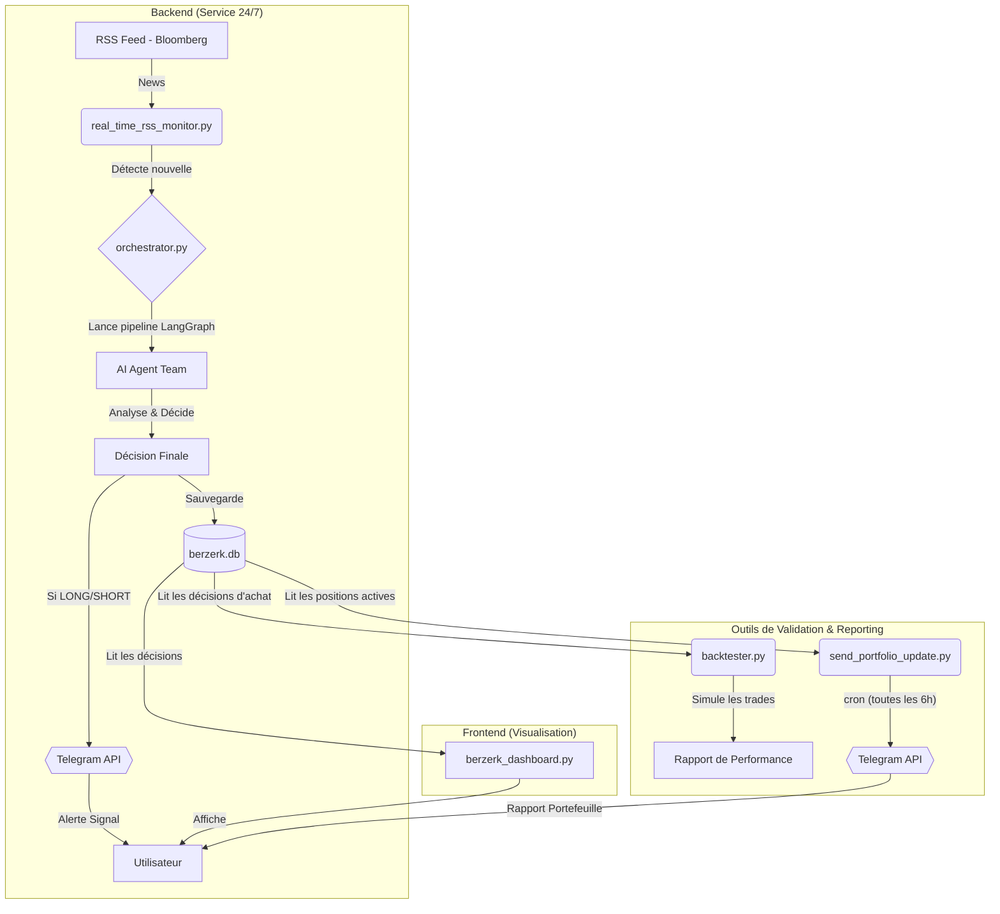

# ⚡ BERZERK

Un moteur d'analyse d'actualités financières basé sur l'IA, conçu pour générer des décisions d'investissement "tac-au-tac".

BERZERK est un système automatisé qui surveille en temps réel les actualités financières, déploie une équipe d'agents IA spécialisés pour analyser leur impact potentiel, et génère des décisions d'investissement claires et exploitables. Le projet est construit sur une philosophie de "Pure Prédiction", visant à agir sur le potentiel futur d'une information avant que le marché ne l'ait pleinement intégrée.


## 🎯 Core Features

- **Real-Time News Monitoring**: Surveillance quasi-instantanée (cycles de 30s) du flux RSS de Bloomberg avec des optimisations HTTP avancées (ETags, Last-Modified) pour une efficacité maximale.
- **AI Agent Team**: Une équipe d'agents IA, orchestrée par LangGraph, collabore pour analyser les news sous différents angles :
  - **Ticker Hunter**: Identifie les entreprises cotées les plus impactées par une news.
  - **Pure Prediction Analyst**: Évalue l'impact futur d'une nouvelle sur une action spécifique, en ignorant délibérément la réaction passée du marché.
  - **Final Investor**: Synthétise toutes les analyses, sélectionne la meilleure opportunité et prend la décision finale (LONG, SHORT, SURVEILLER).
- **Automated Analysis Pipeline**: Un graphe d'états (LangGraph) gère l'ensemble du processus, de la récupération de la news à la décision finale, de manière robuste, traçable et avec une validation systématique des tickers.
- **Real-Time Trade Alerts**: Notifications instantanées via Telegram pour chaque décision LONG ou SHORT, permettant une action immédiate.
- **Automated Portfolio Reporting**: Des résumés périodiques (via cron) de toutes les positions actives et de leur performance actuelle sont envoyés directement sur Telegram.
- **"Clarté Radicale" Decision Dashboard**: Une interface utilisateur Streamlit épurée qui présente les décisions, le portefeuille actif et la performance de chaque trade en temps réel.
- **Centralized Database**: Utilise SQLite pour stocker les articles, les analyses et les décisions, assurant la persistance et la traçabilité de chaque action.

## 🏗️ Architecture

Le système est conçu avec une séparation claire entre le backend (surveillance/analyse/notification) et le frontend (visualisation).



## 🛠️ Tech Stack
- **Backend**: Python 3.9+
- **AI & Orchestration**: LangChain, LangGraph, Google Gemini
- **Frontend**: Streamlit
- **Database**: SQLite
- **Data & Web**: yfinance (données financières), Tavily (recherche web), requests, BeautifulSoup4, feedparser
- **Notifications**: API Telegram

## 🚀 Setup and Installation

### 1. Clone the Repository
```bash
git clone https://github.com/votre-nom-utilisateur/berzerk.git
cd berzerk
```

### 2. Create a Virtual Environment
```bash
python3 -m venv venv
source venv/bin/activate
# Sur Windows: venv\Scripts\activate
```

### 3. Install Dependencies
```bash
pip install -r requirements.txt
```

### 4. Set Up Environment Variables
Le système a besoin de clés API pour fonctionner. Copiez le fichier d'exemple et remplissez-le avec vos clés.
```bash
cp env.example .env
```
Ouvrez le fichier .env avec un éditeur et ajoutez vos clés :
```dotenv
# Clé API pour Google Gemini
GOOGLE_API_KEY="votre_clé_ici"

# Clé API pour Tavily Search
TAVILY_API_KEY="votre_clé_ici"

# --- Notifications (Optionnel) ---
# Token pour le bot Telegram
TELEGRAM_BOT_TOKEN="votre_token_ici"
# ID du chat Telegram où envoyer les notifications
TELEGRAM_CHAT_ID="votre_chat_id_ici"
```

## 📖 How to Use

### 1. Lancement Principal (Recommandé)
Le script start_realtime_monitor.py lance le moniteur en arrière-plan et, optionnellement, le tableau de bord.
Pour lancer la surveillance seule (mode serveur) :
```bash
python start_realtime_monitor.py
```
Pour lancer la surveillance ET le tableau de bord en parallèle (mode local) :
```bash
python start_realtime_monitor.py --with-dashboard
```
Accédez au tableau de bord sur http://localhost:8501.

### 2. Lancer le Tableau de Bord Manuellement
Si vous voulez seulement visualiser les décisions déjà présentes dans la base de données.
```bash
streamlit run berzerk_dashboard.py
```

### 3. Analyser une URL Unique (Mode Test)
Pour tester le pipeline sur un article spécifique sans lancer la surveillance.
```bash
python orchestrator.py "https://url-de-votre-article.com"
```

### 4. Réinitialiser et Ré-analyser
Pour nettoyer toutes les analyses et relancer le processus sur les articles les plus récents (utile après une mise à jour des agents).
```bash
python reset_and_analyze.py
```

### 5. Obtenir un Rapport de Portefeuille Manuellement
Pour tester l'envoi du rapport de portefeuille sans attendre la tâche planifiée.
```bash
python send_portfolio_update.py
```

## 🧠 The BERZERK Philosophy: "Tac au Tac" Pure Prediction

BERZERK a évolué pour adopter une philosophie radicale : la prédiction pure. Contrairement à une approche prudente qui vérifierait si le marché a déjà réagi, BERZERK agit comme un visionnaire.

- **Il Ignore Délibérément les Données de Marché Passées** : Le système ne regarde pas le prix de la veille. Il évite ainsi d'être "pollué" par la volatilité et les réactions irrationnelles à court terme.
- **Il se Fonde sur le Potentiel de l'Information** : La décision est basée sur l'impact fondamental que la news est susceptible d'avoir sur le business d'une entreprise.
- **Il Vise à Agir AVANT la Foule** : L'objectif est de capturer la valeur créée par l'information elle-même, pas de suivre une tendance déjà en cours.

Cette approche fait de BERZERK non pas un simple co-pilote d'analyse, mais une véritable machine de guerre prédictive, conçue pour être offensive et décisive.

## 📂 Project Modules Explained

- **orchestrator.py**: Le cœur du système. Contient le pipeline LangGraph qui orchestre la collaboration des agents IA et gère la logique de décision.
- **agents.py**: Définit les profils et les capacités de chaque agent IA spécialisé (Ticker Hunter, Pure Prediction Analyst, etc.).
- **real_time_rss_monitor.py**: Le service de surveillance 24/7 qui scanne les flux RSS, détecte les nouvelles, déclenche le pipeline d'analyse et envoie les alertes de trade.
- **berzerk_dashboard.py**: L'interface utilisateur Streamlit conçue selon le principe de "Clarté Radicale", affichant les signaux et le portefeuille actif.
- **send_portfolio_update.py**: Script autonome, lancé par cron, qui envoie un résumé des positions actives et de leur performance sur Telegram.
- **start_realtime_monitor.py**: Script de lancement simplifié pour une prise en main facile.
- **reset_and_analyze.py**: Script de maintenance pour réinitialiser et relancer les analyses.
- **berzerk.db**: La base de données SQLite où toutes les données sont stockées.

## 📄 License

This project is licensed under the MIT License. 