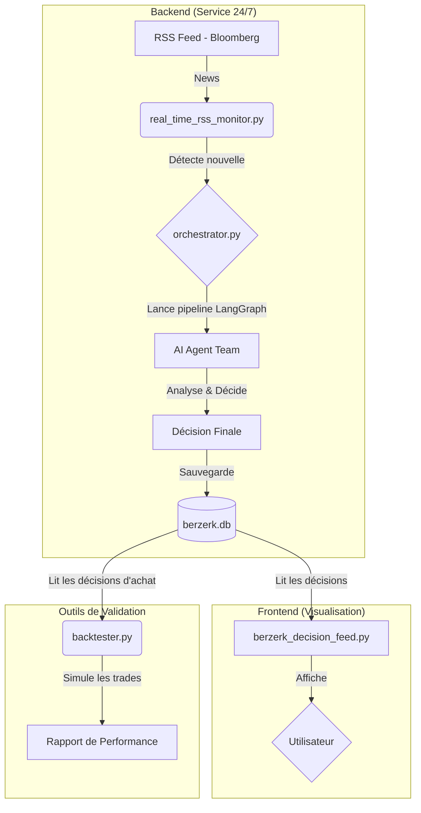

# ⚡ BERZERK

An AI-powered financial news analysis engine for generating "tac-au-tac" investment decisions.

BERZERK est un système automatisé qui surveille en temps réel les actualités financières, déploie une équipe d'agents IA spécialisés pour analyser leur impact potentiel, et génère des décisions d'investissement claires et exploitables. Le projet est construit sur une philosophie de "Pure Prédiction", visant à agir sur le potentiel futur d'une information avant que le marché ne l'ait pleinement intégrée.


## 🎯 Core Features

**Real-Time News Monitoring**: Surveillance quasi-instantanée (cycles de 30s) du flux RSS de Bloomberg avec des optimisations HTTP avancées (ETags, Last-Modified) pour une efficacité maximale.

**AI Agent Team**: Une équipe d'agents IA, orchestrée par LangGraph, collabore pour analyser les news sous différents angles :
- **Ticker Hunter**: Identifie les entreprises cotées les plus impactées par une news.
- **Pure Prediction Analyst**: Évalue l'impact futur d'une nouvelle sur une action spécifique, en ignorant délibérément la réaction passée du marché.
- **Sector & Geopolitical Analysts**: Fournissent un contexte plus large lorsque nécessaire.
- **Final Investor**: Synthétise toutes les analyses pour prendre la décision finale.

**Automated Analysis Pipeline**: Un graphe d'états (LangGraph) gère l'ensemble du processus, de la récupération de la news à la décision finale, de manière robuste et traçable.

**"Clarté Radicale" Decision Feed**: Une interface utilisateur Streamlit épurée qui présente les décisions d'investissement de manière simple, hiérarchisée et orientée vers l'action.

**Performance Backtesting**: Un module intégré pour simuler la performance historique des recommandations d'achat et valider la stratégie du système.

**Centralized Database**: Utilise SQLite pour stocker les articles, les analyses et les décisions, assurant la persistance et évitant le retraitement.

## 🏗️ Architecture

Le système est conçu avec une séparation claire entre le backend de surveillance/analyse et le frontend de visualisation.



## 🛠️ Tech Stack

- **Backend**: Python 3.9+
- **AI & Orchestration**: LangChain, LangGraph, Google Gemini
- **Frontend**: Streamlit
- **Database**: SQLite
- **Data & Web**: yfinance (données financières), Tavily (recherche web), requests, BeautifulSoup4, feedparser

## 🚀 Setup and Installation

Suivez ces étapes pour mettre en place BERZERK sur votre machine locale.

### 1. Clone the Repository

```bash
git clone https://github.com/votre-nom-utilisateur/berzerk.git
cd berzerk
```

### 2. Create a Virtual Environment

Il est fortement recommandé d'utiliser un environnement virtuel pour isoler les dépendances du projet.

```bash
python3 -m venv venv
source venv/bin/activate
# Sur Windows: venv\Scripts\activate
```

### 3. Install Dependencies

Toutes les dépendances requises sont listées dans requirements.txt.

```bash
pip install -r requirements.txt
```

### 4. Set Up Environment Variables

Le système a besoin de clés API pour fonctionner. Copiez le fichier d'exemple et remplissez-le avec vos clés.

```bash
cp env.example .env
```

Ouvrez le fichier `.env` avec un éditeur de texte et ajoutez vos clés API :

```dotenv
# Clé API pour Google Gemini
GOOGLE_API_KEY="votre_clé_ici"

# Clé API pour Tavily Search
TAVILY_API_KEY="votre_clé_ici"
```

### 5. Initialize the Database

La base de données `berzerk.db` sera créée automatiquement au premier lancement du moniteur. Aucune action manuelle n'est requise.

## 📖 How to Use

BERZERK peut être utilisé de plusieurs manières, en fonction de vos besoins.

### 1. Lancement Principal (Recommandé)

Le script `start_realtime_monitor.py` est le moyen le plus simple de démarrer le système. Il lance le moniteur en arrière-plan et, optionnellement, le tableau de bord.

Pour lancer la surveillance seule :
```bash
python start_realtime_monitor.py
```

Pour lancer la surveillance ET le tableau de bord en parallèle :
```bash
python start_realtime_monitor.py --with-dashboard
```

Vous pouvez ensuite accéder au tableau de bord sur http://localhost:8501.

Appuyez sur `Ctrl+C` dans le terminal pour arrêter tous les processus.

### 2. Lancer le Tableau de Bord Manuellement

Si vous voulez seulement visualiser les décisions déjà présentes dans la base de données.

```bash
streamlit run berzerk_decision_feed.py
```

### 3. Vérifier la Performance

Pour lancer une simulation des performances passées des décisions d'achat.

```bash
python backtester.py
```

### 4. Analyser une URL Unique (Mode Test)

Pour tester le pipeline sur un article spécifique sans lancer la surveillance continue.

```bash
python orchestrator.py "https://url-de-votre-article.com"
```

### 5. Réinitialiser les Analyses

Pour nettoyer toutes les analyses existantes et relancer le processus sur les articles les plus récents (utile après une mise à jour des agents).

```bash
python reset_and_analyze.py
```

## 🧠 The BERZERK Philosophy: "Tac au Tac" Pure Prediction

BERZERK a évolué pour adopter une philosophie radicale : **la prédiction pure**. Contrairement à une approche prudente qui vérifierait si le marché a déjà réagi à une nouvelle, BERZERK agit comme un visionnaire.

- **Il Ignore Délibérément les Données de Marché Passées** : Le système ne regarde pas le prix de la veille ou le volume récent. Il évite ainsi d'être "pollué" par la volatilité et les réactions irrationnelles à court terme.

- **Il se Fonde sur le Potentiel de l'Information** : La décision est basée sur l'impact fondamental que la news est susceptible d'avoir sur le business d'une entreprise.

- **Il Vise à Agir AVANT la Foule** : L'objectif est de capturer la valeur créée par l'information elle-même, pas de suivre une tendance déjà en cours.

Cette approche fait de BERZERK non pas un simple co-pilote d'analyse, mais une véritable **machine de guerre prédictive**, conçue pour être offensive et décisive.

## 📂 Project Modules Explained

- **`orchestrator.py`**: Le cœur du système. Contient le pipeline LangGraph qui orchestre la collaboration des agents IA.
- **`agents.py`**: Définit les profils et les capacités de chaque agent IA spécialisé (Ticker Hunter, Pure Prediction Analyst, etc.).
- **`real_time_rss_monitor.py`**: Le service de surveillance 24/7 qui scanne les flux RSS, détecte les nouvelles et déclenche le pipeline d'analyse.
- **`berzerk_decision_feed.py`**: L'interface utilisateur Streamlit conçue selon le principe de "Clarté Radicale".
- **`backtester.py`**: Outil de validation qui simule la rentabilité des décisions d'achat passées.
- **`start_realtime_monitor.py`**: Script de lancement simplifié pour une prise en main facile.
- **`reset_and_analyze.py`**: Script de maintenance pour réinitialiser et relancer les analyses.
- **`berzerk.db`**: La base de données SQLite où toutes les données (articles, décisions) sont stockées.

## 📄 License

This project is licensed under the MIT License. See the LICENSE file for details. 