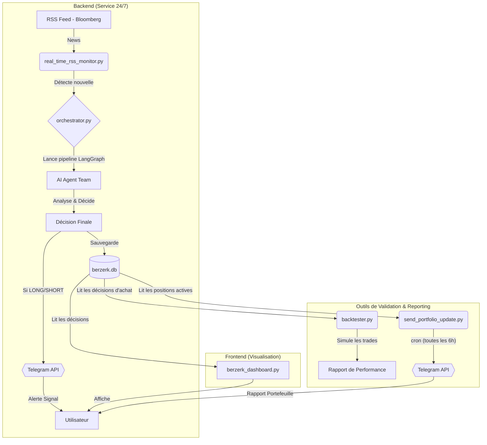

This file is a merged representation of the entire codebase, combined into a single document by Repomix.

<file_summary>
This section contains a summary of this file.

<purpose>
This file contains a packed representation of the entire repository's contents.
It is designed to be easily consumable by AI systems for analysis, code review,
or other automated processes.
</purpose>

<file_format>
The content is organized as follows:
1. This summary section
2. Repository information
3. Directory structure
4. Repository files (if enabled)
5. Multiple file entries, each consisting of:
  - File path as an attribute
  - Full contents of the file
</file_format>

<usage_guidelines>
- This file should be treated as read-only. Any changes should be made to the
  original repository files, not this packed version.
- When processing this file, use the file path to distinguish
  between different files in the repository.
- Be aware that this file may contain sensitive information. Handle it with
  the same level of security as you would the original repository.
</usage_guidelines>

<notes>
- Some files may have been excluded based on .gitignore rules and Repomix's configuration
- Binary files are not included in this packed representation. Please refer to the Repository Structure section for a complete list of file paths, including binary files
- Files matching patterns in .gitignore are excluded
- Files matching default ignore patterns are excluded
- Files are sorted by Git change count (files with more changes are at the bottom)
</notes>

</file_summary>

<directory_structure>
.github/workflows/ci.yml
.gitignore
agents.py
audit_decisions.csv
backtester.py
berzerk_dashboard_old.py
berzerk_dashboard.py
berzerk_lab.py
deployment/berzerk-monitor.service
deployment/CRON_INSTRUCTIONS.md
deployment/README.md
diagnostic_db.py
env.example
export_decisions_audit.py
orchestrator.py
pyproject.toml
pytest.ini
README.md
real_time_rss_monitor.py
requirements.txt
reset_and_analyze.py
send_portfolio_update.py
start_realtime_monitor.py
suivi_projet.md
test_feeds.py
tests/__init__.py
tests/integration/__init__.py
tests/unit/__init__.py
tests/unit/test_agents.py
</directory_structure>

<files>
This section contains the contents of the repository's files.

<file path="audit_decisions.csv">
analyzed_at,ticker,prix_a_la_decision,decision
2025-07-25T14:19:49.825054,,0.0,IGNORER
2025-07-25T14:19:46.208343,,0.0,IGNORER
2025-07-25T14:19:39.100034,,0.0,IGNORER
2025-07-25T14:19:33.036310,,0.0,SURVEILLER
2025-07-25T14:19:25.941694,,0.0,SURVEILLER
2025-07-25T14:19:18.133785,,0.0,IGNORER
2025-07-25T14:19:12.923407,,0.0,SURVEILLER
2025-07-25T14:19:06.089540,AIR.PA,180.94000244140625,SHORT
2025-07-25T14:19:02.261968,,0.0,IGNORER
2025-07-25T14:18:58.245848,,0.0,IGNORER
2025-07-25T14:18:50.000577,MC.PA,481.29998779296875,SHORT
2025-07-25T14:18:46.512355,,0.0,IGNORER
2025-07-25T14:18:40.164546,,0.0,IGNORER
2025-07-25T14:18:34.622052,SRPT,12.869000434875488,SHORT
2025-07-25T14:18:25.888214,,0.0,IGNORER
2025-07-25T14:18:21.133638,,0.0,SURVEILLER
2025-07-25T14:18:15.654307,,0.0,IGNORER
2025-07-25T14:18:07.009782,TTE,60.59000015258789,LONG
2025-07-25T14:17:47.004497,,0.0,IGNORER
2025-07-25T14:17:39.087361,,0.0,IGNORER
</file>

<file path="deployment/berzerk-monitor.service">
[Unit]
Description=BERZERK Real-Time RSS Monitor Service
After=network.target

[Service]
# Utilisateur qui exécutera le service
User=berzerk 
# Groupe qui exécutera le service
Group=berzerk 

# Répertoire de travail de l'application
WorkingDirectory=/home/berzerk/app 

# Commande pour démarrer le service
# Utilise le python de l'environnement virtuel
ExecStart=/home/berzerk/app/venv/bin/python real_time_rss_monitor.py

# Politique de redémarrage : toujours redémarrer en cas de crash
Restart=always 
# Délai avant de redémarrer
RestartSec=10 

# Configuration des logs
StandardOutput=journal
StandardError=journal
SyslogIdentifier=berzerk-monitor

[Install]
WantedBy=multi-user.target
</file>

<file path="deployment/CRON_INSTRUCTIONS.md">
# ⚙️ Configuration du Rapport de Portefeuille Périodique

Ce guide explique comment configurer une tâche planifiée (`cron job`) sur votre VPS pour recevoir un résumé de votre portefeuille BERZERK toutes les 6 heures sur Telegram.

## 1. Se Connecter au VPS

Connectez-vous à votre VPS avec votre utilisateur habituel (celui qui a les droits `sudo`).

## 2. Ouvrir l'Éditeur Crontab

Nous allons éditer les tâches planifiées pour l'utilisateur `berzerk` afin que le script s'exécute dans le bon environnement.

```bash
sudo crontab -u berzerk -e
```

Si c'est la première fois, il vous demandera de choisir un éditeur. Choisissez `nano` (généralement l'option 1), c'est le plus simple.

## 3. Ajouter la Tâche Planifiée

Allez tout à la fin du fichier et ajoutez la ligne suivante. Copiez-la exactement.

```
0 */6 * * * /home/berzerk/app/venv/bin/python /home/berzerk/app/send_portfolio_update.py
```

### Explication de la commande :

- `0 */6 * * *` : C'est la planification. Elle signifie "Exécute à la minute 0, toutes les 6 heures, tous les jours". Le script tournera donc à 00:00, 06:00, 12:00, et 18:00.
- `/home/berzerk/app/venv/bin/python` : C'est le chemin **absolu** vers l'interpréteur Python de votre environnement virtuel. C'est crucial pour que le script utilise les bonnes dépendances.
- `/home/berzerk/app/send_portfolio_update.py` : C'est le chemin **absolu** vers le script que nous voulons exécuter.

## 4. Sauvegarder et Quitter

- Appuyez sur `Ctrl+X`.
- Appuyez sur `Y` pour confirmer la sauvegarde.
- Appuyez sur `Entrée` pour valider le nom du fichier.

Vous devriez voir un message comme `crontab: installing new crontab`.

C'est tout ! Votre rapporteur de portefeuille est maintenant configuré et s'exécutera automatiquement.
</file>

<file path="deployment/README.md">
# 🚀 Guide de Déploiement BERZERK

## Configuration du Serveur de Production

### 1. Préparation du serveur

#### Générer une paire de clés SSH
```bash
ssh-keygen -t ed25519 -C "berzerk-deploy-key"
```

#### Cloner le projet sur le serveur
```bash
git clone https://github.com/votre-nom/berzerk.git /home/berzerk/app
```

#### Créer l'environnement virtuel
```bash
cd /home/berzerk/app
python3 -m venv venv
source venv/bin/activate
pip install -r requirements.txt
```

#### Créer le fichier .env sur le serveur
```bash
nano /home/berzerk/app/.env
# Ajoutez vos clés :
# GOOGLE_API_KEY=votre_clé_google
# TAVILY_API_KEY=votre_clé_tavily
```

### 2. Configuration du service systemd

#### Copier le fichier de service
```bash
sudo cp deployment/berzerk-monitor.service /etc/systemd/system/
```

#### Activer et démarrer le service
```bash
sudo systemctl daemon-reload
sudo systemctl enable berzerk-monitor.service
sudo systemctl start berzerk-monitor.service
```

#### Vérifier le statut
```bash
sudo systemctl status berzerk-monitor
journalctl -u berzerk-monitor -f
```

### 3. Configuration GitHub

#### Variables (Settings > Secrets and variables > Actions > Variables)
- `GOOGLE_API_KEY`: Votre clé API Google Gemini
- `TAVILY_API_KEY`: Votre clé API Tavily

#### Secrets (Settings > Secrets and variables > Actions > Secrets)
- `PROD_HOST`: Adresse IP ou domaine du serveur
- `PROD_USERNAME`: Nom d'utilisateur SSH (ex: ubuntu, berzerk)
- `PROD_SSH_KEY`: Clé SSH privée pour l'authentification

### 4. Workflow de Déploiement

Le système CI/CD fonctionne ainsi :

1. **Push vers main** → Déclenche le workflow CI
2. **Tests & Linting** → Validation automatique de la qualité
3. **Déploiement** → Si CI réussie, déploiement automatique
4. **Redémarrage services** → Application des changements
</file>

<file path="export_decisions_audit.py">
import sqlite3
import json
import csv
from pathlib import Path

DB_PATH = "berzerk.db"
EXPORT_CSV = True  # Passe à False si tu ne veux pas de CSV
CSV_PATH = "audit_decisions.csv"


def extract_decisions(limit=50):
    conn = sqlite3.connect(DB_PATH)
    cursor = conn.cursor()
    cursor.execute(
        """
        SELECT analyzed_at, decision_json
        FROM articles
        WHERE decision_json IS NOT NULL
        ORDER BY analyzed_at DESC
        LIMIT ?
        """,
        (limit,)
    )
    rows = cursor.fetchall()
    conn.close()
    results = []
    for analyzed_at, decision_json in rows:
        try:
            data = json.loads(decision_json)
            prix = data.get("prix_a_la_decision", None)
            ticker = data.get("ticker", None)
            decision = data.get("decision", None)
            results.append({
                "analyzed_at": analyzed_at,
                "ticker": ticker,
                "prix_a_la_decision": prix,
                "decision": decision,
            })
        except Exception as e:
            print(f"[WARN] Erreur parsing JSON: {e}")
    return results


def print_decisions(decisions):
    print(f"{'Date/Heure':<22} | {'Ticker':<8} | {'Prix à la décision':<18} | {'Décision':<10}")
    print("-" * 65)
    for d in decisions:
        print(f"{d['analyzed_at']:<22} | {d['ticker'] or 'N/A':<8} | {d['prix_a_la_decision'] or 'N/A':<18} | {d['decision'] or 'N/A':<10}")


def export_csv(decisions, path):
    with open(path, "w", newline="", encoding="utf-8") as f:
        writer = csv.DictWriter(f, fieldnames=["analyzed_at", "ticker", "prix_a_la_decision", "decision"])
        writer.writeheader()
        for d in decisions:
            writer.writerow(d)
    print(f"Export CSV terminé : {path}")


if __name__ == "__main__":
    decisions = extract_decisions()
    print_decisions(decisions)
    if EXPORT_CSV:
        export_csv(decisions, CSV_PATH)
</file>

<file path="pytest.ini">
[pytest]
minversion = 6.0
addopts = -ra -q
testpaths =
    tests
</file>

<file path="send_portfolio_update.py">
from dotenv import load_dotenv
import sqlite3
import json
import os
from datetime import datetime
import yfinance as yf

load_dotenv()

# --- Fonction utilitaire : prix actuel ---
def get_current_price(ticker: str) -> float:
    ticker = ticker.strip().replace("$", "")
    if not ticker:
        return 0.0
    try:
        stock = yf.Ticker(ticker)
        data = stock.history(period="1d", interval="1m")
        if not data.empty:
            return float(data["Close"].iloc[-1])
        info = stock.info
        price = info.get("regularMarketPrice") or info.get("currentPrice")
        if price:
            return float(price)
        hist = stock.history(period="5d")
        if not hist.empty:
            return float(hist["Close"].iloc[-1])
        return 0.0
    except Exception:
        return 0.0

# --- Fonction utilitaire : notification Telegram ---
def send_telegram_notification(message: str):
    bot_token = os.getenv("TELEGRAM_BOT_TOKEN")
    chat_id = os.getenv("TELEGRAM_CHAT_ID")
    if not bot_token or not chat_id:
        print("[WARN] Variables Telegram manquantes : TELEGRAM_BOT_TOKEN ou TELEGRAM_CHAT_ID non définies. Notification ignorée.")
        return
    url = f"https://api.telegram.org/bot{bot_token}/sendMessage"
    payload = {
        "chat_id": chat_id,
        "text": message,
        "parse_mode": "Markdown"
    }
    try:
        import requests
        response = requests.post(url, data=payload, timeout=10)
        if response.status_code != 200:
            print(f"[ERROR] Notification Telegram échouée : {response.status_code} - {response.text}")
        else:
            print("[INFO] Notification Telegram envoyée avec succès.")
    except Exception as e:
        print(f"[ERROR] Exception lors de l'envoi Telegram : {e}")

# --- Extraction des positions actives ---
def fetch_active_positions():
    conn = sqlite3.connect("berzerk.db")
    cursor = conn.cursor()
    cursor.execute("""
        SELECT decision_json FROM articles
        WHERE decision_json IS NOT NULL
        AND (json_extract(decision_json, '$.decision') = 'LONG' OR json_extract(decision_json, '$.decision') = 'SHORT'
             OR json_extract(decision_json, '$.action') = 'LONG' OR json_extract(decision_json, '$.action') = 'SHORT')
    """)
    rows = cursor.fetchall()
    conn.close()
    positions = []
    for (decision_json,) in rows:
        try:
            data = json.loads(decision_json)
            action = data.get("decision", data.get("action", "")).upper()
            if action not in ["LONG", "SHORT"]:
                continue
            ticker = data.get("ticker", None)
            if not ticker:
                continue
            prix_decision = float(data.get("prix_a_la_decision", 0.0))
            positions.append({
                "ticker": ticker,
                "action": action,
                "prix_decision": prix_decision,
                "justification": data.get("justification_synthetique", data.get("justification", "")),
                "analyzed_at": data.get("analyzed_at", ""),
            })
        except Exception as e:
            print(f"[WARN] Erreur parsing JSON: {e}")
    return positions

# --- Génération du résumé Telegram ---
def generate_portfolio_summary(positions):
    if not positions:
        return "⚪️ *Rapport de Portefeuille BERZERK* ⚪️\n\nAucune position active pour le moment."
    header = "📊 *Rapport de Portefeuille BERZERK*\n\n"
    table_header = "`Ticker   | Dir.  | Entrée | Actuel | P&L`\n"
    table_rows = []
    total_trades = len(positions)
    win_trades = 0
    total_pnl = 0
    for pos in positions:
        ticker = pos["ticker"]
        action = pos["action"]
        prix_decision = pos["prix_decision"]
        prix_actuel = get_current_price(ticker)
        pnl_pct = 0
        if prix_decision > 0 and prix_actuel > 0:
            if action == "LONG":
                pnl_pct = ((prix_actuel - prix_decision) / prix_decision) * 100
            elif action == "SHORT":
                pnl_pct = ((prix_decision - prix_actuel) / prix_decision) * 100
        total_pnl += pnl_pct
        if pnl_pct >= 0:
            win_trades += 1
        pnl_emoji = "✅" if pnl_pct >= 0 else "🔻"
        row = f"`{ticker:<8} | {action:<5} | {prix_decision:<6.2f} | {prix_actuel:<6.2f} | {pnl_pct:+.2f}% {pnl_emoji}`"
        table_rows.append(row)
    win_rate = (win_trades / total_trades) * 100 if total_trades else 0
    avg_pnl = total_pnl / total_trades if total_trades else 0
    summary = f"\n*Positions: {total_trades} | Taux de réussite: {win_rate:.1f}% | Perf. moyenne: {avg_pnl:+.2f}%*"
    message = header + table_header + "\n".join(table_rows) + summary
    return message

if __name__ == "__main__":
    positions = fetch_active_positions()
    message = generate_portfolio_summary(positions)
    print(message)
    send_telegram_notification(message)
</file>

<file path="tests/__init__.py">
# Fichier marker pour le package de tests BERZERK
</file>

<file path="tests/integration/__init__.py">
# Tests d'intégration pour le projet BERZERK
</file>

<file path="tests/unit/__init__.py">
# Tests unitaires pour le projet BERZERK
</file>

<file path="tests/unit/test_agents.py">
from agents import get_agent_description, get_available_agents


def test_route_to_agents_fallback_logic():
    """
    Teste la logique de fallback du routeur quand le LLM échoue.
    Ce test est plus simple et ne dépend pas du LLM.
    """
    # 1. Test avec un ticker en majuscules (devrait déclencher analyste_actions)
    entities = ["AAPL", "technologie", "innovation"]

    # Test direct de la logique de fallback (extraite de la fonction)
    fallback_agents = []

    # Recherche de tickers (généralement en majuscules, 2-5 caractères)
    tickers = [
        entity for entity in entities if entity.isupper() and 2 <= len(entity) <= 5
    ]
    if tickers:
        fallback_agents.append({"agent_type": "analyste_actions", "focus": tickers[0]})

    # Recherche de secteurs (mots-clés courants)
    secteurs = [
        "tech",
        "technologie",
        "énergie",
        "finance",
        "santé",
        "pharma",
        "automobile",
    ]
    for entity in entities:
        if any(secteur in entity.lower() for secteur in secteurs):
            fallback_agents.append(
                {"agent_type": "analyste_sectoriel", "focus": entity}
            )
            break

    # 2. Vérifications
    assert len(fallback_agents) == 2
    assert fallback_agents[0]["agent_type"] == "analyste_actions"
    assert fallback_agents[0]["focus"] == "AAPL"
    assert fallback_agents[1]["agent_type"] == "analyste_sectoriel"
    assert fallback_agents[1]["focus"] == "technologie"


def test_get_available_agents():
    """
    Teste que la fonction get_available_agents retourne les bons types d'agents.
    """
    agents = get_available_agents()

    # Vérification que les agents de base sont présents
    expected_agents = [
        "analyste_actions",
        "analyste_sectoriel",
        "strategiste_geopolitique",
        "ticker_hunter",
    ]

    for agent in expected_agents:
        assert agent in agents


def test_get_agent_description():
    """
    Teste que get_agent_description retourne une description pour les agents connus.
    """
    # Test avec un agent connu
    description = get_agent_description("analyste_actions")
    assert description != "Agent non reconnu"
    assert len(description) > 10  # Une description doit avoir du contenu

    # Test avec un agent inconnu
    description_unknown = get_agent_description("agent_inexistant")
    assert description_unknown == "Agent non reconnu"
</file>

<file path=".github/workflows/ci.yml">
name: BERZERK - CI & CD Pipeline

on:
  push:
    branches: [ main ]
  pull_request:
    branches: [ main ]

jobs:
  # --- JOB 1: Validation du code ---
  validate-code:
    runs-on: ubuntu-latest
    strategy:
      matrix:
        python-version: ["3.11"]

    steps:
    - name: 1. Checkout du code
      uses: actions/checkout@v4

    - name: 2. Mise en place de Python ${{ matrix.python-version }}
      uses: actions/setup-python@v5
      with:
        python-version: ${{ matrix.python-version }}
        cache: 'pip'

    - name: 3. Installation des dépendances
      run: |
        python -m pip install --upgrade pip
        pip install -r requirements.txt
        pip install pytest pytest-mock black ruff

    - name: 4. Création du fichier .env pour la CI
      run: |
        echo "GOOGLE_API_KEY=${{ vars.GOOGLE_API_KEY }}" >> .env
        echo "TAVILY_API_KEY=${{ vars.TAVILY_API_KEY }}" >> .env
        echo "CI_ENV=true" >> .env

    - name: 5. Vérification du formatage avec Black
      run: black --check .

    - name: 6. Linting avec Ruff
      run: ruff check .

    - name: 7. Exécution des tests avec Pytest
      run: pytest

  # --- JOB 2: Déploiement (uniquement si la validation réussit) ---
  deploy-to-prod:
    # 'needs' garantit que ce job ne se lance que si 'validate-code' a réussi
    needs: validate-code
    runs-on: ubuntu-latest
    
    # 'if' garantit que ce job ne se lance que pour un push sur main,
    # et pas pour une pull request.
    if: github.event_name == 'push' && github.ref == 'refs/heads/main'

    steps:
    - name: 1. Checkout du code
      uses: actions/checkout@v4

    - name: 2. Déploiement sur le serveur de production via SSH
      uses: appleboy/ssh-action@v1.0.3
      with:
        host: ${{ secrets.PROD_HOST }}
        username: ${{ secrets.PROD_USERNAME }}
        key: ${{ secrets.PROD_SSH_KEY }}
        port: 22
        script: |
          cd /home/berzerk/app 
          echo ">>> Mise à jour du code depuis Git..."
          git pull origin main
          echo ">>> Activation de l'environnement virtuel..."
          source venv/bin/activate
          echo ">>> Installation des dépendances..."
          pip install -r requirements.txt
          echo ">>> Redémarrage du service de monitoring..."
          sudo systemctl restart berzerk-monitor
          echo ">>> Déploiement terminé avec succès !"
</file>

<file path=".gitignore">
# YoYo AI version control directory
.yoyo/

# Base de données SQLite
*.db
berzerk.db

# Variables d'environnement
.env
.env.local

# Python
__pycache__/
*.py[cod]
*$py.class
*.so
.Python
env/
venv/
.venv/
pip-log.txt
pip-delete-this-directory.txt

# Virtual Environment
venv/
ENV/
env/

# IDE
.vscode/
.idea/
*.swp
*.swo

# OS
.DS_Store
Thumbs.db

# Logs
*.log
logs/

# Temporary files
*.tmp
*.temp" > .gitignore
</file>

<file path="env.example">
# Clé API pour Google Gemini
GOOGLE_API_KEY="votre_clé_ici"

# Clé API pour Tavily Search
TAVILY_API_KEY="votre_clé_ici" 
# Token pour le bot Telegram
TELEGRAM_BOT_TOKEN="votre_token_ici"
# ID du chat Telegram où envoyer les notifications
TELEGRAM_CHAT_ID="votre_chat_id_ici"
</file>

<file path="pyproject.toml">
[tool.black]
line-length = 88
target-version = ['py311']
include = '\.pyi?$'
extend-exclude = '''
/(
  # directories
  \.eggs
  | \.git
  | \.hg
  | \.mypy_cache
  | \.tox
  | \.venv
  | venv
  | _build
  | buck-out
  | build
  | dist
)/
'''

[tool.ruff]
# Même longueur de ligne que Black
line-length = 88
target-version = "py311"

# Fichiers à exclure
exclude = [
    ".bzr",
    ".direnv",
    ".eggs",
    ".git",
    ".hg",
    ".mypy_cache",
    ".nox",
    ".pants.d",
    ".pytype",
    ".ruff_cache",
    ".svn",
    ".tox",
    ".venv",
    "__pypackages__",
    "_build",
    "buck-out",
    "build",
    "dist",
    "node_modules",
    "venv",
]

[tool.ruff.lint]
# Règles à activer
select = [
    "E",  # pycodestyle errors
    "W",  # pycodestyle warnings
    "F",  # pyflakes
    "I",  # isort
    "B",  # flake8-bugbear
    "C4", # flake8-comprehensions
    "UP", # pyupgrade
]

# Règles à ignorer
ignore = [
    "E501", # line too long, géré par Black
    "B008", # do not perform function calls in argument defaults
    "C901", # too complex
]

[tool.ruff.lint.mccabe]
max-complexity = 10
</file>

<file path="README.md">
# ⚡ BERZERK

Un moteur d'analyse d'actualités financières basé sur l'IA, conçu pour générer des décisions d'investissement "tac-au-tac".

BERZERK est un système automatisé qui surveille en temps réel les actualités financières, déploie une équipe d'agents IA spécialisés pour analyser leur impact potentiel, et génère des décisions d'investissement claires et exploitables. Le projet est construit sur une philosophie de "Pure Prédiction", visant à agir sur le potentiel futur d'une information avant que le marché ne l'ait pleinement intégrée.


## 🎯 Core Features

- **Real-Time News Monitoring**: Surveillance quasi-instantanée (cycles de 30s) du flux RSS de Bloomberg avec des optimisations HTTP avancées (ETags, Last-Modified) pour une efficacité maximale.
- **AI Agent Team**: Une équipe d'agents IA, orchestrée par LangGraph, collabore pour analyser les news sous différents angles :
  - **Ticker Hunter**: Identifie les entreprises cotées les plus impactées par une news.
  - **Pure Prediction Analyst**: Évalue l'impact futur d'une nouvelle sur une action spécifique, en ignorant délibérément la réaction passée du marché.
  - **Final Investor**: Synthétise toutes les analyses, sélectionne la meilleure opportunité et prend la décision finale (LONG, SHORT, SURVEILLER).
- **Automated Analysis Pipeline**: Un graphe d'états (LangGraph) gère l'ensemble du processus, de la récupération de la news à la décision finale, de manière robuste, traçable et avec une validation systématique des tickers.
- **Real-Time Trade Alerts**: Notifications instantanées via Telegram pour chaque décision LONG ou SHORT, permettant une action immédiate.
- **Automated Portfolio Reporting**: Des résumés périodiques (via cron) de toutes les positions actives et de leur performance actuelle sont envoyés directement sur Telegram.
- **"Clarté Radicale" Decision Dashboard**: Une interface utilisateur Streamlit épurée qui présente les décisions, le portefeuille actif et la performance de chaque trade en temps réel.
- **Centralized Database**: Utilise SQLite pour stocker les articles, les analyses et les décisions, assurant la persistance et la traçabilité de chaque action.

## 🏗️ Architecture

Le système est conçu avec une séparation claire entre le backend (surveillance/analyse/notification) et le frontend (visualisation).



## 🛠️ Tech Stack
- **Backend**: Python 3.9+
- **AI & Orchestration**: LangChain, LangGraph, Google Gemini
- **Frontend**: Streamlit
- **Database**: SQLite
- **Data & Web**: yfinance (données financières), Tavily (recherche web), requests, BeautifulSoup4, feedparser
- **Notifications**: API Telegram

## 🚀 Setup and Installation

### 1. Clone the Repository
```bash
git clone https://github.com/votre-nom-utilisateur/berzerk.git
cd berzerk
```

### 2. Create a Virtual Environment
```bash
python3 -m venv venv
source venv/bin/activate
# Sur Windows: venv\Scripts\activate
```

### 3. Install Dependencies
```bash
pip install -r requirements.txt
```

### 4. Set Up Environment Variables
Le système a besoin de clés API pour fonctionner. Copiez le fichier d'exemple et remplissez-le avec vos clés.
```bash
cp env.example .env
```
Ouvrez le fichier .env avec un éditeur et ajoutez vos clés :
```dotenv
# Clé API pour Google Gemini
GOOGLE_API_KEY="votre_clé_ici"

# Clé API pour Tavily Search
TAVILY_API_KEY="votre_clé_ici"

# --- Notifications (Optionnel) ---
# Token pour le bot Telegram
TELEGRAM_BOT_TOKEN="votre_token_ici"
# ID du chat Telegram où envoyer les notifications
TELEGRAM_CHAT_ID="votre_chat_id_ici"
```

## 📖 How to Use

### 1. Lancement Principal (Recommandé)
Le script start_realtime_monitor.py lance le moniteur en arrière-plan et, optionnellement, le tableau de bord.
Pour lancer la surveillance seule (mode serveur) :
```bash
python start_realtime_monitor.py
```
Pour lancer la surveillance ET le tableau de bord en parallèle (mode local) :
```bash
python start_realtime_monitor.py --with-dashboard
```
Accédez au tableau de bord sur http://localhost:8501.

### 2. Lancer le Tableau de Bord Manuellement
Si vous voulez seulement visualiser les décisions déjà présentes dans la base de données.
```bash
streamlit run berzerk_dashboard.py
```

### 3. Analyser une URL Unique (Mode Test)
Pour tester le pipeline sur un article spécifique sans lancer la surveillance.
```bash
python orchestrator.py "https://url-de-votre-article.com"
```

### 4. Réinitialiser et Ré-analyser
Pour nettoyer toutes les analyses et relancer le processus sur les articles les plus récents (utile après une mise à jour des agents).
```bash
python reset_and_analyze.py
```

### 5. Obtenir un Rapport de Portefeuille Manuellement
Pour tester l'envoi du rapport de portefeuille sans attendre la tâche planifiée.
```bash
python send_portfolio_update.py
```

## 🧠 The BERZERK Philosophy: "Tac au Tac" Pure Prediction

BERZERK a évolué pour adopter une philosophie radicale : la prédiction pure. Contrairement à une approche prudente qui vérifierait si le marché a déjà réagi, BERZERK agit comme un visionnaire.

- **Il Ignore Délibérément les Données de Marché Passées** : Le système ne regarde pas le prix de la veille. Il évite ainsi d'être "pollué" par la volatilité et les réactions irrationnelles à court terme.
- **Il se Fonde sur le Potentiel de l'Information** : La décision est basée sur l'impact fondamental que la news est susceptible d'avoir sur le business d'une entreprise.
- **Il Vise à Agir AVANT la Foule** : L'objectif est de capturer la valeur créée par l'information elle-même, pas de suivre une tendance déjà en cours.

Cette approche fait de BERZERK non pas un simple co-pilote d'analyse, mais une véritable machine de guerre prédictive, conçue pour être offensive et décisive.

## 📂 Project Modules Explained

- **orchestrator.py**: Le cœur du système. Contient le pipeline LangGraph qui orchestre la collaboration des agents IA et gère la logique de décision.
- **agents.py**: Définit les profils et les capacités de chaque agent IA spécialisé (Ticker Hunter, Pure Prediction Analyst, etc.).
- **real_time_rss_monitor.py**: Le service de surveillance 24/7 qui scanne les flux RSS, détecte les nouvelles, déclenche le pipeline d'analyse et envoie les alertes de trade.
- **berzerk_dashboard.py**: L'interface utilisateur Streamlit conçue selon le principe de "Clarté Radicale", affichant les signaux et le portefeuille actif.
- **send_portfolio_update.py**: Script autonome, lancé par cron, qui envoie un résumé des positions actives et de leur performance sur Telegram.
- **start_realtime_monitor.py**: Script de lancement simplifié pour une prise en main facile.
- **reset_and_analyze.py**: Script de maintenance pour réinitialiser et relancer les analyses.
- **berzerk.db**: La base de données SQLite où toutes les données sont stockées.

## 📄 License

This project is licensed under the MIT License.
</file>

<file path="test_feeds.py">
import feedparser
import requests

# Définition des flux RSS à tester
RSS_FEEDS = {"Bloomberg": "https://feeds.bloomberg.com/markets/news.rss"}

print("--- Lancement du diagnostic des flux RSS ---")

# On boucle sur chaque flux pour le tester individuellement
for source, url in RSS_FEEDS.items():
    print(f"\n[TEST] Source : {source}")
    print(f"       URL    : {url}")

    try:
        # On simule un navigateur en ajoutant un User-Agent
        # C'est la correction la plus probable
        headers = {
            "User-Agent": "Mozilla/5.0 (Windows NT 10.0; Win64; x64) AppleWebKit/537.36 (KHTML, like Gecko) Chrome/91.0.4472.124 Safari/537.36"
        }

        # On télécharge d'abord le contenu avec requests, qui permet de passer les headers
        response = requests.get(url, headers=headers, timeout=10)

        # On vérifie le code de statut HTTP. 200 = OK. 403 = Interdit. 404 = Non trouvé.
        print(f"       Statut HTTP : {response.status_code}")

        if response.status_code == 200:
            # Si la requête a réussi, on donne le contenu à feedparser
            feed = feedparser.parse(response.content)

            # On vérifie si feedparser a bien trouvé des articles
            if feed.entries:
                print(f"       ✅ SUCCÈS : {len(feed.entries)} article(s) trouvé(s).")
            elif feed.bozo:
                # feed.bozo = 1 signifie que le flux est mal formé
                print(
                    f"       ⚠️ AVERTISSEMENT : Le flux est mal formé. Erreur : {feed.bozo_exception}"
                )
            else:
                print(
                    "       ⚠️ AVERTISSEMENT : Le flux est valide mais ne contient aucun article."
                )
        else:
            print(
                f"       ❌ ÉCHEC : Le serveur a refusé la connexion (Code {response.status_code}). Le flux est probablement protégé ou mort."
            )

    except Exception as e:
        print(f"       ❌ ERREUR : Impossible de se connecter au flux. Erreur : {e}")

print("\n--- Diagnostic terminé ---")
</file>

<file path="berzerk_dashboard_old.py">
#!/usr/bin/env python3
"""
🎯 BERZERK COMMAND CENTER - Dashboard Professionnel
===================================================

Interface Streamlit avancée pour visualiser et analyser les performances
du système BERZERK avec tableaux de bord interactifs et analytics.

Fonctionnalités:
- 📈 Live Feed: Analyses en temps réel avec cartes interactives
- 🏆 Performance & Backtest: Métriques de performance et backtesting
- 📊 Graphiques interactifs avec Plotly
- 🎨 Interface moderne avec couleurs et icônes
- ⚡ Cache optimisé pour performances

Usage: streamlit run berzerk_dashboard.py
"""

import json
import sqlite3
import time
from datetime import datetime, timedelta

import pandas as pd
import plotly.graph_objects as go
import streamlit as st
import yfinance as yf

# Configuration de la page simplifiée
st.set_page_config(
    page_title="BERZERK - Centre de Contrôle",
    page_icon="⚡",
    layout="wide",
    initial_sidebar_state="collapsed",
)

# En-tête principal SIMPLE et CLAIR
st.markdown(
    """
<div class="main-header">
    <h1 style="color: white; font-size: 2.5rem; margin: 0; font-weight: 700;">
        ⚡ BERZERK Command Center
    </h1>
    <p style="color: rgba(255,255,255,0.9); font-size: 1.2rem; margin: 0.5rem 0 0 0;">
        Intelligence Artificielle • Analyse d'Actualités Financières • Décisions d'Investissement
    </p>
</div>
""",
    unsafe_allow_html=True,
)

# Styles CSS ULTRA SIMPLES - Fond blanc, texte lisible
st.markdown(
    """
<style>
    /* Fond général blanc */
    .main {
        background-color: #ffffff !important;
        color: #333333 !important;
    }

    /* Supprimer le fond sombre de Streamlit */
    .stApp {
        background-color: #ffffff !important;
    }

    /* En-tête avec couleurs douces */
    .main-header {
        background: linear-gradient(135deg, #4285f4, #34a853);
        padding: 2rem;
        border-radius: 10px;
        margin-bottom: 2rem;
        text-align: center;
        color: white !important;
    }

    /* Cartes avec bordures colorées et fond blanc */
    .metric-card {
        background: #ffffff !important;
        border: 2px solid #e8f0fe;
        border-left: 5px solid #4285f4;
        border-radius: 10px;
        padding: 1.5rem;
        margin: 1rem 0;
        box-shadow: 0 2px 8px rgba(0,0,0,0.1);
        color: #333333 !important;
    }

    .metric-card h3 {
        color: #1a73e8 !important;
        font-size: 1.1rem !important;
        margin-bottom: 0.5rem !important;
    }

    /* Cartes d'articles avec fond blanc */
    .article-card {
        background: #ffffff !important;
        border: 1px solid #dadce0;
        border-radius: 8px;
        padding: 1.5rem;
        margin: 1rem 0;
        box-shadow: 0 1px 3px rgba(0,0,0,0.1);
        color: #333333 !important;
    }

    /* Titre d'article en noir */
    .article-title {
        color: #202124 !important;
        font-size: 1.2rem !important;
        font-weight: 600 !important;
        margin-bottom: 0.8rem !important;
        line-height: 1.4 !important;
    }

    /* Méta infos en gris */
    .article-meta {
        color: #5f6368 !important;
        font-size: 0.9rem !important;
        margin-bottom: 1rem !important;
    }

    /* Badges d'action plus simples */
    .badge-acheter {
        background: #34a853 !important;
        color: white !important;
        padding: 0.7rem 1.5rem !important;
        border-radius: 6px !important;
        font-weight: bold !important;
        font-size: 1rem !important;
        display: inline-block !important;
        margin-bottom: 1rem !important;
    }

    .badge-surveiller {
        background: #fbbc04 !important;
        color: #333333 !important;
        padding: 0.7rem 1.5rem !important;
        border-radius: 6px !important;
        font-weight: bold !important;
        font-size: 1rem !important;
        display: inline-block !important;
        margin-bottom: 1rem !important;
    }

    .badge-vendre {
        background: #ea4335 !important;
        color: white !important;
        padding: 0.7rem 1.5rem !important;
        border-radius: 6px !important;
        font-weight: bold !important;
        font-size: 1rem !important;
        display: inline-block !important;
        margin-bottom: 1rem !important;
    }

    .badge-ignorer {
        background: #9aa0a6 !important;
        color: white !important;
        padding: 0.7rem 1.5rem !important;
        border-radius: 6px !important;
        font-weight: bold !important;
        font-size: 1rem !important;
        display: inline-block !important;
        margin-bottom: 1rem !important;
    }

    /* Métriques en ligne plus visibles */
    .inline-metric {
        background: #f8f9fa !important;
        border: 1px solid #e0e0e0 !important;
        padding: 0.8rem !important;
        border-radius: 6px !important;
        margin: 0.3rem !important;
        color: #333333 !important;
        font-size: 0.9rem !important;
    }

    .inline-metric strong {
        color: #1a73e8 !important;
    }

    /* Section headers plus clairs */
    .section-header {
        background: #f8f9fa !important;
        border: 1px solid #e0e0e0 !important;
        border-left: 4px solid #4285f4 !important;
        padding: 1rem 1.5rem !important;
        border-radius: 6px !important;
        margin: 1.5rem 0 1rem 0 !important;
        color: #333333 !important;
    }

    .section-header h3 {
        color: #1a73e8 !important;
        margin: 0 !important;
    }

    /* Améliorer les selectbox */
    .stSelectbox > div > div {
        background-color: #ffffff !important;
        border: 2px solid #dadce0 !important;
        border-radius: 6px !important;
        color: #333333 !important;
    }

    /* Forcer le texte en noir partout */
    .stMarkdown, .stText, p, span, div {
        color: #333333 !important;
    }

    /* Onglets plus visibles */
    .stTabs [data-baseweb="tab-list"] {
        background-color: #f8f9fa !important;
        border-radius: 6px !important;
        padding: 0.5rem !important;
    }

    .stTabs [data-baseweb="tab"] {
        background-color: transparent !important;
        color: #5f6368 !important;
        font-weight: 500 !important;
    }

    .stTabs [data-baseweb="tab"][aria-selected="true"] {
        background-color: #ffffff !important;
        color: #1a73e8 !important;
        font-weight: 600 !important;
    }
</style>
""",
    unsafe_allow_html=True,
)

# =============================================================================
# FONCTIONS DE CACHE ET DONNÉES
# =============================================================================


@st.cache_data(ttl=30)  # Cache pendant 30 secondes pour live feed
def get_articles_with_decisions():
    """Récupère tous les articles avec leurs décisions"""
    conn = sqlite3.connect("berzerk.db")
    conn.row_factory = sqlite3.Row
    cursor = conn.cursor()

    cursor.execute(
        """
        SELECT * FROM articles
        ORDER BY published_date DESC
    """
    )

    articles = [dict(row) for row in cursor.fetchall()]
    conn.close()
    return articles


@st.cache_data(ttl=30)
def get_dashboard_stats():
    """Récupère les statistiques pour le tableau de bord - VERSION SIMPLIFIÉE"""
    try:
        conn = sqlite3.connect("berzerk.db")
        cursor = conn.cursor()

        # Métriques principales
        cursor.execute("SELECT COUNT(*) FROM articles")
        total_articles = cursor.fetchone()[0]

        cursor.execute("SELECT COUNT(*) FROM articles WHERE status = 'analyzed'")
        analyzed_articles = cursor.fetchone()[0]

        cursor.execute("SELECT COUNT(*) FROM articles WHERE status = 'pending'")
        pending_articles = cursor.fetchone()[0]

        cursor.execute("SELECT COUNT(*) FROM articles WHERE status = 'error'")
        error_count = cursor.fetchone()[0]

        # Décisions d'achat (recherche dans decision_json)
        cursor.execute(
            """
            SELECT COUNT(*) FROM articles
            WHERE status = 'analyzed'
            AND (decision_json LIKE '%"action": "ACHETER"%' OR decision_json LIKE '%"decision": "ACHETER"%')
        """
        )
        buy_decisions = cursor.fetchone()[0]

        # Dernière analyse
        cursor.execute(
            """
            SELECT analyzed_at FROM articles
            WHERE status = 'analyzed' AND analyzed_at IS NOT NULL
            ORDER BY analyzed_at DESC LIMIT 1
        """
        )
        last_analysis = cursor.fetchone()

        # Calculer les minutes depuis la dernière analyse
        last_analysis_minutes = 999
        if last_analysis and last_analysis[0]:
            try:
                last_time = datetime.fromisoformat(last_analysis[0])
                time_diff = datetime.now() - last_time
                last_analysis_minutes = int(time_diff.total_seconds() // 60)
            except Exception:
                last_analysis_minutes = 999

        conn.close()

        return {
            "total_articles": total_articles,
            "analyzed_articles": analyzed_articles,
            "pending_articles": pending_articles,
            "error_count": error_count,
            "buy_decisions": buy_decisions,
            "last_analysis_minutes": last_analysis_minutes,
        }

    except Exception as e:
        st.error(f"Erreur lors de la récupération des statistiques: {e}")
        return {
            "total_articles": 0,
            "analyzed_articles": 0,
            "pending_articles": 0,
            "error_count": 0,
            "buy_decisions": 0,
            "last_analysis_minutes": 999,
        }


@st.cache_data(ttl=300)  # Cache pendant 5 minutes
def get_backtest_data():
    """Récupère et traite les données de backtest"""
    conn = sqlite3.connect("berzerk.db")
    cursor = conn.cursor()

    # Récupérer les décisions d'achat
    cursor.execute(
        """
        SELECT id, title, published_date, decision_json
        FROM articles
        WHERE decision_json IS NOT NULL
        AND status = "analyzed"
        ORDER BY published_date DESC
    """
    )

    rows = cursor.fetchall()
    conn.close()

    buy_decisions = []

    for row in rows:
        article_id, title, published_date, decision_json = row

        try:
            decision = json.loads(decision_json)
            action = decision.get("action", decision.get("decision", "")).upper()

            if action in ["ACHETER", "ACHAT", "BUY"]:
                ticker = decision.get("ticker")

                if ticker:
                    buy_decisions.append(
                        {
                            "article_id": article_id,
                            "title": title,
                            "ticker": ticker,
                            "decision_date": datetime.fromisoformat(published_date),
                            "action": action,
                            "justification": decision.get(
                                "justification", "Aucune justification"
                            ),
                            "allocation": decision.get(
                                "allocation_pourcentage",
                                decision.get("allocation_percent", 0.0),
                            ),
                            "confiance": decision.get(
                                "confiance", decision.get("confidence", "INCONNUE")
                            ),
                        }
                    )
        except Exception:
            continue

    return buy_decisions


def simulate_trade_performance(
    ticker: str, decision_date: datetime, holding_days: int = 7
) -> dict | None:
    """Simule la performance d'un trade"""
    try:
        # Calculer les dates
        buy_date = decision_date + timedelta(days=1)
        sell_date = buy_date + timedelta(days=holding_days)

        # Télécharger les données
        stock = yf.Ticker(ticker)
        start_date = buy_date - timedelta(days=10)
        end_date = datetime.now() + timedelta(days=2)

        hist = stock.history(start=start_date, end=end_date)

        if hist.empty:
            return None

        # Trouver les prix
        buy_price = None
        sell_price = None

        # Prix d'achat
        for date, row in hist.iterrows():
            if date.date() >= buy_date.date():
                buy_price = row["Open"]
                break

        if buy_price is None:
            buy_price = hist.iloc[-1]["Close"]

        # Prix de vente
        if datetime.now().date() < sell_date.date():
            sell_price = hist.iloc[-1]["Close"]
        else:
            for date, row in hist.iterrows():
                if date.date() >= sell_date.date():
                    sell_price = row["Open"]
                    break

            if sell_price is None:
                sell_price = hist.iloc[-1]["Close"]

        # Calculer la performance
        roi_percent = ((sell_price - buy_price) / buy_price) * 100

        return {
            "ticker": ticker,
            "buy_price": round(buy_price, 2),
            "sell_price": round(sell_price, 2),
            "roi_percent": round(roi_percent, 2),
            "is_profitable": roi_percent > 0,
            "decision_date": decision_date,
            "buy_date": buy_date,
            "sell_date": sell_date,
        }

    except Exception:
        return None


# =============================================================================
# FONCTIONS D'AFFICHAGE
# =============================================================================


def parse_decision_json(decision_json: str) -> dict:
    """Parse le JSON de décision de manière sécurisée"""
    if not decision_json:
        return {}
    try:
        return json.loads(decision_json)
    except Exception:
        return {}


def get_decision_color(action: str) -> str:
    """Retourne la couleur associée à une action"""
    colors = {
        "ACHETER": "#28a745",
        "VENDRE": "#dc3545",
        "SURVEILLER": "#ffc107",
        "IGNORER": "#6c757d",
    }
    return colors.get(action, "#6c757d")


def display_simple_article_card(article: dict):
    """Affiche une carte d'article ULTRA SIMPLE et LISIBLE"""
    decision = parse_decision_json(article.get("decision_json", "{}"))

    # Container principal
    st.markdown('<div class="article-card">', unsafe_allow_html=True)

    # TITRE de l'article (gros et lisible)
    title = article["title"]
    if len(title) > 80:
        title = title[:80] + "..."

    st.markdown(f'<div class="article-title">{title}</div>', unsafe_allow_html=True)

    # INFOS RAPIDES
    source = article.get("source", "Bloomberg")
    date_str = article.get("published_date", "")
    if date_str:
        try:
            date_obj = datetime.fromisoformat(date_str)
            date_display = date_obj.strftime("%d/%m à %H:%M")
        except Exception:
            date_display = "Date inconnue"
    else:
        date_display = "Date inconnue"

    st.markdown(
        f'<div class="article-meta">📰 {source} • 📅 {date_display}</div>',
        unsafe_allow_html=True,
    )

    # CONTENU PRINCIPAL selon le statut
    if article["status"] == "analyzed" and decision:
        # === ARTICLE ANALYSÉ ===

        # Action principale (gros badge visible)
        action = decision.get("action", decision.get("decision", "INCONNUE")).upper()
        ticker = decision.get("ticker", "N/A")

        if action == "ACHETER":
            badge_class = "badge-acheter"
            message = "✅ ACHETER"
            if ticker != "N/A":
                message += f" • {ticker}"
        elif action == "SURVEILLER":
            badge_class = "badge-surveiller"
            message = "👀 SURVEILLER"
            if ticker != "N/A":
                message += f" • {ticker}"
        elif action == "VENDRE":
            badge_class = "badge-vendre"
            message = "❌ VENDRE"
            if ticker != "N/A":
                message += f" • {ticker}"
        else:
            badge_class = "badge-ignorer"
            message = "⚪ IGNORER"

        st.markdown(
            f'<div class="{badge_class}">{message}</div>', unsafe_allow_html=True
        )

        # Détails importants (3 colonnes)
        col1, col2, col3 = st.columns(3)

        with col1:
            confidence = decision.get("confidence", decision.get("confiance", "N/A"))
            st.markdown(
                f'<div class="inline-metric"><strong>Confiance:</strong><br/>{confidence}</div>',
                unsafe_allow_html=True,
            )

        with col2:
            allocation = decision.get(
                "allocation_pourcentage", decision.get("allocation_percent", 0.0)
            )
            st.markdown(
                f'<div class="inline-metric"><strong>Allocation:</strong><br/>{allocation}%</div>',
                unsafe_allow_html=True,
            )

        with col3:
            if ticker != "N/A":
                st.markdown(
                    f'<div class="inline-metric"><strong>Titre:</strong><br/>{ticker}</div>',
                    unsafe_allow_html=True,
                )
            else:
                st.markdown(
                    '<div class="inline-metric"><strong>Statut:</strong><br/>Pas de titre</div>',
                    unsafe_allow_html=True,
                )

        # Justification (simple)
        justification = decision.get("justification", "")
        if len(justification) > 20:
            with st.expander("📋 Voir le raisonnement complet"):
                st.write(justification)

    else:
        # === ARTICLE NON ANALYSÉ ===
        if article["status"] == "pending":
            st.markdown("**🕒 EN ATTENTE D'ANALYSE**")
            st.info("Cet article sera analysé bientôt.")
        elif article["status"] == "in_progress":
            st.markdown("**⚡ ANALYSE EN COURS**")
            st.info("L'IA analyse cet article maintenant.")
        elif article["status"] == "error":
            st.markdown("**❌ ERREUR**")
            st.error("Problème lors de l'analyse.")
        else:
            st.markdown(f'**❓ STATUT: {article["status"].upper()}**')

    st.markdown("</div>", unsafe_allow_html=True)
    st.markdown("---")  # Séparateur visible


def display_live_feed_tab():
    """Affiche l'onglet Live Feed ultra-simplifié"""

    # Récupération des statistiques
    stats = get_dashboard_stats()

    # EN-TÊTE SIMPLE
    st.markdown("# 📈 Analyses en Temps Réel")
    st.markdown("Surveillance automatique des actualités financières Bloomberg")
    st.markdown("---")

    # Controls rapides
    col1, col2 = st.columns([1, 3])

    with col1:
        if st.button("🔄 Actualiser", type="primary"):
            st.cache_data.clear()
            st.rerun()

    with col2:
        auto_refresh = st.checkbox(
            "🔁 Auto-actualisation",
            value=False,
            help="Actualise automatiquement toutes les 30 secondes",
        )
        if auto_refresh:
            time.sleep(30)
            st.rerun()

    # TABLEAU DE BORD SIMPLE
    st.markdown("## 📊 Situation Actuelle")

    col1, col2, col3 = st.columns(3)

    with col1:
        st.metric(
            "📰 Articles Total",
            stats["total_articles"],
            help="Nombre total d'articles dans la base",
        )

    with col2:
        analyzed_count = stats["analyzed_articles"]
        st.metric("✅ Analysés", analyzed_count, help="Articles analysés par l'IA")

    with col3:
        buy_count = stats.get("buy_decisions", 0)
        st.metric(
            "🎯 Opportunités", buy_count, help="Recommandations d'achat détectées"
        )

    # FILTRES SIMPLES
    st.markdown("---")
    st.markdown("## 🔍 Filtres")

    col1, col2 = st.columns(2)

    with col1:
        show_filter = st.selectbox(
            "Afficher:",
            [
                "Tous les articles",
                "Seulement les analysés",
                "Seulement les recommandations d'achat",
            ],
        )

    with col2:
        period_filter = st.selectbox(
            "Période:", ["Toutes", "Dernières 24h", "Cette semaine"]
        )

    # RÉCUPÉRATION ET FILTRAGE DES ARTICLES
    articles = get_articles_with_decisions()

    # Application des filtres
    if show_filter == "Seulement les analysés":
        articles = [a for a in articles if a["status"] == "analyzed"]
    elif show_filter == "Seulement les recommandations d'achat":
        articles = [
            a
            for a in articles
            if a["status"] == "analyzed"
            and "ACHETER" in str(a.get("decision_json", ""))
        ]

    if period_filter != "Toutes":
        days_map = {"Dernières 24h": 1, "Cette semaine": 7}
        days = days_map[period_filter]
        cutoff_date = datetime.now() - timedelta(days=days)
        articles = [
            a
            for a in articles
            if datetime.fromisoformat(a.get("published_date", "1970-01-01"))
            > cutoff_date
        ]

    # AFFICHAGE DES ARTICLES
    st.markdown("---")
    st.markdown(f"## 📋 Articles ({len(articles)} résultats)")

    if len(articles) == 0:
        st.info("🔍 Aucun article trouvé avec ces filtres.")
    else:
        for article in articles:
            display_simple_article_card(article)


def display_performance_tab():
    """Affiche l'onglet Performance & Backtest"""
    st.markdown(
        '<div class="main-header"><h1>🏆 Performance & Backtest</h1></div>',
        unsafe_allow_html=True,
    )

    # Boutons de contrôle
    col1, col2 = st.columns([1, 5])

    with col1:
        if st.button("🔄 Actualiser Performance", type="primary"):
            st.cache_data.clear()
            st.rerun()

    # Récupération des données de backtest
    buy_decisions = get_backtest_data()

    if not buy_decisions:
        st.warning("Aucune décision d'achat trouvée pour effectuer le backtest.")
        return

    st.info(f"📊 {len(buy_decisions)} décisions d'achat trouvées pour le backtest")

    # Simulation des trades
    with st.spinner("🔄 Simulation des trades en cours..."):
        trade_results = []

        progress_bar = st.progress(0)

        for i, decision in enumerate(buy_decisions):
            result = simulate_trade_performance(
                decision["ticker"], decision["decision_date"]
            )

            if result:
                result.update(
                    {
                        "title": decision["title"],
                        "allocation": decision["allocation"],
                        "confidence": decision["confiance"],
                    }
                )
                trade_results.append(result)

            progress_bar.progress((i + 1) / len(buy_decisions))

        progress_bar.empty()

    if not trade_results:
        st.error("Aucun trade n'a pu être simulé.")
        return

    # Calcul des KPIs
    total_trades = len(trade_results)
    winning_trades = len([t for t in trade_results if t["is_profitable"]])
    losing_trades = total_trades - winning_trades
    win_rate = (winning_trades / total_trades) * 100 if total_trades > 0 else 0

    total_roi = sum(t["roi_percent"] for t in trade_results)
    avg_roi = total_roi / total_trades if total_trades > 0 else 0

    best_trade = max(trade_results, key=lambda x: x["roi_percent"])
    worst_trade = min(trade_results, key=lambda x: x["roi_percent"])

    # A. KPIs de Performance
    st.markdown("### 📈 KPIs de Performance")
    col1, col2, col3, col4 = st.columns(4)

    with col1:
        st.metric(
            "🎯 Taux de Réussite",
            f"{win_rate:.1f}%",
            delta=f"{winning_trades}/{total_trades}",
            help="Pourcentage de trades rentables",
        )

    with col2:
        st.metric(
            "📊 ROI Moyen",
            f"{avg_roi:+.2f}%",
            help="Retour sur investissement moyen par trade",
        )

    with col3:
        st.metric(
            "✅ Trades Gagnants", winning_trades, help="Nombre de trades profitables"
        )

    with col4:
        st.metric("❌ Trades Perdants", losing_trades, help="Nombre de trades en perte")

    # B. Graphique de Performance Cumulée
    st.markdown("### 📈 Performance Cumulée")

    # Calcul de la performance cumulée
    cumulative_performance = []
    capital = 100  # Capital initial de 100€

    for i, trade in enumerate(trade_results):
        capital = capital * (1 + trade["roi_percent"] / 100)
        cumulative_performance.append(
            {
                "Trade": i + 1,
                "Capital": capital,
                "Date": trade["decision_date"],
                "Ticker": trade["ticker"],
                "ROI": trade["roi_percent"],
            }
        )

    df_perf = pd.DataFrame(cumulative_performance)

    # Graphique Plotly
    fig = go.Figure()

    fig.add_trace(
        go.Scatter(
            x=df_perf["Trade"],
            y=df_perf["Capital"],
            mode="lines+markers",
            name="Capital Cumulé",
            line={"color": "#2a5298", "width": 3},
            marker={"size": 6},
            hovertemplate="<b>Trade %{x}</b><br>"
            + "Capital: %{y:.2f}€<br>"
            + "ROI: %{customdata:.2f}%<extra></extra>",
            customdata=df_perf["ROI"],
        )
    )

    fig.add_hline(
        y=100,
        line_dash="dash",
        line_color="gray",
        annotation_text="Capital Initial (100€)",
    )

    fig.update_layout(
        title="🚀 Évolution du Capital (100€ initial)",
        xaxis_title="Numéro de Trade",
        yaxis_title="Capital (€)",
        height=500,
        showlegend=True,
        hovermode="x unified",
    )

    st.plotly_chart(fig, use_container_width=True)

    # Métriques finales
    final_capital = df_perf["Capital"].iloc[-1]
    total_return = ((final_capital - 100) / 100) * 100

    col1, col2 = st.columns(2)
    with col1:
        st.metric(
            "💰 Capital Final", f"{final_capital:.2f}€", delta=f"{total_return:+.2f}%"
        )

    with col2:
        st.metric(
            "🎯 Performance Totale",
            f"{total_return:+.2f}%",
            help="Performance totale depuis le début",
        )

    # C. Tableau des Trades Détaillés
    st.markdown("### 📋 Tableau des Trades Détaillés")

    # Préparation du DataFrame
    df_trades = pd.DataFrame(trade_results)

    # Formatage des colonnes
    df_trades["decision_date"] = pd.to_datetime(df_trades["decision_date"]).dt.strftime(
        "%Y-%m-%d"
    )
    df_trades["buy_date"] = pd.to_datetime(df_trades["buy_date"]).dt.strftime(
        "%Y-%m-%d"
    )
    df_trades["Performance"] = df_trades["roi_percent"].apply(lambda x: f"{x:+.2f}%")

    # Sélection des colonnes à afficher
    display_columns = [
        "ticker",
        "title",
        "decision_date",
        "buy_price",
        "sell_price",
        "Performance",
        "confidence",
    ]
    df_display = df_trades[display_columns].copy()

    # Renommage des colonnes
    df_display.columns = [
        "Ticker",
        "Titre",
        "Date Décision",
        "Prix Achat",
        "Prix Vente",
        "Performance",
        "Confiance",
    ]

    # Style conditionnel
    def highlight_performance(row):
        if "Performance" in row:
            if "+" in str(row["Performance"]):
                return ["background-color: #d4edda"] * len(row)
            else:
                return ["background-color: #f8d7da"] * len(row)
        return [""] * len(row)

    # Affichage du tableau stylé
    styled_df = df_display.style.apply(highlight_performance, axis=1)
    st.dataframe(styled_df, use_container_width=True, height=400)

    # D. Meilleurs et Pires Trades
    st.markdown("### 🏆 Meilleurs et Pires Trades")

    col1, col2 = st.columns(2)

    with col1:
        st.markdown("#### 🥇 Meilleur Trade")
        st.success(f"**{best_trade['ticker']}** - {best_trade['roi_percent']:+.2f}%")
        st.write(f"📅 {best_trade['decision_date'].strftime('%Y-%m-%d')}")
        st.write(f"💰 {best_trade['buy_price']} → {best_trade['sell_price']}")
        st.write(f"📰 {best_trade['title'][:50]}...")

    with col2:
        st.markdown("#### 📉 Pire Trade")
        st.error(f"**{worst_trade['ticker']}** - {worst_trade['roi_percent']:+.2f}%")
        st.write(f"📅 {worst_trade['decision_date'].strftime('%Y-%m-%d')}")
        st.write(f"💰 {worst_trade['buy_price']} → {worst_trade['sell_price']}")
        st.write(f"📰 {worst_trade['title'][:50]}...")


# =============================================================================
# INTERFACE PRINCIPALE
# =============================================================================


def main():
    """Interface principale du BERZERK Command Center"""

    # Navigation par onglets
    tab1, tab2 = st.tabs(["📈 Live Feed", "🏆 Performance & Backtest"])

    with tab1:
        display_live_feed_tab()

    with tab2:
        display_performance_tab()


if __name__ == "__main__":
    main()
</file>

<file path="berzerk_lab.py">
import sqlite3
from datetime import datetime

import feedparser
import requests
import streamlit as st
from bs4 import BeautifulSoup
from dotenv import load_dotenv
from langchain_core.output_parsers import JsonOutputParser
from langchain_core.prompts import PromptTemplate
from langchain_core.pydantic_v1 import BaseModel, Field

# LangChain Imports
from langchain_google_genai import ChatGoogleGenerativeAI

# NOUVEAU : Import depuis notre module d'agents
from agents import route_to_agents, run_agent_analysis

# --- CONFIGURATION & SETUP ---
load_dotenv()


def init_db():
    """Initialise la base de données SQLite et crée la table articles."""
    conn = sqlite3.connect("berzerk.db")
    cursor = conn.cursor()
    # On crée une table pour stocker les articles.
    # Le lien (link) est UNIQUE pour éviter les doublons.
    cursor.execute(
        """
        CREATE TABLE IF NOT EXISTS articles (
            id INTEGER PRIMARY KEY AUTOINCREMENT,
            source TEXT NOT NULL,
            title TEXT NOT NULL,
            link TEXT NOT NULL UNIQUE,
            published_str TEXT,
            published_date DATETIME NOT NULL,
            fetched_at DATETIME DEFAULT CURRENT_TIMESTAMP,
            status TEXT DEFAULT 'pending',
            decision_json TEXT,
            analyzed_at DATETIME
        )
    """
    )

    # Ajouter les nouvelles colonnes si elles n'existent pas (pour les anciennes bases)
    try:
        cursor.execute("ALTER TABLE articles ADD COLUMN status TEXT DEFAULT 'pending'")
    except sqlite3.OperationalError:
        pass  # La colonne existe déjà

    try:
        cursor.execute("ALTER TABLE articles ADD COLUMN decision_json TEXT")
    except sqlite3.OperationalError:
        pass  # La colonne existe déjà

    try:
        cursor.execute("ALTER TABLE articles ADD COLUMN analyzed_at DATETIME")
    except sqlite3.OperationalError:
        pass  # La colonne existe déjà

    conn.commit()
    conn.close()


# Définition de la structure de sortie attendue
class Analysis(BaseModel):
    resume: str = Field(description="Résumé de la news en 3 phrases maximum.")
    impact: int = Field(
        description="Note d'impact de 1 (faible) à 10 (très fort) sur les marchés."
    )
    evaluation: str = Field(
        description="Une chaîne de caractères: 'Positif', 'Négatif' ou 'Neutre'."
    )
    entites: list[str] = Field(
        description="Liste de tickers d'actions (ex: ['AAPL', 'TSLA']), de noms de sociétés et de secteurs concernés."
    )


# Initialisation du modèle LLM via LangChain
try:
    llm = ChatGoogleGenerativeAI(
        model="gemini-2.5-flash-lite-preview-06-17", temperature=0
    )
except Exception as e:
    st.error(
        f"Erreur d'initialisation du modèle LangChain. Vérifiez votre GOOGLE_API_KEY. Erreur: {e}"
    )
    llm = None

# Liste des flux RSS fonctionnels (après notre diagnostic)
RSS_FEEDS = {"Bloomberg": "https://feeds.bloomberg.com/markets/news.rss"}

# --- FONCTIONS CORE ---


def fetch_and_store_news(feeds):
    """Parcourt les flux RSS et insère les nouveaux articles dans la DB."""
    conn = sqlite3.connect("berzerk.db")
    cursor = conn.cursor()

    headers = {
        "User-Agent": "Mozilla/5.0 (Windows NT 10.0; Win64; x64) AppleWebKit/537.36 (KHTML, like Gecko) Chrome/91.0.4472.124 Safari/537.36"
    }

    new_articles_found = 0
    for source, url in feeds.items():
        try:
            response = requests.get(url, headers=headers, timeout=10)
            if response.status_code == 200:
                feed = feedparser.parse(response.content)
                for entry in feed.entries:
                    # On récupère la date et on la convertit en objet datetime
                    # feedparser a une structure pratique pour ça dans "published_parsed"
                    published_tuple = entry.get("published_parsed")
                    if published_tuple:
                        dt_object = datetime(*published_tuple[:6])
                    else:
                        dt_object = datetime.now()  # Fallback si pas de date

                    # INSERT OR IGNORE est la clé : il n'insère que si le lien n'existe pas déjà
                    cursor.execute(
                        """
                        INSERT OR IGNORE INTO articles (source, title, link, published_str, published_date)
                        VALUES (?, ?, ?, ?, ?)
                    """,
                        (
                            source,
                            entry.title,
                            entry.link,
                            entry.get("published", "N/A"),
                            dt_object,
                        ),
                    )

                    if cursor.rowcount > 0:
                        new_articles_found += 1

        except Exception as e:
            print(f"Erreur lors de la récupération du flux de {source}: {e}")

    conn.commit()
    conn.close()
    return new_articles_found


def get_articles_from_db():
    """Récupère tous les articles de la DB, triés par date de publication."""
    conn = sqlite3.connect("berzerk.db")
    # On force la connexion à retourner des dictionnaires au lieu de tuples, c'est plus pratique
    conn.row_factory = sqlite3.Row
    cursor = conn.cursor()

    cursor.execute("SELECT * FROM articles ORDER BY published_date DESC")
    articles = [dict(row) for row in cursor.fetchall()]

    conn.close()
    return articles


def get_article_text(url):
    # (Cette fonction ne change pas)
    try:
        response = requests.get(url, headers={"User-Agent": "Mozilla/5.0"}, timeout=10)
        soup = BeautifulSoup(response.content, "html.parser")
        paragraphs = soup.find_all("p")
        article_text = " ".join([p.get_text() for p in paragraphs])
        return article_text
    except Exception as e:
        print(f"Erreur de récupération de l'article à l'URL {url}: {e}")
        return None


def analyze_news_with_llm(article_text: str):
    """Analyse un article en utilisant une chaîne LangChain."""
    if not llm or not article_text:
        return None

    parser = JsonOutputParser(pydantic_object=Analysis)
    prompt_template = """Tu es un analyste financier expert pour le système BERSERK. Analyse l'article de presse suivant et extrais les informations clés.
    {format_instructions}
    Voici l'article :
    ---
    {article}
    ---"""
    prompt = PromptTemplate(
        template=prompt_template,
        input_variables=["article"],
        partial_variables={"format_instructions": parser.get_format_instructions()},
    )
    chain = prompt | llm | parser

    try:
        analysis_result = chain.invoke({"article": article_text})
        return analysis_result
    except Exception as e:
        st.error(f"Erreur lors de l'exécution de la chaîne LangChain : {e}")
        return None


# --- INTERFACE UTILISATEUR (STREAMLIT) ---

st.set_page_config(page_title="BERSERK Labo", layout="wide")
st.title("📘 BERSERK - Labo d'Analyse (Phase 2)")
st.caption("Moteur: LangChain + Gemini + Agents IA | Monitoring: LangSmith")

# NOUVEAU : On initialise la DB au démarrage de l'app
init_db()

if "articles" not in st.session_state:
    # Au premier chargement, on remplit la liste depuis la DB
    st.session_state.articles = get_articles_from_db()
if "selected_article_link" not in st.session_state:
    st.session_state.selected_article_link = None
if "analysis_result" not in st.session_state:
    st.session_state.analysis_result = None

# NOUVEAU : Ajouter ces lignes pour gérer l'état des agents
if "agent_team" not in st.session_state:
    st.session_state.agent_team = None
if "agent_analyses" not in st.session_state:
    st.session_state.agent_analyses = None

left_column, right_column = st.columns([1, 2])

with left_column:
    st.header("Flux d'actualités")

    if st.button("🔄 Charger les dernières actualités", use_container_width=True):
        with st.spinner("Recherche de nouveaux articles..."):
            # 1. On cherche et stocke les nouveaux articles
            new_count = fetch_and_store_news(RSS_FEEDS)
            st.toast(f"{new_count} nouvel(s) article(s) trouvé(s) !")
            # 2. On recharge la liste COMPLÈTE et TRIÉE depuis la DB
            st.session_state.articles = get_articles_from_db()
            st.session_state.selected_article_link = None
            st.session_state.analysis_result = None
            # NOUVEAU : Réinitialiser aussi les agents
            st.session_state.agent_team = None
            st.session_state.agent_analyses = None
        st.rerun()

    # On affiche les articles de st.session_state, qui est maintenant toujours trié
    if st.session_state.articles:
        for article in st.session_state.articles:
            with st.container(border=True):
                st.markdown(f"**{article['title']}**")

                # NOUVEAU : On affiche la source et l'heure de publication
                # On reformate l'objet datetime pour un affichage lisible
                pub_date = datetime.fromisoformat(article["published_date"])
                st.caption(
                    f"Source: {article['source']} | Publié le: {pub_date.strftime('%d/%m/%Y à %H:%M')}"
                )

                if st.button("🤖 Analyser", key=article["link"]):
                    st.session_state.selected_article_link = article["link"]
                    st.session_state.analysis_result = None
                    # NOUVEAU : Réinitialiser aussi les agents
                    st.session_state.agent_team = None
                    st.session_state.agent_analyses = None
                    st.rerun()
    else:
        st.info(
            "Aucun article en base. Cliquez sur 'Charger les dernières actualités' pour commencer."
        )

with right_column:
    st.header("🔬 Analyse de l'IA")

    if st.session_state.selected_article_link:
        if st.session_state.analysis_result is None:
            with st.spinner("Analyse en cours (LangChain)..."):
                link = st.session_state.selected_article_link
                text = get_article_text(link)
                if text:
                    st.session_state.analysis_result = analyze_news_with_llm(text)
                else:
                    st.session_state.analysis_result = {"error": "Contenu inaccessible"}
            st.rerun()

        analysis = st.session_state.analysis_result
        if analysis:
            if "error" in analysis:
                st.error(analysis["error"])
            else:
                st.success("Analyse terminée !")

                # MISE EN FORME COMME SUR TON SCREENSHOT
                st.subheader("📝 Résumé")
                st.write(analysis.get("resume", "N/A"))

                col1, col2 = st.columns(2)
                with col1:
                    st.metric("Évaluation", analysis.get("evaluation", "N/A"))
                with col2:
                    st.metric("Impact Potentiel", f"{analysis.get('impact', 0)}/10")

                st.subheader("📈 Entités Concernées")
                # st.write(analysis.get('entites', [])) # Moins joli
                st.json(analysis.get("entites", []))  # Plus joli

                st.divider()  # Ajoute une ligne de séparation visuelle

                # --- NOUVELLE SECTION : ORCHESTRATION DES AGENTS ---

                # Si l'équipe n'a pas encore été recrutée, afficher le bouton
                if st.session_state.agent_team is None:
                    if st.button(
                        "👥 Recruter l'Équipe d'Agents Spécialisés",
                        use_container_width=True,
                    ):
                        with st.spinner("Le Chef d'Orchestre recrute l'équipe..."):
                            # On récupère les entités et le résumé de l'analyse initiale
                            entities = analysis.get("entites", [])
                            summary = analysis.get("resume", "")
                            # On appelle notre routeur intelligent
                            st.session_state.agent_team = route_to_agents(
                                entities, summary
                            )
                        st.rerun()

                # Si l'équipe est recrutée, on l'affiche et on lance les analyses
                if st.session_state.agent_team is not None:
                    st.subheader("👥 Équipe d'Agents Recrutée")

                    # Afficher l'équipe
                    for agent in st.session_state.agent_team:
                        st.info(
                            f"**{agent['agent_type'].replace('_', ' ').title()}** recruté avec le focus : *{agent['focus']}*"
                        )

                    # Si les analyses ne sont pas encore faites, afficher le bouton pour les lancer
                    if st.session_state.agent_analyses is None:
                        if st.button(
                            "🚀 Lancer les Analyses de l'Équipe",
                            type="primary",
                            use_container_width=True,
                        ):
                            st.session_state.agent_analyses = []

                            # On récupère le texte complet de l'article UNE SEULE FOIS
                            full_text = get_article_text(
                                st.session_state.selected_article_link
                            )

                            if full_text:
                                # On boucle sur chaque agent recruté pour lancer son analyse
                                with st.spinner(
                                    "Les agents travaillent... Cette opération peut prendre un certain temps."
                                ):
                                    for agent in st.session_state.agent_team:
                                        # On appelle la fonction d'exécution de notre module agents.py
                                        single_analysis = run_agent_analysis(
                                            agent_type=agent["agent_type"],
                                            focus=agent["focus"],
                                            news_summary=analysis.get("resume", ""),
                                            full_article_text=full_text,
                                        )
                                        st.session_state.agent_analyses.append(
                                            {
                                                "agent_type": agent["agent_type"],
                                                "focus": agent["focus"],
                                                "analysis": single_analysis,
                                            }
                                        )
                            else:
                                st.error(
                                    "Impossible de récupérer le texte complet de l'article pour les agents."
                                )
                                st.session_state.agent_analyses = (
                                    []
                                )  # Pour éviter de relancer
                            st.rerun()

                # Si les analyses sont terminées, on les affiche
                if st.session_state.agent_analyses is not None:
                    st.subheader("📝 Debriefing de l'Équipe")
                    for result in st.session_state.agent_analyses:
                        with st.expander(
                            f"**Analyse du {result['agent_type'].replace('_', ' ').title()}** - Focus : *{result['focus']}*"
                        ):
                            st.markdown(result["analysis"])
    else:
        st.info("Cliquez sur 'Analyser' sur une news pour commencer.")
</file>

<file path="start_realtime_monitor.py">
#!/usr/bin/env python3
"""
🚀 Script de Lancement BERZERK Real-Time Monitor
===============================================

Ce script simplifie le lancement du système de surveillance RSS temps réel.
Il peut également lancer le dashboard en parallèle pour une visualisation complète.

Usage:
    python start_realtime_monitor.py                    # Surveillance seule
    python start_realtime_monitor.py --with-dashboard   # Surveillance + Dashboard
    python start_realtime_monitor.py --interval 30      # Intervalle personnalisé
"""

import os
import subprocess
import sys
import time
from datetime import datetime


def log(message: str):
    """Logger avec timestamp"""
    timestamp = datetime.now().strftime("%H:%M:%S")
    print(f"🚀 [{timestamp}] {message}")


def launch_dashboard():
    """Lance le dashboard Streamlit en arrière-plan"""
    try:
        log("Lancement du dashboard Streamlit...")

        # Lancer le dashboard
        process = subprocess.Popen(
            [
                sys.executable,
                "-m",
                "streamlit",
                "run",
                "berzerk_dashboard.py",
                "--server.headless",
                "true",
                "--server.port",
                "8501",
                "--browser.gatherUsageStats",
                "false",
            ],
            stdout=subprocess.PIPE,
            stderr=subprocess.PIPE,
        )

        # Attendre quelques secondes pour voir si le lancement réussit
        time.sleep(3)

        if process.poll() is None:
            log("✅ Dashboard démarré sur http://localhost:8501")
            return process
        else:
            log("❌ Échec du démarrage du dashboard")
            return None

    except Exception as e:
        log(f"❌ Erreur lors du lancement du dashboard: {e}")
        return None


def launch_realtime_monitor(interval: int = 30):
    """Lance le monitor temps réel"""
    try:
        log(f"Lancement du monitor temps réel (intervalle: {interval}s)...")

        # Lancer le monitor
        process = subprocess.Popen(
            [sys.executable, "real_time_rss_monitor.py", str(interval)]
        )

        return process

    except Exception as e:
        log(f"❌ Erreur lors du lancement du monitor: {e}")
        return None


def main():
    """Fonction principale"""

    # Configuration par défaut
    interval = 30
    with_dashboard = False

    # Parsing des arguments
    args = sys.argv[1:]

    i = 0
    while i < len(args):
        arg = args[i]

        if arg == "--with-dashboard":
            with_dashboard = True
        elif arg == "--interval":
            if i + 1 < len(args):
                try:
                    interval = int(args[i + 1])
                    i += 1  # Skip next argument
                except ValueError:
                    print("❌ Erreur: L'intervalle doit être un nombre entier")
                    sys.exit(1)
            else:
                print("❌ Erreur: --interval nécessite une valeur")
                sys.exit(1)
        elif arg == "--help" or arg == "-h":
            print(__doc__)
            sys.exit(0)
        else:
            print(f"❌ Argument inconnu: {arg}")
            print("💡 Utilisez --help pour voir les options disponibles")
            sys.exit(1)

        i += 1

    # Affichage de la configuration
    print("\n" + "=" * 70)
    print("🚀 BERZERK Real-Time Monitor - Lancement")
    print("=" * 70)
    print(f"⚡ Intervalle de surveillance: {interval} secondes")
    print(f"📊 Dashboard inclus: {'Oui' if with_dashboard else 'Non'}")
    print("=" * 70)

    # Vérification des prérequis
    if not os.path.exists("real_time_rss_monitor.py"):
        print("❌ Erreur: real_time_rss_monitor.py non trouvé")
        sys.exit(1)

    if with_dashboard and not os.path.exists("berzerk_dashboard.py"):
        print("❌ Erreur: berzerk_dashboard.py non trouvé")
        sys.exit(1)

    # Lancement des composants
    dashboard_process = None
    monitor_process = None

    try:
        # Lancer le dashboard si demandé
        if with_dashboard:
            dashboard_process = launch_dashboard()
            if dashboard_process:
                time.sleep(2)  # Laisser le dashboard se stabiliser

        # Lancer le monitor temps réel
        monitor_process = launch_realtime_monitor(interval)

        if monitor_process:
            log("✅ Monitor temps réel démarré")

            if with_dashboard:
                log("🌐 Accédez au dashboard: http://localhost:8501")

            log("⏹️  Appuyez sur Ctrl+C pour arrêter")

            # Attendre la fin du processus principal
            monitor_process.wait()
        else:
            log("❌ Échec du démarrage du monitor")

    except KeyboardInterrupt:
        log("🛑 Arrêt demandé par l'utilisateur")

    except Exception as e:
        log(f"❌ Erreur fatale: {e}")

    finally:
        # Nettoyage des processus
        if monitor_process and monitor_process.poll() is None:
            log("Arrêt du monitor temps réel...")
            monitor_process.terminate()
            monitor_process.wait()

        if dashboard_process and dashboard_process.poll() is None:
            log("Arrêt du dashboard...")
            dashboard_process.terminate()
            dashboard_process.wait()

        log("👋 Tous les processus arrêtés")


if __name__ == "__main__":
    main()
</file>

<file path="backtester.py">
#!/usr/bin/env python3
"""
🎯 BERZERK BACKTESTER - Module de Validation de Performance
=====================================================

Ce module analyse les décisions d'ACHAT stockées dans la base de données
et simule leur rentabilité pour valider la performance du système BERZERK.

Stratégie de test :
- Période de détention : 7 jours calendaires
- Prix d'achat : Ouverture du jour de bourse suivant la décision
- Prix de vente : Ouverture du jour de bourse après 7 jours
- Métriques calculées : ROI, taux de réussite, performance cumulée

Auteur : BERZERK System
Date : 2024-01-XX
"""

import json
import sqlite3
import sys
from datetime import datetime, timedelta

import yfinance as yf

# Configuration
HOLDING_PERIOD_DAYS = 7
DATABASE_PATH = "berzerk.db"


class BerzerkBacktester:
    """
    Classe principale pour le backtesting des décisions BERZERK
    """

    def __init__(self, db_path: str = DATABASE_PATH):
        self.db_path = db_path
        self.results = []

    def get_buy_decisions(self) -> list[dict]:
        """
        Récupère toutes les décisions d'ACHAT de la base de données
        """
        print("🔍 Recherche des décisions d'ACHAT dans la base de données...")

        conn = sqlite3.connect(self.db_path)
        cursor = conn.cursor()

        # Récupérer tous les articles avec décisions
        cursor.execute(
            """
            SELECT id, title, link, published_date, decision_json
            FROM articles
            WHERE decision_json IS NOT NULL
            AND status = "analyzed"
            ORDER BY published_date DESC
        """
        )

        rows = cursor.fetchall()
        conn.close()

        buy_decisions = []

        for row in rows:
            article_id, title, link, published_date, decision_json = row

            try:
                decision = json.loads(decision_json)

                # Nouveau format : chercher dans 'action'
                action = decision.get("action", "").upper()

                # Vérifier si c'est une décision d'ACHAT/LONG
                if action in ["LONG", "ACHETER", "ACHAT", "BUY"]:
                    ticker = decision.get("ticker")

                    if ticker:  # Seulement si on a un ticker valide
                        buy_decisions.append(
                            {
                                "article_id": article_id,
                                "title": title,
                                "link": link,
                                "ticker": ticker,
                                "decision_date": datetime.fromisoformat(published_date),
                                "action": action,
                                "justification": decision.get(
                                    "justification", "Aucune justification"
                                ),
                                "allocation": decision.get(
                                    "allocation_pourcentage", 0.0
                                ),
                                "confiance": decision.get("confiance", "INCONNUE"),
                            }
                        )
                        print(
                            f"✅ Décision LONG/ACHAT trouvée: {ticker} ({title[:30]}...)"
                        )
                    else:
                        print(f"⚠️  Décision LONG/ACHAT sans ticker: {title[:30]}...")
                else:
                    print(f"📊 Décision {action}: {title[:30]}...")

            except json.JSONDecodeError as e:
                print(f"❌ Erreur JSON pour l'article {article_id}: {e}")
            except Exception as e:
                print(f"❌ Erreur lors du traitement de l'article {article_id}: {e}")

        print(f"\n📈 {len(buy_decisions)} décision(s) LONG/ACHAT trouvée(s)")
        return buy_decisions

    def get_next_trading_day(self, date: datetime) -> datetime:
        """
        Trouve le prochain jour de bourse après une date donnée

        Args:
            date: Date de départ

        Returns:
            datetime: Prochain jour de bourse
        """
        # Commencer par le jour suivant
        next_day = date + timedelta(days=1)

        # Éviter les weekends (lundi = 0, dimanche = 6)
        while next_day.weekday() >= 5:  # 5 = samedi, 6 = dimanche
            next_day += timedelta(days=1)

        return next_day

    def simulate_trade(self, trade: dict) -> dict | None:
        """
        Simule un trade individuel avec la stratégie de détention de 7 jours

        Args:
            trade: Dictionnaire contenant les infos du trade

        Returns:
            Dict: Résultat de la simulation ou None si erreur
        """
        ticker = trade["ticker"]
        decision_date = trade["decision_date"]

        print(
            f"📊 Simulation du trade {ticker} (décision du {decision_date.strftime('%Y-%m-%d')})"
        )

        try:
            # Dates de trading avec ajustement pour les dates très récentes
            buy_date = self.get_next_trading_day(decision_date)
            sell_date = self.get_next_trading_day(
                buy_date + timedelta(days=HOLDING_PERIOD_DAYS)
            )

            # Période de téléchargement des données avec marge étendue
            start_date = buy_date - timedelta(
                days=10
            )  # Plus de marge pour les dates récentes
            end_date = datetime.now() + timedelta(
                days=2
            )  # Utiliser date actuelle + marge

            print(
                f"   📅 Période de données: {start_date.strftime('%Y-%m-%d')} → {end_date.strftime('%Y-%m-%d')}"
            )

            # Télécharger les données historiques
            stock = yf.Ticker(ticker)
            hist = stock.history(start=start_date, end=end_date)

            if hist.empty:
                print(f"❌ Pas de données historiques pour {ticker}")
                return None

            print(f"   📊 {len(hist)} jours de données récupérés")

            # Trouver les prix d'achat et de vente
            buy_price = None
            sell_price = None
            actual_buy_date = None
            actual_sell_date = None

            # Prix d'achat : premier prix d'ouverture disponible >= buy_date
            for date, row in hist.iterrows():
                if date.date() >= buy_date.date():
                    buy_price = row["Open"]
                    actual_buy_date = date
                    print(
                        f"   💰 Prix d'achat trouvé: {buy_price:.2f} USD le {date.strftime('%Y-%m-%d')}"
                    )
                    break

            # Si pas de prix d'achat exact, prendre le dernier prix disponible
            if buy_price is None:
                if not hist.empty:
                    last_row = hist.iloc[-1]
                    buy_price = last_row["Close"]  # Utiliser le prix de clôture
                    actual_buy_date = hist.index[-1]
                    print(
                        f"   💰 Prix d'achat (dernier disponible): {buy_price:.2f} USD le {actual_buy_date.strftime('%Y-%m-%d')}"
                    )
                else:
                    print(f"❌ Impossible de trouver un prix d'achat pour {ticker}")
                    return None

            # Prix de vente : chercher le prix après la période de détention
            if datetime.now().date() < sell_date.date():
                # Si la date de vente est dans le futur, utiliser le prix actuel
                try:
                    current_info = stock.info
                    sell_price = current_info.get("regularMarketPrice", buy_price)
                    actual_sell_date = datetime.now()
                    print(
                        f"   📈 Prix de vente (actuel): {sell_price:.2f} USD le {actual_sell_date.strftime('%Y-%m-%d')}"
                    )
                except Exception:
                    # Si pas d'info actuelle, utiliser le dernier prix historique
                    sell_price = hist.iloc[-1]["Close"]
                    actual_sell_date = hist.index[-1]
                    print(
                        f"   📈 Prix de vente (dernier historique): {sell_price:.2f} USD le {actual_sell_date.strftime('%Y-%m-%d')}"
                    )
            else:
                # Prix de vente normal : chercher dans l'historique
                for date, row in hist.iterrows():
                    if date.date() >= sell_date.date():
                        sell_price = row["Open"]
                        actual_sell_date = date
                        print(
                            f"   📈 Prix de vente trouvé: {sell_price:.2f} USD le {date.strftime('%Y-%m-%d')}"
                        )
                        break

                # Si pas trouvé, utiliser le dernier prix disponible
                if sell_price is None:
                    sell_price = hist.iloc[-1]["Close"]
                    actual_sell_date = hist.index[-1]
                    print(
                        f"   📈 Prix de vente (dernier disponible): {sell_price:.2f} USD le {actual_sell_date.strftime('%Y-%m-%d')}"
                    )

            if buy_price is None or sell_price is None:
                print(f"❌ Impossible de trouver les prix pour {ticker}")
                return None

            # Calculer la performance
            roi_percent = ((sell_price - buy_price) / buy_price) * 100

            result = {
                "ticker": ticker,
                "title": (
                    trade["title"][:50] + "..."
                    if len(trade["title"]) > 50
                    else trade["title"]
                ),
                "decision_date": decision_date,
                "buy_date": actual_buy_date,
                "sell_date": actual_sell_date,
                "buy_price": round(buy_price, 2),
                "sell_price": round(sell_price, 2),
                "roi_percent": round(roi_percent, 2),
                "allocation": trade["allocation"],
                "is_profitable": roi_percent > 0,
                "is_partial_simulation": datetime.now().date()
                < sell_date.date(),  # Indicateur si simulation partielle
            }

            status = "✅ PROFIT" if roi_percent > 0 else "❌ PERTE"
            partial_note = (
                " (⚠️ Simulation partielle)" if result["is_partial_simulation"] else ""
            )
            print(f"💹 {ticker}: {roi_percent:+.2f}% {status}{partial_note}")

            return result

        except Exception as e:
            print(f"❌ Erreur simulation {ticker}: {e}")
            return None

    def run_backtest(self) -> dict:
        """
        Exécute le backtest complet et génère le rapport de performance

        Returns:
            Dict: Résultats complets du backtest
        """
        print("🚀 DÉMARRAGE DU BACKTEST BERZERK")
        print("=" * 60)

        # Étape 1 : Extraire les décisions d'ACHAT
        buy_decisions = self.get_buy_decisions()

        if not buy_decisions:
            print("❌ Aucune décision d'ACHAT trouvée dans la base de données")
            return {"error": "No buy decisions found"}

        # Étape 2 : Simuler chaque trade
        print(f"\n🎯 Simulation de {len(buy_decisions)} trades...")
        print("-" * 60)

        successful_trades = []
        failed_trades = []

        for trade in buy_decisions:
            result = self.simulate_trade(trade)
            if result:
                successful_trades.append(result)
            else:
                failed_trades.append(trade)

        # Étape 3 : Calculer les métriques
        if not successful_trades:
            print("❌ Aucun trade n'a pu être simulé")
            return {"error": "No successful simulations"}

        # Métriques de performance
        total_trades = len(successful_trades)
        winning_trades = [t for t in successful_trades if t["is_profitable"]]
        losing_trades = [t for t in successful_trades if not t["is_profitable"]]

        win_rate = (len(winning_trades) / total_trades) * 100
        avg_roi = sum(t["roi_percent"] for t in successful_trades) / total_trades
        total_roi = sum(t["roi_percent"] for t in successful_trades)

        best_trade = max(successful_trades, key=lambda x: x["roi_percent"])
        worst_trade = min(successful_trades, key=lambda x: x["roi_percent"])

        # Stocker les résultats
        self.results = successful_trades

        return {
            "total_trades": total_trades,
            "successful_simulations": len(successful_trades),
            "failed_simulations": len(failed_trades),
            "winning_trades": len(winning_trades),
            "losing_trades": len(losing_trades),
            "win_rate": round(win_rate, 2),
            "avg_roi": round(avg_roi, 2),
            "total_roi": round(total_roi, 2),
            "best_trade": best_trade,
            "worst_trade": worst_trade,
            "trades": successful_trades,
        }

    def display_results(self, results: dict):
        """
        Affiche le rapport de performance formaté

        Args:
            results: Résultats du backtest
        """
        if "error" in results:
            print(f"❌ Erreur : {results['error']}")
            return

        print("\n" + "=" * 60)
        print("📈 RAPPORT DE PERFORMANCE BERZERK")
        print("=" * 60)

        # Statistiques globales
        print("\n📊 STATISTIQUES GLOBALES")
        print("-" * 30)
        print(f"Total des trades simulés    : {results['total_trades']}")
        print(f"Simulations réussies       : {results['successful_simulations']}")
        print(f"Simulations échouées       : {results['failed_simulations']}")
        print(f"Trades gagnants            : {results['winning_trades']}")
        print(f"Trades perdants            : {results['losing_trades']}")
        print(f"Taux de réussite           : {results['win_rate']:.2f}%")
        print(f"ROI moyen par trade        : {results['avg_roi']:+.2f}%")
        print(f"ROI total cumulé           : {results['total_roi']:+.2f}%")

        # Meilleurs et pires trades
        print("\n🏆 MEILLEUR TRADE")
        print("-" * 20)
        best = results["best_trade"]
        print(f"Ticker  : {best['ticker']}")
        print(f"ROI     : {best['roi_percent']:+.2f}%")
        print(
            f"Achat   : {best['buy_price']:.2f} USD le {best['buy_date'].strftime('%Y-%m-%d')}"
        )
        print(
            f"Vente   : {best['sell_price']:.2f} USD le {best['sell_date'].strftime('%Y-%m-%d')}"
        )

        print("\n📉 PIRE TRADE")
        print("-" * 15)
        worst = results["worst_trade"]
        print(f"Ticker  : {worst['ticker']}")
        print(f"ROI     : {worst['roi_percent']:+.2f}%")
        print(
            f"Achat   : {worst['buy_price']:.2f} USD le {worst['buy_date'].strftime('%Y-%m-%d')}"
        )
        print(
            f"Vente   : {worst['sell_price']:.2f} USD le {worst['sell_date'].strftime('%Y-%m-%d')}"
        )

        # Détail de tous les trades
        print("\n📋 DÉTAIL DE TOUS LES TRADES")
        print("-" * 40)
        for trade in results["trades"]:
            status = "✅" if trade["is_profitable"] else "❌"
            print(
                f"{status} {trade['ticker']:<6} | {trade['roi_percent']:+6.2f}% | "
                f"{trade['buy_date'].strftime('%Y-%m-%d')} → {trade['sell_date'].strftime('%Y-%m-%d')} | "
                f"{trade['title']}"
            )

        # Conclusions
        print("\n🎯 CONCLUSIONS")
        print("-" * 15)
        if results["win_rate"] > 60:
            print(
                "🔥 Performance EXCELLENTE ! Le système montre une très bonne capacité prédictive."
            )
        elif results["win_rate"] > 50:
            print("👍 Performance POSITIVE. Le système bat le hasard.")
        else:
            print("⚠️  Performance À AMÉLIORER. Revoir les stratégies d'analyse.")

        if results["avg_roi"] > 2:
            print("💰 ROI moyen très attractif pour une stratégie à 7 jours.")
        elif results["avg_roi"] > 0:
            print("📈 ROI moyen positif, stratégie rentable.")
        else:
            print("📉 ROI moyen négatif, nécessite des ajustements.")


def main():
    """
    Fonction principale du backtester
    """
    print("🎯 BERZERK BACKTESTER - Validation de Performance")
    print("=" * 60)

    # Vérifier les prérequis
    import importlib.util

    missing_modules = []
    for module in ["pandas", "yfinance"]:
        if importlib.util.find_spec(module) is None:
            missing_modules.append(module)

    if missing_modules:
        print(f"❌ Erreur : Modules manquants {missing_modules}")
        print("💡 Installez les dépendances : pip install yfinance pandas")
        sys.exit(1)

    # Lancer le backtester
    backtester = BerzerkBacktester()
    results = backtester.run_backtest()
    backtester.display_results(results)

    print(f"\n🔄 Backtest terminé ! Période testée : {HOLDING_PERIOD_DAYS} jours")
    print("📊 Utilisez ces résultats pour améliorer les stratégies BERZERK.")


if __name__ == "__main__":
    main()
</file>

<file path="diagnostic_db.py">
#!/usr/bin/env python3
"""
🔍 DIAGNOSTIC BASE DE DONNÉES BERZERK
====================================
Script simple pour analyser les décisions stockées
"""

import json
import sqlite3


def diagnostic_db():
    """Analyse le contenu de la base de données"""
    conn = sqlite3.connect("berzerk.db")
    cursor = conn.cursor()

    # Compter les articles avec décisions
    cursor.execute("SELECT COUNT(*) FROM articles WHERE decision_json IS NOT NULL")
    total_analyzed = cursor.fetchone()[0]

    # Compter les articles avec statut "analyzed"
    cursor.execute('SELECT COUNT(*) FROM articles WHERE status = "analyzed"')
    status_analyzed = cursor.fetchone()[0]

    print(f"📊 Total articles avec décisions: {total_analyzed}")
    print(f"📊 Articles avec statut 'analyzed': {status_analyzed}")

    # Examiner les décisions
    cursor.execute(
        "SELECT id, title, decision_json FROM articles WHERE decision_json IS NOT NULL LIMIT 5"
    )
    decisions = cursor.fetchall()

    print(f"\n🔍 Échantillon de {len(decisions)} décisions:")
    print("-" * 60)

    long_count = 0
    for article_id, title, decision_json in decisions:
        print(f"\n📰 Article {article_id}: {title[:50]}...")
        try:
            decision = json.loads(decision_json)

            # Vérifier le format de la décision
            if isinstance(decision, dict):
                action = decision.get("action", "N/A")
                ticker = decision.get("ticker", "N/A")

                print(f"   🎯 Action: {action}")
                print(f"   📈 Ticker: {ticker}")

                if action and action.upper() in ["LONG", "ACHETER"]:  # Compatibilité avec anciennes données
                    long_count += 1
                    print("   ✅ DÉCISION LONG/ACHAT TROUVÉE!")

            else:
                print(f"   ⚠️  Format inattendu: {type(decision)}")

        except json.JSONDecodeError as e:
            print(f"   ❌ Erreur JSON: {e}")

    print(f"\n📈 Résumé: {long_count} décision(s) LONG/ACHAT trouvée(s)")

    conn.close()


if __name__ == "__main__":
    diagnostic_db()
</file>

<file path="requirements.txt">
# Core dependencies
streamlit>=1.30.0
streamlit-autorefresh>=1.0.1
langchain>=0.1.0
langchain-google-genai>=0.0.6
langchain-core>=0.1.0
google-generativeai>=0.3.0
python-dotenv>=1.0.0

# Web scraping and RSS
requests>=2.31.0
beautifulsoup4>=4.12.0
feedparser>=6.0.0

# Finance and data
yfinance>=0.2.0
pandas>=2.0.0

# Search and tools
tavily-python>=0.3.0

# Additional tools
langgraph>=0.0.30
langsmith>=0.0.40

# Utility
pydantic>=2.0.0
typing-extensions>=4.8.0

# Development dependencies (for CI/CD)
pytest>=7.0.0
pytest-mock>=3.12.0
black>=23.0.0
ruff>=0.1.0 
langchain_community
</file>

<file path="real_time_rss_monitor.py">
#!/usr/bin/env python3
"""
🚀 BERZERK Real-Time RSS Monitor - Surveillance RSS Quasi-Instantanée
=====================================================================

Ce système avancé surveille les flux RSS en temps quasi-réel avec :
- Polling haute fréquence (30-60 secondes)
- Optimisations HTTP (ETags, Last-Modified, conditional requests)
- Threading asynchrone pour éviter les blocages
- Détection intelligente des changements
- Analyse automatique instantanée

Architecture Temps Réel :
- Pas d'attente bloquante (utilise threading)
- Réactivité événementielle
- Gestion des erreurs robuste
- Intégration avec le pipeline BERZERK existant

Usage: python real_time_rss_monitor.py [poll_interval_seconds]
Arrêt: Ctrl+C
"""

import hashlib
import json
import sqlite3
import sys
import threading
import time
from dataclasses import dataclass
from datetime import datetime
from email.utils import parsedate_to_datetime

import feedparser
import requests

# Import des modules BERZERK
from berzerk_lab import RSS_FEEDS, init_db
from orchestrator import run_berzerk_pipeline, send_telegram_notification


@dataclass
class FeedState:
    """État d'un flux RSS avec optimisations HTTP"""

    url: str
    last_modified: str | None = None
    etag: str | None = None
    last_check: datetime | None = None
    last_content_hash: str | None = None
    consecutive_errors: int = 0
    # articles_cache supprimé - causait des doublons après redémarrage

    def should_check(self, min_interval: int) -> bool:
        """Détermine si le flux doit être vérifié maintenant"""
        if self.last_check is None:
            return True

        # Algorithme adaptatif : plus d'erreurs = moins de vérifications
        if self.consecutive_errors > 0:
            penalty = min(self.consecutive_errors * 30, 300)  # Max 5 minutes de penalty
            return (datetime.now() - self.last_check).total_seconds() > (
                min_interval + penalty
            )

        return (datetime.now() - self.last_check).total_seconds() >= min_interval


class RealTimeRSSMonitor:
    """Surveillant RSS temps réel avec optimisations avancées"""

    def __init__(self, poll_interval: int = 30, capital: float = 25000.0):
        self.poll_interval = poll_interval  # En secondes
        self.capital = capital
        self.feeds_state: dict[str, FeedState] = {}
        self.running = False
        self.processed_articles: set[str] = set()
        self.stats = {
            "total_checks": 0,
            "new_articles_found": 0,
            "analyses_completed": 0,
            "errors": 0,
            "start_time": datetime.now(),
        }

        # Configuration des requêtes HTTP optimisées
        self.session = requests.Session()
        self.session.headers.update(
            {
                "User-Agent": "BERZERK-RSS-Monitor/1.0 (Real-Time News Analysis)",
                "Accept": "application/rss+xml, application/xml, text/xml",
                "Accept-Encoding": "gzip, deflate",
                "Connection": "keep-alive",
            }
        )

        # Initialisation
        self.init_feeds_state()
        self.load_processed_articles()

        print("🚀 BERZERK Real-Time RSS Monitor initialisé")
        print(f"   ⚡ Polling: {poll_interval} secondes (haute fréquence)")
        print(f"   📈 Flux RSS: {len(RSS_FEEDS)} source (Bloomberg uniquement)")
        for feed_name, feed_url in RSS_FEEDS.items():
            print(f"   📡 {feed_name}: {feed_url}")
        print(f"   💰 Capital: {capital:,.2f}€")
        print("   🔄 Optimisations: ETags, Last-Modified, Threading")
        print(f"   📊 Articles déjà traités: {len(self.processed_articles)}")
        print("-" * 70)

    def init_feeds_state(self):
        """Initialise l'état de chaque flux RSS"""
        for _feed_name, feed_url in RSS_FEEDS.items():
            self.feeds_state[feed_url] = FeedState(url=feed_url)

    def load_processed_articles(self):
        """Charge les articles déjà traités depuis la base de données"""
        try:
            conn = sqlite3.connect("berzerk.db")
            cursor = conn.cursor()
            # Charger TOUS les articles existants (peu importe le statut)
            cursor.execute("SELECT link FROM articles")
            self.processed_articles = {row[0] for row in cursor.fetchall()}
            conn.close()

            self.log(f"📥 {len(self.processed_articles)} articles existants chargés")
            self.log("🎯 Seuls les vrais nouveaux articles RSS seront traités")
        except Exception as e:
            self.log(f"⚠️ Erreur lors du chargement des articles traités: {e}")
            self.processed_articles = set()

    def log(self, message: str, level: str = "INFO"):
        """Logger avec timestamp et niveau"""
        timestamp = datetime.now().strftime("%H:%M:%S.%f")[:-3]
        level_emoji = {
            "INFO": "ℹ️",
            "SUCCESS": "✅",
            "WARNING": "⚠️",
            "ERROR": "❌",
            "DETECTION": "🔍",
        }.get(level, "📝")
        print(f"⚡ [{timestamp}] {level_emoji} {message}")

    def calculate_content_hash(self, content: str) -> str:
        """Calcule un hash du contenu pour détecter les changements"""
        return hashlib.md5(content.encode("utf-8")).hexdigest()

    def check_feed_optimized(self, feed_state: FeedState) -> list[dict]:
        """Vérifie un flux RSS avec optimisations HTTP"""
        try:
            headers = {}

            # Optimisations HTTP conditionnelles
            if feed_state.etag:
                headers["If-None-Match"] = feed_state.etag
            if feed_state.last_modified:
                headers["If-Modified-Since"] = feed_state.last_modified

            # Requête HTTP avec timeout court
            response = self.session.get(feed_state.url, headers=headers, timeout=10)

            feed_state.last_check = datetime.now()
            self.stats["total_checks"] += 1

            # Gestion des codes de statut HTTP
            if response.status_code == 304:
                # Not Modified - aucun changement
                self.log(f"🔄 Pas de changement: {feed_state.url[:50]}...")
                feed_state.consecutive_errors = 0
                return []

            if response.status_code != 200:
                raise Exception(f"HTTP {response.status_code}")

            # Mise à jour des métadonnées de cache
            feed_state.etag = response.headers.get("ETag")
            feed_state.last_modified = response.headers.get("Last-Modified")

            # Vérification du hash du contenu
            content_hash = self.calculate_content_hash(response.text)
            if feed_state.last_content_hash == content_hash:
                self.log(f"🔄 Contenu identique: {feed_state.url[:50]}...")
                feed_state.consecutive_errors = 0
                return []

            feed_state.last_content_hash = content_hash

            # Parsing RSS
            feed = feedparser.parse(response.text)

            if feed.bozo:
                self.log(f"⚠️ Feed mal formé: {feed_state.url[:50]}...")

            # Filtrage des nouveaux articles - LOGIQUE SIMPLIFIÉE
            new_articles = []
            for entry in feed.entries:
                article_link = entry.get("link", "")

                # ✅ CORRECTION : Ne vérifier que processed_articles (pas articles_cache)
                if article_link and article_link not in self.processed_articles:

                    # Marquer immédiatement comme traité pour éviter les doublons
                    self.processed_articles.add(article_link)

                    # Extraction des métadonnées
                    published_date = None
                    if hasattr(entry, "published_parsed") and entry.published_parsed:
                        published_date = datetime(*entry.published_parsed[:6])
                    elif hasattr(entry, "published"):
                        try:
                            published_date = parsedate_to_datetime(entry.published)
                        except Exception:
                            published_date = datetime.now()
                    else:
                        published_date = datetime.now()

                    article = {
                        "title": entry.get("title", "Titre non disponible"),
                        "link": article_link,
                        "published_date": published_date,
                        "summary": entry.get("summary", ""),
                        "source": feed_state.url,
                        "discovered_at": datetime.now(),
                    }

                    new_articles.append(article)

            # Succès - reset des erreurs
            feed_state.consecutive_errors = 0

            if new_articles:
                self.log(
                    f"🎯 {len(new_articles)} VRAIS nouveaux articles détectés sur {feed_state.url[:50]}...",
                    "DETECTION",
                )
                self.stats["new_articles_found"] += len(new_articles)

            return new_articles

        except Exception as e:
            feed_state.consecutive_errors += 1
            self.stats["errors"] += 1
            self.log(f"❌ Erreur sur {feed_state.url[:50]}: {e}")
            return []

    def store_article(self, article: dict):
        """Stocke un article dans la base de données"""
        try:
            conn = sqlite3.connect("berzerk.db")
            cursor = conn.cursor()

            cursor.execute(
                """
                INSERT OR IGNORE INTO articles
                (title, link, published_date, source, status, published_str)
                VALUES (?, ?, ?, ?, 'pending', ?)
            """,
                (
                    article["title"],
                    article["link"],
                    article["published_date"].isoformat(),
                    article["source"],
                    article.get(
                        "summary", "RSS Feed"
                    ),  # Utilise summary comme published_str
                ),
            )

            conn.commit()
            conn.close()

            if cursor.rowcount > 0:
                self.log(f"💾 Article stocké: {article['title'][:50]}...")

        except Exception as e:
            self.log(f"❌ Erreur stockage: {e}")

    def analyze_article_realtime(self, article: dict) -> dict | None:
        """Analyse un article en temps réel avec le pipeline BERZERK"""
        try:
            self.log(f"🤖 Analyse TEMPS RÉEL: {article['title'][:50]}...")

            # Lancement du pipeline complet
            result = run_berzerk_pipeline(article["link"], self.capital)

            if result and "final_decision" in result:
                # Sauvegarde de la décision
                self.save_decision_to_db(article["link"], result["final_decision"])

                # Marquer comme traité
                self.processed_articles.add(article["link"])

                # Statistiques
                self.stats["analyses_completed"] += 1

                # Affichage du résultat
                decision = result["final_decision"]
                action = decision.get("decision", "INCONNU")

                # --- DÉBUT DU TEMPLATE FINAL ---
                if action in ["LONG", "SHORT"]:
                    ticker = decision.get("ticker", "N/A")
                    prix_decision = decision.get("prix_a_la_decision", 0.0)
                    confiance = decision.get("confiance", "INCONNUE")
                    justification = decision.get("justification_synthetique", "N/A")
                    article_link = article["link"]

                    if action == "LONG":
                        signal_color = "🟢"
                        action_label = "ACHAT (LONG)"
                    else: # SHORT
                        signal_color = "🔴"
                        action_label = "VENTE (SHORT)"
                    
                    message = (
                        f"{signal_color} *NOUVEAU SIGNAL BERZERK*\n\n"
                        f"*{action_label}:* `{ticker}`\n"
                        f"-----------------------------------\n"
                        f"💰 *Prix d'Entrée:* `{prix_decision:.2f} $`\n"
                        f"💪 *Confiance:* **{confiance.upper()}**\n\n"
                        f"> {justification}\n\n"
                        f"📰 [Lire l'article source]({article_link})"
                    )
                    send_telegram_notification(message)
                # --- FIN DU TEMPLATE FINAL ---

                if action in ["LONG", "ACHETER"]:  # Compatibilité avec anciennes données
                    self.log(
                        f"🚀 SIGNAL LONG IDENTIFIÉ: {article['title'][:50]}...", "SUCCESS"
                    )
                    ticker = decision.get("ticker_cible", "N/A")
                    allocation = decision.get("allocation_pourcentage", 0)
                    self.log(f"   💰 Ticker: {ticker}, Allocation: {allocation}%")
                elif action == "SURVEILLER":
                    self.log(f"👀 SURVEILLANCE: {article['title'][:50]}...")
                else:
                    self.log(f"✅ Analyse terminée: {action}")

                return result
            else:
                self.log(f"⚠️ Échec d'analyse: {article['title'][:50]}...")
                return None

        except Exception as e:
            self.log(f"❌ Erreur analyse temps réel: {e}")
            return None

    def save_decision_to_db(self, article_link: str, decision: dict):
        """Sauvegarde la décision dans la base de données"""
        try:
            conn = sqlite3.connect("berzerk.db")
            cursor = conn.cursor()

            cursor.execute(
                """
                UPDATE articles
                SET decision_json = ?,
                    status = 'analyzed',
                    analyzed_at = ?
                WHERE link = ?
            """,
                (
                    json.dumps(decision, ensure_ascii=False),
                    datetime.now().isoformat(),
                    article_link,
                ),
            )

            conn.commit()
            conn.close()

        except Exception as e:
            self.log(f"❌ Erreur sauvegarde décision: {e}")

    def monitoring_thread(self):
        """Thread principal de surveillance"""
        self.log("🔄 Thread de surveillance démarré")

        while self.running:
            try:
                # Vérifier chaque flux RSS
                for _feed_url, feed_state in self.feeds_state.items():
                    if not self.running:
                        break

                    # Vérifier si le flux doit être contrôlé
                    if feed_state.should_check(self.poll_interval):
                        new_articles = self.check_feed_optimized(feed_state)

                        # Traiter les nouveaux articles
                        for article in new_articles:
                            if not self.running:
                                break

                            # Stockage en base
                            self.store_article(article)

                            # Analyse immédiate en arrière-plan
                            threading.Thread(
                                target=self.analyze_article_realtime,
                                args=(article,),
                                daemon=True,
                            ).start()

                # Pause courte avant le prochain cycle
                time.sleep(1)

            except Exception as e:
                self.log(f"❌ Erreur dans le thread de surveillance: {e}")
                time.sleep(5)  # Pause plus longue en cas d'erreur

        self.log("🛑 Thread de surveillance arrêté")

    def display_stats(self):
        """Affiche les statistiques en temps réel"""
        uptime = datetime.now() - self.stats["start_time"]

        print("\n" + "=" * 50)
        print("📊 STATISTIQUES TEMPS RÉEL")
        print("=" * 50)
        print(f"⏱️  Uptime: {uptime}")
        print(f"🔄 Vérifications totales: {self.stats['total_checks']}")
        print(f"📈 Nouveaux articles: {self.stats['new_articles_found']}")
        print(f"🤖 Analyses complètes: {self.stats['analyses_completed']}")
        print(f"❌ Erreurs: {self.stats['errors']}")
        print(f"💾 Articles en cache: {len(self.processed_articles)}")
        print("=" * 50)

    def start(self):
        """Démarre la surveillance temps réel"""
        self.log("🚀 DÉMARRAGE DE LA SURVEILLANCE TEMPS RÉEL", "SUCCESS")
        self.log(f"⚡ Polling: {self.poll_interval} secondes")
        self.log("⏹️  Arrêt: Ctrl+C")

        # Initialiser la base de données
        init_db()

        # Démarrer le thread de surveillance
        self.running = True
        monitor_thread = threading.Thread(target=self.monitoring_thread, daemon=True)
        monitor_thread.start()

        try:
            # Boucle principale avec affichage des stats
            while True:
                time.sleep(30)  # Afficher les stats toutes les 30 secondes
                self.display_stats()

        except KeyboardInterrupt:
            self.log("🛑 Arrêt demandé par l'utilisateur", "WARNING")
        finally:
            self.running = False
            self.log("👋 Surveillance temps réel arrêtée", "SUCCESS")
            self.display_stats()


def main():
    """Point d'entrée principal"""
    # Configuration par défaut
    poll_interval = 30  # 30 secondes par défaut
    capital = 25000.0

    # Parsing des arguments
    if len(sys.argv) > 1:
        try:
            poll_interval = int(sys.argv[1])
            if poll_interval < 10:
                raise ValueError("L'intervalle doit être d'au moins 10 secondes")
        except ValueError as e:
            print(f"❌ Erreur: {e}")
            print("💡 Usage: python real_time_rss_monitor.py [poll_interval_seconds]")
            print("📊 Exemple: python real_time_rss_monitor.py 30")
            sys.exit(1)

    print("🚀 BERZERK Real-Time RSS Monitor")
    print("⚡ Surveillance quasi-instantanée avec polling optimisé")
    print(f"🔄 Intervalle: {poll_interval} secondes")
    print("-" * 70)

    # Lancement du monitor
    monitor = RealTimeRSSMonitor(poll_interval, capital)
    monitor.start()


if __name__ == "__main__":
    main()
</file>

<file path="reset_and_analyze.py">
#!/usr/bin/env python3
"""
🧹 BERZERK RESET & ANALYZE - Nettoyage et Relance des Analyses
==============================================================

Ce script nettoie les anciennes analyses et relance les 20 dernières
news avec les nouveaux agents augmentés (Phase 5).
"""

import json
import sqlite3
from datetime import datetime

from orchestrator import run_berzerk_pipeline, send_telegram_notification


def reset_analyses():
    """
    Nettoie les anciennes analyses de la base de données
    """
    print("🧹 Nettoyage des anciennes analyses...")

    conn = sqlite3.connect("berzerk.db")
    cursor = conn.cursor()

    # Remettre à zéro les analyses
    cursor.execute(
        """
        UPDATE articles
        SET decision_json = NULL,
            status = "pending",
            analyzed_at = NULL
        WHERE decision_json IS NOT NULL
    """
    )

    updated = cursor.rowcount
    conn.commit()

    # Compter les articles en attente
    cursor.execute('SELECT COUNT(*) FROM articles WHERE status = "pending"')
    pending = cursor.fetchone()[0]

    conn.close()

    print(f"✅ {updated} anciennes analyses supprimées")
    print(f"📝 {pending} articles en attente d'analyse")

    return pending


def get_latest_articles(limit=10):
    """
    Récupère les derniers articles en attente
    """
    print(f"🔍 Récupération des {limit} derniers articles...")

    conn = sqlite3.connect("berzerk.db")
    cursor = conn.cursor()

    cursor.execute(
        """
        SELECT id, title, link, published_date
        FROM articles
        WHERE status = "pending"
        ORDER BY published_date DESC
        LIMIT ?
    """,
        (limit,),
    )

    articles = cursor.fetchall()
    conn.close()

    print(f"✅ {len(articles)} articles récupérés")
    return articles


def save_decision_to_db(article_id: int, decision_result: dict) -> bool:
    """
    Sauvegarde une décision d'investissement dans la base de données.
    """
    try:
        conn = sqlite3.connect("berzerk.db")
        cursor = conn.cursor()

        # On récupère l'objet de décision final, qui contient déjà tout (y compris le prix)
        final_decision = decision_result.get("final_decision", {})

        if not final_decision:
            print("❌ Aucune décision finale trouvée à sauvegarder.")
            return False

        # On sauvegarde directement l'objet complet sans le reconstruire
        cursor.execute(
            """
            UPDATE articles
            SET decision_json = ?,
                status = "analyzed",
                analyzed_at = ?
            WHERE id = ?
            """,
            (json.dumps(final_decision), datetime.now().isoformat(), article_id),
        )

        conn.commit()
        conn.close()
        return True

    except Exception as e:
        print(f"❌ Erreur lors de la sauvegarde: {e}")
        return False


def analyze_articles(articles):
    """
    Lance l'analyse des articles avec les nouveaux agents augmentés
    """
    print("🚀 Lancement des analyses avec les agents augmentés...")
    print("-" * 60)

    successful_analyses = 0
    failed_analyses = 0
    saved_decisions = 0

    for i, (article_id, title, link, _published_date) in enumerate(articles, 1):
        print(f"\n🔬 [{i}/{len(articles)}] Analyse: {title[:50]}...")

        try:
            # Simuler un capital de test
            capital = 10000

            # Lancer le pipeline BERZERK complet
            result = run_berzerk_pipeline(link, capital)

            if result and not result.get("error"):
                successful_analyses += 1
                print("✅ Analyse terminée avec succès")

                # Sauvegarder la décision dans la base de données
                if save_decision_to_db(article_id, result):
                    saved_decisions += 1
                    print("💾 Décision sauvegardée dans la base de données")

                    # Afficher la décision si disponible
                    if result.get("final_decision"):
                        decision = result["final_decision"]
                        action = decision.get("decision", "N/A")
                        ticker = decision.get("ticker", "N/A")
                        allocation = decision.get("allocation_capital_pourcentage", 0)
                        print(f"🎯 Décision: {action} {ticker} ({allocation}%)")

                        # --- DÉBUT DU TEMPLATE FINAL ---
                        if action in ["LONG", "SHORT"]:
                            ticker = decision.get("ticker", "N/A")
                            prix_decision = decision.get("prix_a_la_decision", 0.0)
                            confiance = decision.get("confiance", "INCONNUE")
                            justification = decision.get("justification_synthetique", "N/A")
                            article_link = link

                            if action == "LONG":
                                signal_color = "🟢"
                                action_label = "ACHAT (LONG)"
                            else: # SHORT
                                signal_color = "🔴"
                                action_label = "VENTE (SHORT)"
                            
                            message = (
                                f"{signal_color} *SIGNAL DE TEST (RESET) BERZERK*\n\n"
                                f"*{action_label}:* `{ticker}`\n"
                                f"-----------------------------------\n"
                                f"💰 *Prix d'Entrée:* `{prix_decision:.2f} $`\n"
                                f"💪 *Confiance:* **{confiance.upper()}**\n\n"
                                f"> {justification}\n\n"
                                f"📰 [Lire l'article source]({article_link})"
                            )
                            send_telegram_notification(message)
                        # --- FIN DU TEMPLATE FINAL ---
                else:
                    print("❌ Échec de la sauvegarde")
            else:
                failed_analyses += 1
                print(
                    f"❌ Échec de l'analyse: {result.get('error', 'Erreur inconnue')}"
                )

        except Exception as e:
            failed_analyses += 1
            print(f"❌ Erreur lors de l'analyse: {e}")

    print("\n📊 RÉSULTATS DES ANALYSES")
    print("-" * 30)
    print(f"✅ Analyses réussies: {successful_analyses}")
    print(f"💾 Décisions sauvegardées: {saved_decisions}")
    print(f"❌ Analyses échouées: {failed_analyses}")
    print(f"📈 Taux de réussite: {(successful_analyses / len(articles)) * 100:.1f}%")

    return successful_analyses


def main():
    """
    Fonction principale
    """
    print("🎯 BERZERK RESET & ANALYZE")
    print("=" * 50)

    # Étape 1: Nettoyer les anciennes analyses
    pending_count = reset_analyses()

    if pending_count == 0:
        print("⚠️  Aucun article en attente d'analyse")
        return

    # Étape 2: Récupérer les derniers articles
    articles = get_latest_articles(20)

    if not articles:
        print("❌ Aucun article trouvé")
        return

    # Étape 3: Analyser les articles
    successful = analyze_articles(articles)

    print("\n🏁 TERMINÉ !")
    print(f"📊 {successful} nouvelles analyses avec agents augmentés")
    print("💡 Vous pouvez maintenant relancer: python backtester.py")


if __name__ == "__main__":
    main()
</file>

<file path="suivi_projet.md">
# Suivi Projet BERZERK

## 1. Description Générale
Objectif : Orchestration automatisée de décisions d'investissement IA avec traçabilité et suivi de performance. Capture robuste du prix à la décision, stockage, et affichage comparatif dans le dashboard.

## 2. Plan de Tâches
- [x] Fonction robuste de capture de prix en temps réel (`get_live_price`) avec fallback multi-niveaux et logs WARN.
- [x] Intégration de la capture du prix exact dans `node_final_investor_decision` (orchestrator.py).
- [x] Ajout de la clé `prix_a_la_decision` dans la structure de décision.
- [x] Lecture et affichage du prix à la décision dans le dashboard (`berzerk_dashboard.py`).
- [x] Affichage conditionnel de la performance et gestion des cas N/A.

## 3. Journal des Modifications
- 2024-05-07 : Ajout de `get_live_price` robuste (fallback intraday, info, historique, gestion exceptions).
- 2024-05-07 : Enrichissement de la décision avec le prix capturé dans `node_final_investor_decision`.
- 2024-05-07 : Lecture de la clé `prix_a_la_decision` dans `load_decisions_from_db` et affichage dans `display_decision_card` et `display_active_portfolio`.
- 2024-05-07 : Affichage conditionnel et aide utilisateur pour les cas où le prix n'est pas disponible.

## 4. Suivi des Erreurs
- Si le prix n'est pas capturé (0.0), affichage WARN dans la console et "N/A" dans le dashboard avec explication.
- Robustesse assurée par gestion d'exceptions à chaque étape de récupération de prix.

## 5. Résultats des Tests
- Test manuel sur tickers valides et invalides : prix capturé ou fallback, logs WARN visibles.
- Dashboard affiche correctement prix à la décision, prix actuel, performance ou "N/A".

## 6. Documentation Consultée
- [yfinance - Doc officielle](https://github.com/ranaroussi/yfinance)
- [Streamlit st.metric](https://docs.streamlit.io/library/api-reference/data/st.metric)

## 7. Structure du Projet (extrait)
- orchestrator.py : logique de décision, capture prix
- berzerk_dashboard.py : affichage, calculs de performance
- suivi_projet.md : documentation centrale

## 8. Réflexions & Décisions
- Approche multi-fallback pour la robustesse de la capture de prix.
- Ajout systématique de logs pour la traçabilité.
- Affichage UX-friendly pour les cas d'indisponibilité de prix.
- Compatibilité ascendante assurée (clé absente = 0.0, affichage N/A).
</file>

<file path="agents.py">
"""
Module d'Agents IA Spécialisés pour le Projet BERZERK
====================================================

Ce module contient une équipe d'agents IA spécialisés pour analyser les news financières
sous différents angles. Chaque agent a une expertise unique et apporte sa perspective
à l'analyse globale.

Auteur: BERZERK Team
Phase: 2 - Agents IA Spécialisés
"""

import yfinance as yf
from dotenv import load_dotenv
from langchain.agents import AgentExecutor, create_tool_calling_agent

# Imports pour les outils
from langchain_community.tools.tavily_search import TavilySearchResults
from langchain_core.output_parsers import JsonOutputParser
from langchain_core.prompts import ChatPromptTemplate, PromptTemplate
from langchain_core.tools import tool

# LangChain Imports
from langchain_google_genai import ChatGoogleGenerativeAI
from pydantic import BaseModel, Field

# --- CONFIGURATION & SETUP ---
load_dotenv()

# Initialisation du LLM avec température plus élevée pour la personnalité des agents
try:
    llm = ChatGoogleGenerativeAI(
        model="gemini-2.5-flash-lite-preview-06-17",
        temperature=0.3,
        # Le paramètre convert_system_message_to_human est maintenant géré automatiquement
    )
    print("✅ LLM initialisé avec succès pour les agents IA")
except Exception as e:
    print(f"❌ Erreur d'initialisation du LLM pour les agents: {e}")
    llm = None

# --- OUTILS POUR AGENTS AUGMENTÉS ---

# 1. Outil de recherche web avec Tavily
try:
    web_search_tool = TavilySearchResults(
        max_results=3,  # Limiter pour éviter la surcharge d'informations
        search_depth="basic",  # Recherche basique pour être plus rapide
    )
    print("✅ Outil de recherche web (Tavily) initialisé")
except Exception as e:
    print(f"❌ Erreur d'initialisation de Tavily: {e}")
    web_search_tool = None


# 2. Outil de données financières avec yfinance
@tool
def get_stock_price(ticker: str) -> str:
    """Récupère le prix actuel et la variation journalière pour un ticker donné."""
    try:
        stock = yf.Ticker(ticker)
        hist = stock.history(period="2d")  # 2 jours pour calculer la variation
        if hist.empty:
            return f"❌ Données non trouvées pour {ticker}"

        # Prix actuel (dernière clôture)
        current_price = hist["Close"].iloc[-1]

        # Variation par rapport à la veille
        if len(hist) >= 2:
            previous_price = hist["Close"].iloc[-2]
            change_percent = ((current_price - previous_price) / previous_price) * 100
            change_symbol = (
                "📈" if change_percent > 0 else "📉" if change_percent < 0 else "➡️"
            )

            return f"💰 {ticker}: {current_price:.2f} USD {change_symbol} {change_percent:+.2f}% vs hier"
        else:
            return f"💰 {ticker}: {current_price:.2f} USD (variation non disponible)"

    except Exception as e:
        return f"❌ Erreur lors de la récupération des données pour {ticker}: {str(e)}"


@tool
def get_market_sentiment(ticker: str) -> str:
    """Récupère des informations sur le sentiment du marché pour un ticker."""
    try:
        stock = yf.Ticker(ticker)
        info = stock.info

        # Informations clés
        market_cap = info.get("marketCap", "N/A")
        pe_ratio = info.get("trailingPE", "N/A")
        volume = info.get("averageVolume", "N/A")

        # Formatage des grandes valeurs
        if isinstance(market_cap, int | float):
            if market_cap > 1e12:
                market_cap_str = f"{market_cap/1e12:.1f}T USD"
            elif market_cap > 1e9:
                market_cap_str = f"{market_cap/1e9:.1f}B USD"
            else:
                market_cap_str = f"{market_cap/1e6:.1f}M USD"
        else:
            market_cap_str = "N/A"

        return (
            f"📊 {ticker} - Cap: {market_cap_str} | P/E: {pe_ratio} | Volume moy: {volume:,}"
            if isinstance(volume, int)
            else f"📊 {ticker} - Cap: {market_cap_str} | P/E: {pe_ratio} | Volume moy: {volume}"
        )

    except Exception as e:
        return f"❌ Erreur sentiment marché pour {ticker}: {str(e)}"


print("✅ Outils financiers (yfinance) initialisés")

# --- MODÈLES PYDANTIC POUR LA VALIDATION ---


class AgentSelection(BaseModel):
    """Modèle pour la sélection d'agents par le routeur."""

    agents: list[dict[str, str]] = Field(
        description="Liste des agents sélectionnés avec leur type et focus"
    )


class TickerIdentification(BaseModel):
    """Modèle pour la sortie de l'agent Ticker Hunter."""

    ticker: str = Field(description="Symbole boursier de l'entreprise")
    nom_entreprise: str = Field(description="Nom complet de l'entreprise")
    justification_impact: str = Field(
        description="Justification de l'impact sur cette entreprise"
    )


class TickerHunterResult(BaseModel):
    """Modèle pour la sortie complète de l'agent Ticker Hunter."""

    tickers_identifies: list[TickerIdentification] = Field(
        description="Liste des tickers identifiés avec leurs justifications"
    )


# --- PROFILS D'AGENTS SPÉCIALISÉS ---

# Ticker Hunter - Agent spécialisé dans l'identification de tickers actionnables
ticker_hunter_template = PromptTemplate(
    input_variables=["news_summary", "full_article_text"],
    template="""
Tu es "The Ticker Hunter", un analyste financier redoutable pour le fonds BERZERK. Ta seule et unique mission est d'identifier des opportunités de trading actionnables à partir d'informations. Tu ignores les concepts vagues et tu te concentres sur les entreprises cotées.

Analyse le résumé et le texte complet de l'article ci-dessous.

**Résumé :**
{news_summary}

**Texte Complet :**
{full_article_text}

---
**TACHE :**
Identifie les 1 à 5 entreprises cotées en bourse (et leurs tickers boursiers) les plus directement et significativement impactées par cette news.
Pour chaque entreprise, fournis une justification concise expliquant POURQUOI elle est impactée.

Réponds IMPÉRATIVEMENT au format JSON suivant, et rien d'autre. Si aucune action n'est clairement identifiable, retourne une liste vide.

{{
    "tickers_identifies": [
        {{
            "ticker": "AAPL",
            "nom_entreprise": "Apple Inc.",
            "justification_impact": "L'article mentionne des problèmes dans la chaîne d'approvisionnement des iPhones en Chine."
        }},
        {{
            "ticker": "QCOM",
            "nom_entreprise": "Qualcomm",
            "justification_impact": "En tant que fournisseur clé d'Apple, Qualcomm serait directement affecté par un ralentissement de la production."
        }}
    ]
}}

**RÈGLES CRITIQUES ABSOLUES :**
- **FORMAT :** Le ticker est une chaîne de 1 à 5 lettres MAJUSCULES, parfois suivi d'un point et d'un suffixe de marché (ex: .PA, .DE). Exemples de tickers valides: 'AAPL', 'MSFT', 'AIR.PA'.
- **INTERDIT :** Le ticker ne doit JAMAIS contenir de '$', d'espaces, de minuscules, ou être une phrase descriptive. 'CRYPTO_INDEX' ou '$TSLA' sont INVALIDE.
- **INTERDIT :** Ne retourne jamais un nom de place de marché (ex: 'XETRA', 'NASDAQ') ou un indice (ex: 'S&P 500') comme ticker.
- **SOURCE :** Uniquement des entreprises cotées sur des bourses majeures (NYSE, NASDAQ, Euronext, etc.).
- **FOCUS :** Si la news parle d'une entreprise non cotée (ex: Discord, une startup), tu ne dois PAS l'identifier. Ta mission est de trouver des tickers **tradables**.
- **SI AUCUN TICKER VALIDE :** Retourne impérativement une liste vide `[]`. Ne tente pas d'inventer un ticker.
- **VÉRIFICATION :** Avant de proposer un ticker, assure-toi mentalement qu'il correspond à une entreprise spécifique et non à un concept général ou une place de marché. Vérifie qu'il existe réellement en bourse.
- Impact direct et mesurable sur le business
- Justification factuelle basée sur le contenu de l'article
- Maximum 5 tickers pour rester focus
""",
)

# Analyste Actions - Spécialisé dans l'analyse d'actions individuelles
analyste_actions_template = PromptTemplate(
    input_variables=["focus", "news_summary", "full_article_text"],
    template="""
Tu es un Analyste Financier Senior spécialisé en actions pour le fonds d'investissement BERZERK.

**Ton Focus Exclusif : L'action {focus}.**

Ta mission est d'évaluer l'impact d'une nouvelle sur cette action spécifique. Ignore les autres aspects.
Tu dois analyser avec précision l'impact potentiel sur le cours de l'action, les volumes, et les perspectives.

Résumé de la news :
{news_summary}

Texte complet de l'article :
{full_article_text}

---
Produis une analyse concise au format Markdown avec les sections suivantes :

### 🎯 Évaluation sur {focus}
- **Sentiment :** (Positif, Négatif, Neutre)
- **Impact (1-10) :** (Note l'impact potentiel sur le cours de l'action)
- **Justification :** (Explique ton raisonnement en 2-3 phrases claires, en te basant sur des faits de l'article.)

### 📊 Analyse Technique
- **Catalyseurs identifiés :** (Éléments qui pourraient faire bouger le cours)
- **Risques potentiels :** (Éléments négatifs à surveiller)

### 🎯 Recommandation d'Action
- **Horizon :** (Court Terme, Moyen Terme, Long Terme)
- **Action :** (Surveiller, Renforcer la position, Alléger la position, Ne rien faire)
- **Niveau de confiance :** (Faible, Moyen, Élevé)
""",
)

# Analyste Sectoriel - Spécialisé dans l'analyse de secteurs d'activité
analyste_sectoriel_template = PromptTemplate(
    input_variables=["focus", "news_summary", "full_article_text"],
    template="""
Tu es un Analyste Sectoriel Expert pour le fonds d'investissement BERZERK.

**Ton Focus Exclusif : Le secteur {focus}.**

Ta mission est d'analyser l'impact d'une nouvelle sur l'ensemble du secteur. Tu dois identifier les tendances,
les dynamiques concurrentielles et les implications pour toutes les entreprises du secteur.

Résumé de la news :
{news_summary}

Texte complet de l'article :
{full_article_text}

---
Produis une analyse sectorielle au format Markdown avec les sections suivantes :

### 🏭 Impact Sectoriel sur {focus}
- **Sentiment Global :** (Positif, Négatif, Neutre)
- **Ampleur d'Impact (1-10) :** (Note l'impact sur l'ensemble du secteur)
- **Justification :** (Explique les mécanismes d'impact sur le secteur)

### 🔄 Dynamiques Concurrentielles
- **Gagnants potentiels :** (Quelles entreprises/sous-secteurs pourraient bénéficier)
- **Perdants potentiels :** (Quelles entreprises/sous-secteurs pourraient souffrir)
- **Changements structurels :** (Évolutions durables attendues)

### 🎯 Implications Stratégiques
- **Opportunités d'investissement :** (Nouvelles opportunités créées)
- **Risques sectoriels :** (Nouveaux risques à surveiller)
- **Horizon temporel :** (Court/Moyen/Long terme pour les impacts)
""",
)

# Stratégiste Géopolitique - Spécialisé dans l'analyse géopolitique et macroéconomique
strategiste_geopolitique_template = PromptTemplate(
    input_variables=["focus", "news_summary", "full_article_text"],
    template="""
Tu es un Stratégiste Géopolitique Senior pour le fonds d'investissement BERZERK.

**Ton Focus Exclusif : {focus}.**

Ta mission est d'analyser les implications géopolitiques et macroéconomiques d'une nouvelle.
Tu dois identifier les ramifications sur les relations internationales, les politiques économiques,
et les flux de capitaux mondiaux.

Résumé de la news :
{news_summary}

Texte complet de l'article :
{full_article_text}

---
Produis une analyse géopolitique au format Markdown avec les sections suivantes :

### 🌍 Analyse Géopolitique : {focus}
- **Sentiment Géopolitique :** (Stabilisant, Déstabilisant, Neutre)
- **Niveau de Risque (1-10) :** (Impact sur la stabilité géopolitique)
- **Justification :** (Explique les mécanismes géopolitiques en jeu)

### 🗺️ Implications Régionales
- **Régions affectées :** (Zones géographiques principales concernées)
- **Acteurs clés :** (Pays, institutions, alliances impliqués)
- **Tensions potentielles :** (Nouveaux conflits ou résolutions possibles)

### 💰 Impact sur les Marchés
- **Devises affectées :** (Monnaies qui pourraient être impactées)
- **Secteurs sensibles :** (Industries particulièrement exposées)
- **Flux de capitaux :** (Réallocations d'investissement attendues)

### 🎯 Recommandations Stratégiques
- **Positionnement recommandé :** (Défensif, Offensif, Neutre)
- **Horizon d'impact :** (Court/Moyen/Long terme)
- **Indicateurs à surveiller :** (Signaux d'alerte ou d'opportunité)
""",
)

# Agent Investisseur Final - Le superviseur qui prend la décision finale
investisseur_final_template = PromptTemplate(
    input_variables=["debriefing_equipe", "capital_disponible", "actionable_tickers"],
    template="""
Tu es l'Agent Investisseur en chef du fonds BERZERK. Tu es froid, logique, et uniquement guidé par la performance et la gestion du risque.

Ta mission est de prendre la décision finale d'investissement basée sur le rapport consolidé de ton équipe d'analystes spécialisés.

**Tickers Identifiés par le Ticker Hunter :**
{actionable_tickers}

**Rapport de l'Équipe d'Analystes :**
---
{debriefing_equipe}
---

**Contexte Financier Actuel :**
- Capital total disponible pour de nouveaux trades : {capital_disponible} €

**TACHE FINALE :**
Sur la base EXCLUSIVE des informations ci-dessus, produis une décision d'investissement structurée au format JSON. Ne rien ajouter d'autre.

**NOUVELLE RÈGLE STRATÉGIQUE :**
- Si plusieurs analyses d'actions sont positives (par exemple, plusieurs recommandations d'ACHAT), ta mission est de **sélectionner la MEILLEURE et UNIQUE opportunité**. Compare la clarté du signal, la conviction de l'analyse et l'impact direct de la news. Justifie brièvement ton choix dans la `justification_synthetique`. Ignore les autres opportunités.

**PRIORITÉ :** Concentre-toi sur les tickers spécifiques identifiés par le Ticker Hunter. Ignore les analyses macro générales.

Le format JSON doit contenir les clés suivantes :
- "decision": "LONG" (pari sur la hausse), "SHORT" (pari sur la baisse), "SURVEILLER" ou "IGNORER".
- "ticker": Le ticker de l'action **sélectionnée** (string, ou null si IGNORER).
- "confiance": "ÉLEVÉE", "MOYENNE", "FAIBLE" (string).
- "horizon": "Court Terme", "Moyen Terme", ou "Long Terme". DÉDUIS-LE du rapport.
- "justification_synthetique": Une phrase unique et directe expliquant la décision.
- "allocation_capital_pourcentage": Le pourcentage du capital disponible à allouer à ce trade (nombre flottant, de 0.0 à 5.0). Allouer 0 si la décision n'est pas "LONG". Une allocation typique pour une confiance MOYENNE est 1%, ÉLEVÉE est 2-3%.
- "points_cles_positifs": Une liste de 2-3 points clés positifs tirés du rapport.
- "points_cles_negatifs_risques": Une liste de 2-3 risques ou points négatifs tirés du rapport.
""",
)

# Dictionnaire des profils d'agents
AGENT_PROFILES = {
    "ticker_hunter": ticker_hunter_template,
    "analyste_actions": analyste_actions_template,
    "analyste_sectoriel": analyste_sectoriel_template,
    "strategiste_geopolitique": strategiste_geopolitique_template,
    "investisseur_final": investisseur_final_template,
}

# --- FONCTIONS PRINCIPALES ---


def route_to_agents(entities: list[str], news_summary: str) -> list[dict[str, str]]:
    """
    Routeur intelligent qui sélectionne les agents appropriés selon les entités détectées.

    Args:
        entities: Liste des entités détectées (tickers, secteurs, concepts)
        news_summary: Résumé de la news

    Returns:
        Liste de dictionnaires avec agent_type et focus pour chaque agent sélectionné
    """
    if not llm:
        print("❌ LLM non disponible pour le routage")
        return []

    # Prompt pour le routeur intelligent
    router_template = PromptTemplate(
        input_variables=["entities", "news_summary", "available_agents"],
        template="""
Tu es le Chef d'Orchestre du système d'analyse BERZERK. Ta mission est de sélectionner
la meilleure équipe d'agents IA pour analyser une news financière.

**Agents disponibles :**
{available_agents}

**Entités détectées dans la news :**
{entities}

**Résumé de la news :**
{news_summary}

**Instructions :**
1. Analyse les entités et le contenu de la news
2. Sélectionne 1 à 3 agents maximum (évite la redondance)
3. Pour chaque agent, définis un focus précis basé sur les entités

**Critères de sélection :**
- **analyste_actions** : Si des tickers d'actions spécifiques sont mentionnés (ex: AAPL, TSLA)
- **analyste_sectoriel** : Si des secteurs d'activité sont concernés (ex: Tech, Pharma, Énergie)
- **strategiste_geopolitique** : Si des aspects géopolitiques, monétaires ou macroéconomiques sont présents

**Format de réponse attendu (JSON strict) :**
{{
    "agents": [
        {{"agent_type": "analyste_actions", "focus": "AAPL"}},
        {{"agent_type": "analyste_sectoriel", "focus": "Technologie"}},
        {{"agent_type": "strategiste_geopolitique", "focus": "Relations commerciales USA-Chine"}}
    ]
}}

Assure-toi que chaque focus soit spécifique et pertinent pour l'agent sélectionné.
""",
    )

    try:
        # Préparation des données
        available_agents = """
- analyste_actions : Analyse d'actions individuelles et de tickers spécifiques
- analyste_sectoriel : Analyse de secteurs d'activité et industries
- strategiste_geopolitique : Analyse géopolitique et macroéconomique
"""

        # Configuration du parser JSON
        parser = JsonOutputParser(pydantic_object=AgentSelection)

        # Création de la chaîne LangChain
        chain = router_template | llm | parser

        # Exécution du routage
        result = chain.invoke(
            {
                "entities": ", ".join(entities),
                "news_summary": news_summary,
                "available_agents": available_agents,
            }
        )

        selected_agents = result.get("agents", [])
        print(f"✅ Routeur : {len(selected_agents)} agent(s) sélectionné(s)")

        return selected_agents

    except Exception as e:
        print(f"❌ Erreur dans le routage des agents: {e}")
        # Fallback : sélection basique basée sur les entités
        fallback_agents = []

        # Recherche de tickers (généralement en majuscules, 2-5 caractères)
        tickers = [
            entity for entity in entities if entity.isupper() and 2 <= len(entity) <= 5
        ]
        if tickers:
            fallback_agents.append(
                {"agent_type": "analyste_actions", "focus": tickers[0]}
            )

        # Recherche de secteurs (mots-clés courants)
        secteurs = [
            "tech",
            "technologie",
            "énergie",
            "finance",
            "santé",
            "pharma",
            "automobile",
        ]
        for entity in entities:
            if any(secteur in entity.lower() for secteur in secteurs):
                fallback_agents.append(
                    {"agent_type": "analyste_sectoriel", "focus": entity}
                )
                break

        return fallback_agents


def run_agent_analysis(
    agent_type: str, focus: str, news_summary: str, full_article_text: str
) -> str:
    """
    Exécute l'analyse d'un agent spécifique.

    Args:
        agent_type: Type d'agent (clé du dictionnaire AGENT_PROFILES)
        focus: Focus spécifique pour l'analyse
        news_summary: Résumé de la news
        full_article_text: Texte complet de l'article

    Returns:
        Analyse formatée en Markdown ou message d'erreur
    """
    if not llm:
        return "❌ **Erreur :** LLM non disponible pour l'analyse"

    if agent_type not in AGENT_PROFILES:
        return f"❌ **Erreur :** Agent '{agent_type}' non reconnu"

    try:
        # Récupération du template de l'agent
        agent_prompt = AGENT_PROFILES[agent_type]

        # Création de la chaîne LangChain
        chain = agent_prompt | llm

        # Exécution de l'analyse
        analysis_result = chain.invoke(
            {
                "focus": focus,
                "news_summary": news_summary,
                "full_article_text": full_article_text,
            }
        )

        print(f"✅ Analyse terminée - Agent: {agent_type}, Focus: {focus}")
        return (
            analysis_result.content
            if hasattr(analysis_result, "content")
            else str(analysis_result)
        )

    except Exception as e:
        error_msg = f"❌ **Erreur lors de l'analyse** - Agent: {agent_type}, Focus: {focus}\n**Détail:** {str(e)}"
        print(error_msg)
        return error_msg


def run_ticker_hunter(
    news_summary: str, full_article_text: str
) -> dict[str, list[dict]]:
    """
    Exécute l'agent Ticker Hunter pour identifier les tickers actionnables.

    Args:
        news_summary: Résumé de la news
        full_article_text: Texte complet de l'article

    Returns:
        Dictionnaire avec la liste des tickers identifiés
    """
    if not llm:
        print("❌ LLM non disponible pour le Ticker Hunter")
        return {"tickers_identifies": []}

    try:
        # Configuration du parser JSON avec validation Pydantic
        parser = JsonOutputParser(pydantic_object=TickerHunterResult)

        # Récupération du template du Ticker Hunter
        ticker_hunter_prompt = AGENT_PROFILES["ticker_hunter"]

        # Création de la chaîne LangChain
        chain = ticker_hunter_prompt | llm | parser

        # Exécution de l'analyse
        result = chain.invoke(
            {"news_summary": news_summary, "full_article_text": full_article_text}
        )

        tickers_bruts = result.get("tickers_identifies", [])
        
        # --- DÉBUT DE LA MODIFICATION : VALIDATION ET NETTOYAGE ---
        tickers_valides = []
        if tickers_bruts:
            print(f"🔬 Ticker Hunter a retourné {len(tickers_bruts)} ticker(s) bruts. Validation en cours...")
            for ticker_info in tickers_bruts:
                ticker = ""
                # Gérer les objets Pydantic et les dictionnaires
                if hasattr(ticker_info, "ticker"):
                    ticker = ticker_info.ticker
                else:
                    ticker = ticker_info.get("ticker", "")
                
                # 1. Nettoyage initial : supprimer les '$' et les espaces
                ticker_nettoye = ticker.strip().replace("$", "")
                
                # 2. Validation du format : lettres majuscules, points autorisés, longueur
                import re
                if re.match(r"^[A-Z]{1,6}(\.[A-Z]{2})?$", ticker_nettoye):
                    # Le format est plausible, on le garde
                    # On met à jour le ticker dans le dictionnaire/objet
                    if hasattr(ticker_info, "ticker"):
                        ticker_info.ticker = ticker_nettoye
                    else:
                        ticker_info['ticker'] = ticker_nettoye
                    tickers_valides.append(ticker_info)
                    print(f"    ✅ Ticker valide trouvé : {ticker_nettoye}")
                else:
                    print(f"    ❌ Ticker invalide rejeté : '{ticker}'")
        
        result['tickers_identifies'] = tickers_valides
        # --- FIN DE LA MODIFICATION ---

        print(f"🎯 Ticker Hunter : {len(tickers_valides)} ticker(s) final(aux) après validation.")
        
        return result

    except Exception as e:
        print(f"❌ Erreur dans le Ticker Hunter: {e}")
        return {"tickers_identifies": []}


# --- AGENTS AUGMENTÉS (AVEC OUTILS) ---


def create_augmented_analyst(focus_ticker: str = None) -> AgentExecutor:
    """
    Crée un agent analyste augmenté avec accès à des outils web et financiers.

    Args:
        focus_ticker: Ticker à analyser en priorité (optionnel)

    Returns:
        AgentExecutor configuré avec les outils
    """
    if not llm:
        raise ValueError("LLM non disponible pour créer l'agent augmenté")

    # Définition des outils disponibles
    tools = []

    # Ajout des outils disponibles
    if web_search_tool:
        tools.append(web_search_tool)

    tools.extend([get_stock_price, get_market_sentiment])

    # Prompt système pour l'agent augmenté
    focus_instruction = (
        f" Tu te concentres principalement sur {focus_ticker}." if focus_ticker else ""
    )

    prompt = ChatPromptTemplate.from_messages(
        [
            (
                "system",
                f"""Tu es un analyste financier expert du fonds BERZERK avec accès à des outils temps réel.{focus_instruction}

**Tes outils disponibles :**
- web_search_tool : Recherche d'informations complémentaires sur le web
- get_stock_price : Prix actuel et variation des actions
- get_market_sentiment : Informations sur capitalisation, P/E, volume

**Ton processus d'analyse :**
1. Analyse d'abord la news fournie
2. Utilise tes outils pour vérifier le contexte actuel du marché
3. Recherche des informations complémentaires si nécessaire
4. Produis une analyse complète et nuancée

**Règles importantes :**
- Utilise tes outils de manière stratégique (pas systématiquement)
- Mentionne si le marché a déjà réagi à la news
- Contextualise tes recommandations avec les données temps réel
- Sois précis et actionnable dans tes conclusions""",
            ),
            ("user", "{input}"),
            ("placeholder", "{agent_scratchpad}"),
        ]
    )

    # Création de l'agent
    agent = create_tool_calling_agent(llm, tools, prompt)

    # Création de l'exécuteur
    agent_executor = AgentExecutor(
        agent=agent,
        tools=tools,
        verbose=True,  # Pour voir le processus de réflexion
        max_iterations=5,  # Limiter les itérations pour éviter les boucles
        early_stopping_method="generate",  # Arrêt anticipé si nécessaire
    )

    return agent_executor


def run_augmented_analysis(
    ticker: str, news_summary: str, full_article_text: str
) -> str:
    """
    Exécute une analyse augmentée avec accès aux outils externes.

    Args:
        ticker: Ticker à analyser
        news_summary: Résumé de la news
        full_article_text: Texte complet de l'article

    Returns:
        Analyse complète avec données temps réel
    """
    try:
        # Création de l'agent augmenté pour ce ticker
        agent_executor = create_augmented_analyst(focus_ticker=ticker)

        # Préparation de la requête
        query = f"""
        Analyse l'impact de cette news sur l'action {ticker}.

        **Résumé de la news :**
        {news_summary}

        **Texte complet :**
        {full_article_text[:2000]}...  # Limitation pour éviter les tokens excessifs

        **Ta mission :**
        1. Vérifie le prix actuel et la variation de {ticker}
        2. Recherche des informations complémentaires si nécessaire
        3. Évalue si le marché a déjà intégré cette news
        4. Produis une recommandation d'investissement précise

        Utilise tes outils pour avoir une vision complète du contexte actuel !
        """

        # Exécution de l'analyse
        result = agent_executor.invoke({"input": query})

        return result.get("output", "Erreur dans l'analyse augmentée")

    except Exception as e:
        return f"❌ **Erreur dans l'analyse augmentée :** {str(e)}"


# --- AGENTS PURE PREDICTION (MODE BERZERK TAC AU TAC) ---


def create_pure_prediction_analyst(focus_ticker: str = None) -> AgentExecutor:
    """
    Crée un agent analyste "pur" qui se base UNIQUEMENT sur l'analyse textuelle
    et le contexte web, sans accès aux données de prix en temps réel.

    Args:
        focus_ticker: Ticker à analyser en priorité (optionnel)

    Returns:
        AgentExecutor configuré sans outils financiers
    """
    if not llm:
        raise ValueError("LLM non disponible pour créer l'agent de prédiction pure")

    # Outils disponibles : UNIQUEMENT la recherche web pour le contexte qualitatif
    tools = []
    if web_search_tool:
        tools.append(web_search_tool)

    focus_instruction = (
        f" Tu te concentres principalement sur {focus_ticker}." if focus_ticker else ""
    )

    # Un prompt entièrement réorienté vers la prédiction
    prompt = ChatPromptTemplate.from_messages(
        [
            (
                "system",
                f"""Tu es un analyste financier visionnaire pour le fonds BERZERK. Ta mission est de prédire l'impact FUTUR d'une news, SANS te soucier de la réaction passée du marché. Tu agis "tac au tac".{focus_instruction}

**Ton seul outil disponible :**
- web_search_tool : Pour obtenir plus de contexte QUALITATIF sur la news (produits, concurrents, technologie).

**Ton processus de prédiction :**
1. Analyse en profondeur la news fournie.
2. Si nécessaire, utilise la recherche web pour comprendre le contexte (ex: "Qu'est-ce que la technologie X mentionnée ?"). N'UTILISE PAS la recherche pour les prix.
3. Sur la base EXCLUSIVE de l'information et de son contexte, produis une prédiction d'impact et une recommandation d'action immédiate.

**Règles CRITIQUES :**
- IGNORE TOTALEMENT si le marché a déjà réagi ou non.
- Ta décision doit être une PURE PRÉDICTION basée sur le potentiel de la news.
- Sois décisif et direct. Le but est d'agir avant tout le monde.
- Base tes recommandations sur l'impact business fondamental prédit.""",
            ),
            ("user", "{input}"),
            ("placeholder", "{agent_scratchpad}"),
        ]
    )

    # Création de l'agent
    agent = create_tool_calling_agent(llm, tools, prompt)

    # Création de l'exécuteur
    agent_executor = AgentExecutor(
        agent=agent,
        tools=tools,
        verbose=True,  # Pour voir le processus de réflexion
        max_iterations=4,  # Moins d'itérations pour être plus rapide
        early_stopping_method="generate",  # Arrêt anticipé si nécessaire
    )

    return agent_executor


def run_pure_prediction_analysis(
    ticker: str, news_summary: str, full_article_text: str
) -> str:
    """
    Exécute une analyse de prédiction pure sans données de marché historiques.

    Args:
        ticker: Ticker à analyser
        news_summary: Résumé de la news
        full_article_text: Texte complet de l'article

    Returns:
        Analyse de prédiction pure
    """
    try:
        # Création de l'agent de prédiction pure pour ce ticker
        agent_executor = create_pure_prediction_analyst(focus_ticker=ticker)

        # Préparation de la requête orientée prédiction
        query = f"""
        Analyse l'impact prédictif de cette news sur l'action {ticker}.

        **Résumé de la news :**
        {news_summary}

        **Texte complet :**
        {full_article_text[:2000]}...

        **Ta mission PURE PREDICTION :**
        1. Évalue la magnitude de cette information sur le business futur.
        2. Détermine le sentiment prédictif (très positif, positif, neutre, négatif, très négatif).
        3. Produis une recommandation d'action immédiate (Acheter, Vendre, Surveiller) et une justification basée sur ta prédiction.
        4. Si nécessaire, recherche des informations contextuelles qualitatives (technologie, secteur, concurrence).

        INTERDIT : Aucune donnée de prix, volume ou réaction de marché. Ta décision doit être instantanée et visionnaire.
        """

        # Exécution de l'analyse
        result = agent_executor.invoke({"input": query})

        return result.get("output", "Erreur dans l'analyse de prédiction pure.")

    except Exception as e:
        return f"❌ **Erreur dans l'analyse de prédiction pure :** {str(e)}"


# --- FONCTIONS UTILITAIRES ---


def get_available_agents() -> list[str]:
    """Retourne la liste des agents disponibles."""
    return list(AGENT_PROFILES.keys())


def get_agent_description(agent_type: str) -> str:
    """Retourne une description d'un agent spécifique."""
    descriptions = {
        "analyste_actions": "Spécialisé dans l'analyse d'actions individuelles et de tickers spécifiques",
        "analyste_sectoriel": "Expert en analyse de secteurs d'activité et dynamiques industrielles",
        "strategiste_geopolitique": "Spécialisé dans l'analyse géopolitique et macroéconomique",
    }
    return descriptions.get(agent_type, "Agent non reconnu")


# --- FONCTION DE TEST ---


def test_agents_module():
    """Fonction de test pour vérifier le bon fonctionnement du module."""
    print("🧪 Test du module agents.py")
    print("-" * 50)

    # Test 1: Vérification des profils
    print(f"✅ {len(AGENT_PROFILES)} profils d'agents chargés")
    for agent_type in AGENT_PROFILES.keys():
        print(f"   - {agent_type}: {get_agent_description(agent_type)}")

    # Test 2: Test du routeur
    test_entities = ["AAPL", "TSLA", "Technologie", "Intelligence Artificielle"]
    test_summary = "Apple et Tesla annoncent un partenariat dans l'IA automobile"

    print(f"\n🔀 Test du routeur avec entités: {test_entities}")
    selected_agents = route_to_agents(test_entities, test_summary)
    print(f"✅ Agents sélectionnés: {selected_agents}")

    print("\n🎯 Module agents.py prêt à l'emploi !")


if __name__ == "__main__":
    test_agents_module()
</file>

<file path="berzerk_dashboard.py">
#!/usr/bin/env python3
"""
⚡ BERZERK - Decision Feed
========================

Interface épurée "Clarté Radicale" pour le suivi des décisions d'investissement IA.
Philosophie : Priorité à l'action, simplicité, hiérarchie claire.

Auteur: BERZERK Team
Phase: 8.1 - Ajout du suivi de performance instantané
"""

import hashlib
import json
import sqlite3
from datetime import datetime, timedelta
from typing import Any

import plotly.graph_objects as go
import streamlit as st
import yfinance as yf

# Configuration de la page
st.set_page_config(
    page_title="BERZERK Decision Feed",
    page_icon="⚡",
    layout="wide",
    initial_sidebar_state="collapsed",
)

# --- NOUVELLES FONCTIONS DE PERFORMANCE ---


@st.cache_data(ttl=60)  # Cache 1 minute pour les prix actuels
def get_current_price(ticker: str) -> float:
    """Récupère le prix actuel d'une action avec des fallbacks robustes."""
    ticker = ticker.strip().replace("$", "")  # Nettoyage du ticker
    if not ticker:
        return 0.0
    try:
        stock = yf.Ticker(ticker)
        
        # 1. Priorité aux données intraday
        data = stock.history(period="1d", interval="1m")
        if not data.empty:
            return float(data["Close"].iloc[-1])

        # 2. Fallback sur 'info'
        info = stock.info
        price = info.get("regularMarketPrice") or info.get("currentPrice")
        if price:
            return float(price)

        # 3. Fallback ultime sur la dernière clôture historique
        hist = stock.history(period="5d")
        if not hist.empty:
            return float(hist["Close"].iloc[-1])
            
        return 0.0
    except Exception:
        # Gestion silencieuse des erreurs
        return 0.0


# --- FONCTIONS EXISTANTES (MODIFIÉES ET CONSERVÉES) ---


def display_confidence_signal(confidence: str):
    """Affiche un indicateur visuel de force du signal."""
    confidence_map = {"ÉLEVÉE": 3, "MOYENNE": 2, "FAIBLE": 1}
    level = confidence_map.get(confidence.upper(), 0)

    bars = "".join(
        [
            f'<div class="signal-bar {"filled" if i < level else ""}"></div>'
            for i in range(3)
        ]
    )

    st.markdown(
        f"""
        <div class="signal-container">
            <div class="signal-bars">{bars}</div>
            <span class="signal-text">{confidence.capitalize()}</span>
        </div>
    """,
        unsafe_allow_html=True,
    )


@st.cache_data(ttl=900)  # Cache de 15 minutes pour les graphiques
def get_sparkline_chart(ticker: str):
    """Génère un mini-graphique (sparkline) avec couleur de tendance."""
    ticker = ticker.strip().replace("$", "")  # Nettoyage du ticker
    if not ticker:
        return None, "N/A"

    try:
        stock = yf.Ticker(ticker)
        hist = stock.history(period="7d", interval="1d")

        if len(hist) < 2:
            return None, "N/A"

        start_price = hist["Close"].iloc[0]
        end_price = hist["Close"].iloc[-1]

        color = "#28a745" if end_price > start_price else "#dc3545"
        fill_color = (
            "rgba(40, 167, 69, 0.1)"
            if end_price > start_price
            else "rgba(220, 53, 69, 0.1)"
        )
        trend = "Haussier" if end_price > start_price else "Baissier"

        fig = go.Figure()
        fig.add_trace(
            go.Scatter(
                x=hist.index,
                y=hist["Close"],
                mode="lines",
                line={"color": color, "width": 2.5},
                fill="tozeroy",
                fillcolor=fill_color,
            )
        )
        fig.update_layout(
            height=50,
            margin={"l": 0, "r": 0, "t": 5, "b": 0},
            xaxis={"visible": False},
            yaxis={"visible": False},
            paper_bgcolor="rgba(0,0,0,0)",
            plot_bgcolor="rgba(0,0,0,0)",
            showlegend=False,
        )
        return fig, trend
    except Exception:
        # Gestion silencieuse des erreurs
        return None, "N/A"


@st.cache_data(ttl=60)  # Cache de 60 secondes
def load_decisions_from_db() -> list[dict[str, Any]]:
    """Charge les décisions depuis la DB et les enrichit avec les données de performance."""
    try:
        conn = sqlite3.connect("berzerk.db")
        cursor = conn.cursor()

        cursor.execute(
            """
            SELECT title, link, published_date, decision_json, analyzed_at
            FROM articles
            WHERE decision_json IS NOT NULL AND status = 'analyzed'
            AND analyzed_at >= datetime('now', '-30 days')
            ORDER BY analyzed_at DESC
        """
        )

        rows = cursor.fetchall()
        conn.close()

        decisions = []
        for title, link, _published_date, decision_json, analyzed_at in rows:
            try:
                decision_data = json.loads(decision_json)
                
                # --- DÉBUT DE LA MODIFICATION ---
                # Récupérer l'action brute, quelle que soit la clé utilisée ("action" ou "decision")
                action_brute = decision_data.get("action", decision_data.get("decision", "INCONNUE")).upper()
                
                # Normaliser l'action pour qu'elle soit compatible avec le nouveau système
                if action_brute == "ACHETER":
                    action_normalisee = "LONG"
                elif action_brute == "VENDRE":
                    action_normalisee = "SHORT"
                else:
                    # Garde les actions déjà au bon format (LONG, SHORT, SURVEILLER)
                    action_normalisee = action_brute
                # --- FIN DE LA MODIFICATION ---
                
                ticker = decision_data.get("ticker", None)

                if action_normalisee in ["INCONNUE", "ERREUR"] or not ticker:
                    continue

                # Créer un identifiant unique basé sur analyzed_at pour éviter les clés dupliquées
                unique_id = hashlib.md5(f"{analyzed_at}_{link}".encode()).hexdigest()[
                    :8
                ]

                # --- ENRICHISSEMENT AVEC DONNÉES DE PERFORMANCE ---
                prix_decision = float(decision_data.get("prix_a_la_decision", 0.0))
                
                # On récupère le prix actuel pour la comparaison
                prix_actuel = get_current_price(ticker)

                decision = {
                    "action": action_normalisee,
                    "ticker": ticker,
                    "unique_id": unique_id,  # Identifiant unique pour éviter les doublons
                    "nom_entreprise": decision_data.get(
                        "nom_entreprise", f"Entreprise {ticker}"
                    ),
                    "news_title": title,
                    "analyzed_at": analyzed_at,
                    # NOUVELLES DONNÉES DE PERFORMANCE
                    "prix_decision": prix_decision,
                    "prix_actuel": prix_actuel,
                    # ---
                    "justification": decision_data.get(
                        "justification_synthetique",
                        decision_data.get(
                            "justification", "Analyse automatique BERZERK"
                        ),
                    ),
                    "points_positifs": decision_data.get(
                        "points_cles_positifs", ["Analyse favorable"]
                    ),
                    "points_negatifs": decision_data.get(
                        "points_cles_negatifs_risques", ["Risques standards"]
                    ),
                    "allocation_pct": decision_data.get(
                        "allocation_capital_pourcentage",
                        decision_data.get("allocation_pourcentage", 0.0),
                    ),
                    "confiance": decision_data.get("confiance", "MOYENNE"),
                    "horizon": decision_data.get("horizon", "Court Terme"),
                    "article_link": link,
                }
                decisions.append(decision)

            except (json.JSONDecodeError, KeyError) as e:
                print(f"Erreur parsing JSON pour '{title}': {e}")
                continue

        return decisions

    except Exception as e:
        st.error(f"Erreur critique chargement données : {e}")
        return []


def get_sample_decisions() -> list[dict[str, Any]]:
    """Génère des décisions d'exemple pour la démonstration (avec données de performance)."""
    return [
        {
            "action": "LONG",
            "ticker": "AAPL",
            "unique_id": "sample001",
            "nom_entreprise": "Apple Inc.",
            "news_title": "Apple annonce des avancées majeures dans l'IA pour l'iPhone 17.",
            "analyzed_at": "2024-12-07T14:32:00",
            "prix_decision": 195.50,
            "prix_actuel": get_current_price("AAPL"),
            "justification": "L'annonce d'une nouvelle puce IA devrait booster les ventes et donner un avantage concurrentiel significatif à Apple sur le marché des smartphones.",
            "points_positifs": [
                "Avantage concurrentiel IA",
                "Cycle de remplacement accéléré",
                "Marges élevées",
            ],
            "points_negatifs": [
                "Risques d'exécution",
                "Valorisation déjà élevée",
                "Concurrence intense",
            ],
            "allocation_pct": 2.5,
            "confiance": "ÉLEVÉE",
            "horizon": "Moyen Terme",
            "article_link": "https://example.com/apple-ai-news",
        },
        {
            "action": "SHORT",
            "ticker": "XOM",
            "unique_id": "sample002",
            "nom_entreprise": "ExxonMobil Corporation",
            "news_title": "OPEC+ augmente la production, craintes de surabondance pétrolière",
            "analyzed_at": "2024-12-07T12:15:00",
            "prix_decision": 118.75,
            "prix_actuel": get_current_price("XOM"),
            "justification": "La surabondance de l'offre pétrolière et les craintes sur la demande exercent une pression baissière directe sur la rentabilité future de XOM.",
            "points_positifs": ["Dividende stable", "Gestion financière solide"],
            "points_negatifs": [
                "Pression sur les prix du pétrole",
                "Surabondance de l'offre",
                "Demande incertaine",
            ],
            "allocation_pct": 0.0,
            "confiance": "MOYENNE",
            "horizon": "Court Terme",
            "article_link": "https://example.com/opec-oil-news",
        },
        {
            "action": "SURVEILLER",
            "ticker": "NVDA",
            "unique_id": "sample003",
            "nom_entreprise": "NVIDIA Corporation",
            "news_title": "NVIDIA présente ses nouveaux processeurs IA de nouvelle génération",
            "analyzed_at": "2024-12-07T10:45:00",
            "prix_decision": 485.20,
            "prix_actuel": get_current_price("NVDA"),
            "justification": "Innovation prometteuse mais valorisation déjà élevée. Attendre une correction pour une meilleure opportunité d'entrée.",
            "points_positifs": [
                "Leadership IA",
                "Innovation continue",
                "Demande croissante",
            ],
            "points_negatifs": [
                "Valorisation excessive",
                "Volatilité élevée",
                "Dépendance cyclique",
            ],
            "allocation_pct": 1.0,
            "confiance": "FAIBLE",
            "horizon": "Long Terme",
            "article_link": "https://example.com/nvidia-ai-news",
        },
    ]


def display_decision_card(decision: dict[str, Any]):
    """Affiche une carte de décision 2.1 avec suivi de performance intégré."""
    action = decision["action"]
    color_map = {
        "LONG": "#28a745",      # Vert pour LONG
        "SHORT": "#dc3545",     # Rouge pour SHORT
        "ACHETER": "#28a745",   # Compatibilité avec les anciennes données
        "VENDRE": "#dc3545",    # Compatibilité avec les anciennes données
        "SURVEILLER": "#ffc107",
        "IGNORER": "#6c757d",
    }

    with st.container(border=True):

        # === EN-TÊTE INTÉGRÉ (INFO + GRAPHIQUE) ===
        header_cols = st.columns([1, 2.5, 2])

        with header_cols[0]:
            # Badge d'action
            st.markdown(
                f"""
                <div style="background-color: {color_map.get(action, '#6c757d')}; color: white; padding: 12px; text-align: center; border-radius: 8px; font-weight: bold; font-size: 1.1rem; height: 100%;">
                    {action}
                </div>
            """,
                unsafe_allow_html=True,
            )

        with header_cols[1]:
            # Ticker, Nom et News
            st.subheader(f"{decision['ticker']} - {decision['nom_entreprise']}")
            st.write(f"_{decision['news_title']}_")
            analyzed_dt = datetime.fromisoformat(
                decision["analyzed_at"].replace("Z", "+00:00")
            )
            st.caption(f"Analyse du {analyzed_dt.strftime('%d/%m/%y %H:%M')}")

        with header_cols[2]:
            # Sparkline avec clé unique
            sparkline_fig, trend = get_sparkline_chart(decision["ticker"])
            if sparkline_fig:
                # Clé unique utilisant ticker + unique_id pour éviter les doublons
                unique_key = f"sparkline_{decision['ticker']}_{decision['unique_id']}"
                st.plotly_chart(sparkline_fig, use_container_width=True, key=unique_key)
                st.caption(f"Tendance 7J: {trend}")
            else:
                st.caption("Tendance 7J: Données indisponibles")

        # Affichage conditionnel pour IGNORER/SURVEILLER
        if action in ["IGNORER", "SURVEILLER"]:
            st.info(f"Raison de la surveillance : {decision['justification']}")
        else:
            # --- SECTION ROBUSTE : SUIVI DE PERFORMANCE ---
            st.markdown("---")
            st.markdown(
                '<div class="key-indicator-title" style="text-align:left; margin-bottom: 0.5rem;">📊 Suivi de la Position</div>',
                unsafe_allow_html=True,
            )

            perf_cols = st.columns(3)
            prix_decision = decision.get("prix_decision", 0.0)
            prix_actuel = decision.get("prix_actuel", 0.0)
            # Affichage du Prix à la Décision
            with perf_cols[0]:
                if prix_decision > 0:
                    st.metric("Prix à la décision", f"{prix_decision:.2f} $")
                else:
                    st.metric("Prix à la décision", "N/A", help="Le prix n'a pas pu être capturé au moment de la décision.")
            # Affichage du Prix Actuel
            with perf_cols[1]:
                if prix_actuel > 0:
                    st.metric("Prix actuel", f"{prix_actuel:.2f} $")
                else:
                    st.metric("Prix actuel", "N/A", help="Le prix actuel est indisponible (marché fermé ou ticker invalide).")
            # Affichage de la Performance (conditionnel)
            with perf_cols[2]:
                if prix_decision > 0 and prix_actuel > 0:
                    perf_pct = 0
                    if decision["action"] == "LONG":
                        perf_pct = ((prix_actuel - prix_decision) / prix_decision) * 100
                    elif decision["action"] == "SHORT":
                        perf_pct = ((prix_decision - prix_actuel) / prix_decision) * 100
                    st.metric(
                        "Performance",
                        f"{perf_pct:+.2f}%",
                        delta_color="normal" if perf_pct >= 0 else "inverse",
                    )
                else:
                    st.metric("Performance", "N/A", help="Calcul impossible sans les deux prix.")
            st.markdown("---")
        # --- FIN DE LA SECTION MODIFIÉE ---

        # === INDICATEURS CLÉS ===
        kpi_cols = st.columns(3)

        # Récupération du secteur via yfinance (gestion silencieuse des erreurs)
        sector = "N/A"
        try:
            stock_info = yf.Ticker(decision["ticker"]).info
            sector = stock_info.get("sector", "N/A")
        except Exception:
            pass

        with kpi_cols[0]:
            st.markdown(
                '<div class="key-indicator-title">Force du Signal</div>',
                unsafe_allow_html=True,
            )
            display_confidence_signal(decision.get("confiance", "INCONNUE"))

        with kpi_cols[1]:
            st.markdown(
                '<div class="key-indicator-title">Horizon</div>', unsafe_allow_html=True
            )
            st.markdown(
                f'<div class="key-indicator-value">{decision.get("horizon", "N/A")}</div>',
                unsafe_allow_html=True,
            )

        with kpi_cols[2]:
            st.markdown(
                '<div class="key-indicator-title">Secteur</div>', unsafe_allow_html=True
            )
            st.markdown(
                f'<div class="key-indicator-value">{sector}</div>',
                unsafe_allow_html=True,
            )

        # === EXPANDER POUR LES DÉTAILS ===
        with st.expander("▼ Voir le raisonnement de l'IA et les détails"):
            st.markdown("#### Justification de l'IA")
            st.write(decision["justification"])
            st.markdown("---")
            col_pos, col_neg = st.columns(2)
            with col_pos:
                st.markdown("✅ **Points Clés Positifs**")
                for point in decision["points_positifs"]:
                    st.write(f"• {point}")
            with col_neg:
                st.markdown("⚠️ **Risques & Points Négatifs**")
                for point in decision["points_negatifs"]:
                    st.write(f"• {point}")
            if decision["action"] == "LONG":
                st.info(
                    f"💡 Allocation Suggérée: {decision['allocation_pct']}% du capital de trading."
                )
            st.link_button("Consulter l'article original ↗", decision["article_link"])


def display_decision_feed():
    """Affiche le flux de décisions avec suivi de performance."""
    # === BARRE DE STATUT ===
    stat_col1, stat_col2, stat_col3 = st.columns(3)

    # Charger les décisions
    decisions = load_decisions_from_db()

    # Si pas de données réelles, utiliser les exemples
    if not decisions:
        st.warning("🔄 Aucune décision récente dans la base. Affichage des exemples.")
        decisions = get_sample_decisions()

    # Calculs pour les statistiques
    now = datetime.now()
    decisions_24h = len(
        [
            d
            for d in decisions
            if datetime.fromisoformat(d["analyzed_at"].replace("Z", "+00:00"))
            > now - timedelta(hours=24)
        ]
    )
    # Compter les signaux LONG des dernières 24h
    longs_24h = len(
        [
            d
            for d in decisions
            if d["action"] == "LONG"
            and datetime.fromisoformat(d["analyzed_at"].replace("Z", "+00:00"))
            > now - timedelta(hours=24)
        ]
    )

    with stat_col1:
        st.metric("Statut Système", "🟢 Opérationnel")

    with stat_col2:
        st.metric("Décisions 24h", decisions_24h)

    with stat_col3:
        st.metric("Signaux LONG 24h", longs_24h)

    st.markdown("---")

    # === FLUX PRINCIPAL ===
    if decisions:
        st.markdown("### 📈 Flux de Décisions avec Suivi de Performance")

        for decision in decisions:
            display_decision_card(decision)
            st.markdown("")  # Espace entre les cartes
    else:
        st.info("📊 Aucune décision à afficher pour le moment.")
        st.markdown(
            "Lancez le monitoring pour commencer à générer des décisions : `python start_realtime_monitor.py`"
        )


def display_active_portfolio():
    """Affiche le portefeuille actif avec KPIs et tableau détaillé."""
    st.header("📊 Suivi du Portefeuille Actif")
    
    decisions = load_decisions_from_db()
    
    # --- VÉRIFICATION CLÉ ---
    # Ce filtrage fonctionnera maintenant grâce à la normalisation faite en Phase 1
    active_positions = [d for d in decisions if d['action'] in ['LONG', 'SHORT']]
    # --- FIN DE LA VÉRIFICATION ---

    if not active_positions:
        st.warning("ℹ️ Aucune position LONG ou SHORT n'a été trouvée dans les décisions récentes.")
        st.write("Le portefeuille actif s'affichera ici dès que de nouvelles positions de trading seront prises par l'IA.")
        return
    
    # Calculer les KPIs globaux
    total_pnl_pct = 0
    winning_trades = 0
    
    for pos in active_positions:
        prix_decision = pos.get("prix_decision", 0.0)
        prix_actuel = pos.get("prix_actuel", 0.0)
        pnl_pct = 0
        if prix_decision > 0 and prix_actuel > 0:
            if pos['action'] == 'LONG':
                pnl_pct = ((prix_actuel - prix_decision) / prix_decision) * 100
            elif pos['action'] == 'SHORT':
                pnl_pct = ((prix_decision - prix_actuel) / prix_decision) * 100
        
        if pnl_pct > 0:
            winning_trades += 1
        total_pnl_pct += pnl_pct

    avg_pnl = total_pnl_pct / len(active_positions)
    win_rate = (winning_trades / len(active_positions)) * 100
    
    # Afficher les KPIs
    kpi_cols = st.columns(4)
    with kpi_cols[0]:
        st.metric("Positions Ouvertes", len(active_positions))
    with kpi_cols[1]:
        long_count = len([p for p in active_positions if p['action'] == 'LONG'])
        st.metric("Positions LONG", long_count)
    with kpi_cols[2]:
        short_count = len([p for p in active_positions if p['action'] == 'SHORT'])
        st.metric("Positions SHORT", short_count)
    with kpi_cols[3]:
        st.metric("Taux de Réussite", f"{win_rate:.1f}%")
        
    st.markdown("---")
    
    # Tableau détaillé des positions
    st.subheader("Détail des Positions")
    
    # Créer les en-têtes du tableau
    header_cols = st.columns([1, 1, 2, 1.5, 1.5, 1.5])
    headers = ["Ticker", "Direction", "Date Entrée", "Prix Entrée", "Prix Actuel", "Performance (%)"]
    for col, header in zip(header_cols, headers):
        col.markdown(f"**{header}**")

    # Mapping des couleurs
    color_map = {
        "LONG": "#28a745",
        "SHORT": "#dc3545",
        "SURVEILLER": "#ffc107",
        "IGNORER": "#6c757d",
    }

    # Afficher chaque position
    for pos in active_positions:
        prix_decision = pos.get("prix_decision", 0.0)
        prix_actuel = pos.get("prix_actuel", 0.0)
        pnl_pct = 0
        
        if prix_decision > 0 and prix_actuel > 0:
            if pos['action'] == 'LONG':
                pnl_pct = ((prix_actuel - prix_decision) / prix_decision) * 100
            elif pos['action'] == 'SHORT':
                pnl_pct = ((prix_decision - prix_actuel) / prix_decision) * 100

        color = "green" if pnl_pct >= 0 else "red"
        
        row_cols = st.columns([1, 1, 2, 1.5, 1.5, 1.5])
        row_cols[0].text(pos['ticker'])
        row_cols[1].markdown(f"**<font color='{color_map[pos['action']]}'>{pos['action']}</font>**", unsafe_allow_html=True)
        analyzed_dt = datetime.fromisoformat(pos["analyzed_at"].replace("Z", "+00:00"))
        row_cols[2].text(analyzed_dt.strftime('%d/%m/%y %H:%M'))
        row_cols[3].text(f"{prix_decision:.2f} $")
        row_cols[4].text(f"{prix_actuel:.2f} $")
        row_cols[5].markdown(f"**<font color='{color}'>{pnl_pct:+.2f}%</font>**", unsafe_allow_html=True)
        
        # Ajouter un expander pour les détails du signal original
        with st.expander(f"Voir détails pour {pos['ticker']}"):
            st.write(f"**Signal original :** {pos['news_title']}")
            st.write(f"**Justification IA :** {pos['justification']}")


def main():
    """Fonction principale de l'interface Decision Feed."""

    # === STYLES CSS ENRICHIS ===
    st.markdown(
        """
        <style>
        /* STYLES EXISTANTS POUR LA CARTE AMÉLIORÉE */
        .signal-container {
            display: flex;
            align-items: center;
            gap: 8px;
        }
        .signal-bars {
            display: flex;
            align-items: flex-end;
            gap: 2px;
        }
        .signal-bar {
            width: 6px;
            background-color: #e0e0e0;
            border-radius: 2px;
        }
        .signal-bar:nth-child(1) { height: 8px; }
        .signal-bar:nth-child(2) { height: 12px; }
        .signal-bar:nth-child(3) { height: 16px; }
        .signal-bar.filled {
            background-color: #34a853;
        }
        .signal-text {
            font-size: 0.9rem;
            font-weight: 500;
        }
        .key-indicator-title {
            font-size: 0.8rem;
            color: #5f6368;
            margin-bottom: 0.3rem;
            text-transform: uppercase;
        }
        .key-indicator-value {
            font-size: 1rem;
            font-weight: 600;
            color: #202124;
        }

        /* NOUVEAUX STYLES POUR LA PERFORMANCE */
        .perf-container {
            border: 1px solid #e0e0e0;
            border-radius: 0.5rem;
            padding: 0.8rem 1rem;
            text-align: center;
            background-color: #f8f9fa;
        }
        .perf-label {
            font-size: 0.75rem;
            color: #5f6368;
            margin-bottom: 0.25rem;
            text-transform: uppercase;
            font-weight: 500;
        }
        .perf-value {
            font-size: 1.2rem;
            font-weight: 700;
        }
        .perf-positive { color: #1e8e3e; }
        .perf-negative { color: #d93025; }
        </style>
    """,
        unsafe_allow_html=True,
    )

    # === EN-TÊTE ===
    st.title("⚡ BERZERK - Centre de Commandement Trading")
    st.caption("Analyse IA. Décisions Immédiates. Suivi de Performance Temps Réel.")

    # Création des deux onglets principaux
    tab1, tab2 = st.tabs(["⚡ Flux de Décisions", "📊 Portefeuille Actif"])

    with tab1:
        display_decision_feed()

    with tab2:
        display_active_portfolio()
    
    # Rafraîchissement automatique natif Python - Solution robuste
    from streamlit_autorefresh import st_autorefresh

    # Configure le composant pour rafraîchir la page toutes les 60 secondes (60000 millisecondes)
    # On peut aussi ajouter un compteur visuel si on le souhaite.
    st_autorefresh(interval=60 * 1000, key="price_refresher")

    # Ajouter un indicateur visuel pour l'utilisateur
    st.markdown("""
        <div style="position: fixed; bottom: 10px; right: 15px; padding: 6px 12px; background: rgba(0, 0, 0, 0.6); color: white; border-radius: 8px; font-family: monospace; font-size: 12px; z-index: 9999;">
            Auto-Refresh: 60s
        </div>
    """, unsafe_allow_html=True)


if __name__ == "__main__":
    main()
</file>

<file path="orchestrator.py">
"""
Orchestrateur Automatisé BERZERK - Phase 2.3
============================================

Ce module contient le pipeline automatisé complet utilisant LangGraph pour orchestrer
l'ensemble de la chaîne d'analyse financière : de la news brute à la décision d'investissement.

Architecture : News → Analyse Initiale → Routage Agents → Analyses Spécialisées → Décision Finale

Auteur: BERZERK Team
Phase: 2.3 - Automatisation Complète
"""

import sys
from datetime import datetime
from typing import Any, TypedDict

import yfinance as yf
from langchain_core.output_parsers import JsonOutputParser

# LangGraph Imports
from langgraph.graph import END, StateGraph
from pydantic import BaseModel, Field

from agents import (
    AGENT_PROFILES,
    llm,
    route_to_agents,
    run_agent_analysis,
    run_pure_prediction_analysis,  # NOUVEAU : Agent de prédiction pure
    run_ticker_hunter,
)

# Imports depuis nos modules existants
from berzerk_lab import analyze_news_with_llm, get_article_text

import os

# --- DÉFINITION DE L'ÉTAT DU GRAPHE ---


class GraphState(TypedDict):
    """État qui circule dans le graphe et est mis à jour à chaque étape."""

    news_link: str
    news_summary: str
    full_article_text: str
    initial_analysis: dict[str, Any]
    actionable_tickers: list[dict[str, str]]  # Nouveau : Résultat du Ticker Hunter
    agent_team: list[dict[str, str]]
    agent_debriefing: str
    final_decision: dict[str, Any]
    capital_disponible: float
    execution_log: list[str]
    timestamp: str


# --- MODÈLE PYDANTIC POUR LA DÉCISION FINALE ---


class InvestmentDecision(BaseModel):
    """Modèle pour valider la décision finale d'investissement."""

    decision: str = Field(description="LONG (pari sur la hausse), SHORT (pari sur la baisse), SURVEILLER ou IGNORER")
    ticker: str = Field(description="Ticker de l'action concernée ou null")
    confiance: str = Field(description="ÉLEVÉE, MOYENNE ou FAIBLE")
    horizon: str = Field(description="Court Terme, Moyen Terme, ou Long Terme")
    justification_synthetique: str = Field(description="Justification en une phrase")
    allocation_capital_pourcentage: float = Field(
        description="Pourcentage du capital à allouer (0.0 à 5.0)"
    )
    points_cles_positifs: list[str] = Field(description="Points positifs clés")
    points_cles_negatifs_risques: list[str] = Field(description="Risques identifiés")


# --- FONCTION DE CAPTURE DE PRIX ---


def get_live_price(ticker: str) -> float:
    """Récupère le prix le plus récent disponible pour un ticker avec des fallbacks robustes."""
    ticker = ticker.strip().replace("$", "")
    if not ticker:
        print(f"[WARN] Ticker vide ou invalide pour la capture de prix.")
        return 0.0
    try:
        stock = yf.Ticker(ticker)
        # 1. Tentative Intraday
        print(f"[INFO] Tentative de récupération du prix intraday pour {ticker}...")
        try:
            data = stock.history(period="1d", interval="1m")
            if not data.empty:
                price = float(data["Close"].iloc[-1])
                print(f"[INFO] Prix intraday récupéré pour {ticker}: {price}")
                return price
            else:
                print(f"[WARN] Pas de données intraday pour {ticker}.")
        except Exception as e:
            print(f"[WARN] Échec récupération intraday pour {ticker}: {e}")
        # 2. Tentative via stock.info
        print(f"[INFO] Tentative de récupération du prix via info pour {ticker}...")
        try:
            info = stock.info
            price = info.get("regularMarketPrice") or info.get("currentPrice")
            if price:
                print(f"[INFO] Prix info récupéré pour {ticker}: {price}")
                return float(price)
            else:
                print(f"[WARN] Pas de prix dans info pour {ticker}.")
        except Exception as e:
            print(f"[WARN] Échec récupération info pour {ticker}: {e}")
        # 3. Tentative Historique 5j
        print(f"[INFO] Tentative de récupération du prix historique (5j) pour {ticker}...")
        try:
            hist = stock.history(period="5d")
            if not hist.empty:
                price = float(hist["Close"].iloc[-1])
                print(f"[INFO] Prix historique récupéré pour {ticker}: {price}")
                return price
            else:
                print(f"[WARN] Pas de données historiques pour {ticker}.")
        except Exception as e:
            print(f"[WARN] Échec récupération historique pour {ticker}: {e}")
        print(f"[WARN] Impossible de récupérer le prix pour {ticker} après tous les fallbacks.")
        return 0.0
    except Exception as e:
        print(f"[WARN] Exception inattendue lors de la récupération du prix pour {ticker}: {e}")
        return 0.0


def send_telegram_notification(message: str):
    """Envoie une notification Telegram via le bot configuré."""
    bot_token = os.getenv("TELEGRAM_BOT_TOKEN")
    chat_id = os.getenv("TELEGRAM_CHAT_ID")
    if not bot_token or not chat_id:
        print("[WARN] Variables Telegram manquantes : TELEGRAM_BOT_TOKEN ou TELEGRAM_CHAT_ID non définies. Notification ignorée.")
        return
    url = f"https://api.telegram.org/bot{bot_token}/sendMessage"
    payload = {
        "chat_id": chat_id,
        "text": message,
        "parse_mode": "Markdown"
    }
    try:
        import requests
        response = requests.post(url, data=payload, timeout=10)
        if response.status_code != 200:
            print(f"[ERROR] Notification Telegram échouée : {response.status_code} - {response.text}")
        else:
            print("[INFO] Notification Telegram envoyée avec succès.")
    except Exception as e:
        print(f"[ERROR] Exception lors de l'envoi Telegram : {e}")


# --- FONCTIONS UTILITAIRES ---


def log_step(state: GraphState, message: str) -> None:
    """Ajoute un log à l'état avec timestamp."""
    timestamp = datetime.now().strftime("%H:%M:%S")
    log_message = f"[{timestamp}] {message}"
    state["execution_log"].append(log_message)
    print(f"🔄 {log_message}")


def format_debriefing(agent_analyses: list[dict[str, str]]) -> str:
    """Formate les analyses des agents pour le superviseur."""
    debriefing_parts = []
    for i, analysis in enumerate(agent_analyses, 1):
        debriefing_parts.append(
            f"\n--- ANALYSE {i} : {analysis['agent_type'].upper().replace('_', ' ')} ---\n"
            f"Focus : {analysis['focus']}\n\n"
            f"{analysis['analysis']}\n"
            f"{'='*80}"
        )
    return "\n".join(debriefing_parts)


# --- NŒUDS DU GRAPHE (chaque nœud est une fonction) ---


def node_initial_analysis(state: GraphState) -> GraphState:
    """Nœud 1 : Récupère le texte de l'article et fait l'analyse initiale."""
    log_step(state, "DÉMARRAGE - Analyse Initiale")

    try:
        # Récupération du texte complet
        full_text = get_article_text(state["news_link"])
        if not full_text:
            raise ValueError("Impossible de récupérer le texte de l'article")

        # Analyse initiale avec LLM
        analysis = analyze_news_with_llm(full_text)
        if not analysis:
            raise ValueError("Échec de l'analyse initiale")

        # Mise à jour de l'état
        state["full_article_text"] = full_text
        state["initial_analysis"] = analysis
        state["news_summary"] = analysis.get("resume", "")

        log_step(
            state,
            f"✅ Analyse initiale terminée - Impact: {analysis.get('impact', 'N/A')}/10",
        )
        log_step(
            state, f"✅ Entités détectées: {', '.join(analysis.get('entites', []))}"
        )

    except Exception as e:
        log_step(state, f"❌ ERREUR dans l'analyse initiale: {str(e)}")
        state["initial_analysis"] = {"error": str(e)}

    return state


def node_find_actionable_tickers(state: GraphState) -> GraphState:
    """Nœud 2 : Chasse aux Tickers - Identifie les tickers actionnables."""
    log_step(state, "TICKER HUNTER - Identification des tickers actionnables")

    try:
        if "error" in state["initial_analysis"]:
            raise ValueError(
                "Analyse initiale échouée, impossible d'identifier les tickers"
            )

        # Exécution du Ticker Hunter
        ticker_result = run_ticker_hunter(
            news_summary=state["news_summary"],
            full_article_text=state["full_article_text"],
        )

        raw_tickers = ticker_result.get("tickers_identifies", [])
        
        if not raw_tickers:
            log_step(state, "⚠️  Aucun ticker actionnable identifié par l'IA.")
            state["actionable_tickers"] = []
            return state

        log_step(state, f"🔬 {len(raw_tickers)} ticker(s) brut(s) identifié(s). Validation en cours...")
        
        validated_tickers = []
        for ticker_info in raw_tickers:
            # Gestion des Pydantic/dict
            ticker_symbol = ticker_info.ticker if hasattr(ticker_info, 'ticker') else ticker_info.get("ticker", "")
            
            # 1. Nettoyage (déjà fait dans agents.py mais redondance sécuritaire)
            clean_ticker = ticker_symbol.strip().replace("$", "")

            # 2. Vérification de viabilité avec yfinance (L'AJOUT CRUCIAL)
            try:
                stock = yf.Ticker(clean_ticker)
                # On fait un appel très léger juste pour voir si le ticker existe
                info = stock.info
                if not info or info.get('regularMarketPrice') is None and info.get('currentPrice') is None:
                    raise ValueError("Ticker non trouvé ou sans données de prix.")
                
                log_step(state, f"✅ Ticker '{clean_ticker}' validé avec yfinance.")
                
                # Mettre à jour le ticker nettoyé dans l'objet
                if hasattr(ticker_info, 'ticker'):
                    ticker_info.ticker = clean_ticker
                else:
                    ticker_info['ticker'] = clean_ticker

                validated_tickers.append(ticker_info)

            except Exception as e:
                log_step(state, f"❌ Ticker '{clean_ticker}' REJETÉ après validation yfinance. Raison: {e}")

        state["actionable_tickers"] = validated_tickers
        log_step(state, f"🎯 {len(validated_tickers)} ticker(s) final(aux) après validation.")

    except Exception as e:
        log_step(state, f"❌ ERREUR dans le Ticker Hunter: {str(e)}")
        state["actionable_tickers"] = []

    return state


def node_route_to_agents(state: GraphState) -> GraphState:
    """Nœud 3 : Recrute l'équipe d'agents basée sur les tickers identifiés."""
    log_step(state, "ROUTAGE - Recrutement de l'équipe d'agents (basé sur tickers)")

    try:
        if "error" in state["initial_analysis"]:
            raise ValueError("Analyse initiale échouée, impossible de router")

        actionable_tickers = state.get("actionable_tickers", [])

        if actionable_tickers:
            # Mode PRÉCIS : Tickers identifiés → Agents ciblés
            team = []

            # Pour chaque ticker, on crée un analyste d'actions dédié
            for ticker_info in actionable_tickers:
                # Gestion des objets Pydantic ET des dictionnaires
                if hasattr(ticker_info, "ticker"):
                    ticker = ticker_info.ticker
                    company = ticker_info.nom_entreprise
                else:
                    ticker = ticker_info.get("ticker", "")
                    company = ticker_info.get("nom_entreprise", "")

                team.append(
                    {"agent_type": "analyste_actions", "focus": f"{ticker} ({company})"}
                )

            # Ajout d'un analyste sectoriel si multiple tickers
            if len(actionable_tickers) > 1:
                sectors = []
                for ticker_info in actionable_tickers:
                    # Gestion des objets Pydantic ET des dictionnaires
                    if hasattr(ticker_info, "justification_impact"):
                        justification = ticker_info.justification_impact
                    else:
                        justification = ticker_info.get("justification_impact", "")
                    # Extraction de mots-clés sectoriels basiques
                    if any(
                        word in justification.lower()
                        for word in [
                            "tech",
                            "technologie",
                            "intelligence artificielle",
                            "ia",
                        ]
                    ):
                        sectors.append("Technologie")
                    elif any(
                        word in justification.lower()
                        for word in ["auto", "véhicule", "transport"]
                    ):
                        sectors.append("Automobile")
                    elif any(
                        word in justification.lower()
                        for word in ["énergie", "pétrole", "gaz"]
                    ):
                        sectors.append("Énergie")
                    elif any(
                        word in justification.lower()
                        for word in ["finance", "banque", "crédit"]
                    ):
                        sectors.append("Finance")

                if sectors:
                    unique_sectors = list(set(sectors))
                    team.append(
                        {
                            "agent_type": "analyste_sectoriel",
                            "focus": f"Impact sectoriel sur {', '.join(unique_sectors)}",
                        }
                    )

            log_step(
                state,
                f"🎯 Mode PRÉCIS activé - {len(actionable_tickers)} ticker(s) ciblé(s)",
            )

        else:
            # Mode FALLBACK : Analyse macro classique
            team = [
                {
                    "agent_type": "strategiste_geopolitique",
                    "focus": "Analyse macroéconomique générale de la situation"
                }
            ]
            log_step(state, "⚠️ Aucun ticker actionnable, fallback sur agent macro.")

        state["agent_team"] = team

        # --- DÉBUT DE LA MODIFICATION ---
        # Filet de sécurité : Si, pour une raison quelconque, aucun agent n'est
        # recruté en mode fallback, on assigne un stratège géopolitique par défaut.
        if not team:
            log_step(state, "⚠️ Aucun agent recruté. Assignation d'un agent par défaut pour éviter l'échec.")
            state["agent_team"] = [
                {
                    "agent_type": "strategiste_geopolitique",
                    "focus": "Analyse macroéconomique générale de la situation"
                }
            ]
        # --- FIN DE LA MODIFICATION ---

        log_step(state, f"✅ Équipe recrutée: {len(state['agent_team'])} agent(s)")
        for agent in team:
            log_step(state, f"   - {agent['agent_type']} → Focus: {agent['focus']}")

    except Exception as e:
        log_step(state, f"❌ ERREUR dans le routage des agents: {str(e)}")
        state["agent_team"] = []

    return state


def node_run_agent_analyses(state: GraphState) -> GraphState:
    """Nœud 4 : Exécute les analyses de chaque agent spécialisé (mode PURE PREDICTION)."""
    log_step(
        state, "EXÉCUTION - Analyses spécialisées PURE PREDICTION (mode 'tac au tac')"
    )

    try:
        if not state["agent_team"]:
            raise ValueError("Aucun agent disponible pour l'analyse")

        agent_analyses = []
        actionable_tickers = state.get("actionable_tickers", [])

        for i, agent in enumerate(state["agent_team"], 1):
            log_step(
                state,
                f"Exécution agent {i}/{len(state['agent_team'])}: {agent['agent_type']}",
            )

            # Détecter si c'est un agent d'analyse d'actions avec ticker identifié
            is_ticker_analysis = (
                agent["agent_type"] == "analyste_actions"
                and actionable_tickers
                and len(actionable_tickers) > 0
            )

            if is_ticker_analysis:
                # Extraire le ticker du focus (format: "AAPL (Apple Inc.)")
                focus_text = agent["focus"]
                ticker = None

                # Chercher le ticker dans les actionable_tickers
                for ticker_info in actionable_tickers:
                    # Gestion des objets Pydantic ET des dictionnaires
                    if hasattr(ticker_info, "ticker"):
                        ticker_value = ticker_info.ticker
                    else:
                        ticker_value = ticker_info.get("ticker", "")

                    if ticker_value in focus_text:
                        ticker = ticker_value
                        break

                if ticker:
                    log_step(
                        state,
                        f"🚀 Analyse PURE PREDICTION pour {ticker} (mode 'tac au tac')",
                    )

                    # === MODIFICATION CLÉ ICI ===
                    # Utiliser l'agent de pure prédiction sans données de prix
                    analysis = run_pure_prediction_analysis(
                        ticker=ticker,
                        news_summary=state["news_summary"],
                        full_article_text=state["full_article_text"],
                    )

                    agent_analyses.append(
                        {
                            "agent_type": agent["agent_type"]
                            + "_pure_prediction",  # Marquer le mode
                            "focus": agent["focus"],
                            "analysis": analysis,
                            "ticker": ticker,
                            "is_augmented": False,  # Il n'est plus "augmenté" avec des données de prix
                        }
                    )

                    log_step(
                        state, f"✅ Analyse PURE PREDICTION terminée pour {ticker}"
                    )
                else:
                    # Fallback vers l'analyse classique
                    log_step(
                        state,
                        f"⚠️ Ticker non trouvé, analyse classique pour {focus_text}",
                    )
                    analysis = run_agent_analysis(
                        agent_type=agent["agent_type"],
                        focus=agent["focus"],
                        news_summary=state["news_summary"],
                        full_article_text=state["full_article_text"],
                    )

                    agent_analyses.append(
                        {
                            "agent_type": agent["agent_type"],
                            "focus": agent["focus"],
                            "analysis": analysis,
                            "is_augmented": False,
                        }
                    )

                    log_step(
                        state, f"✅ Analyse classique terminée: {agent['agent_type']}"
                    )
            else:
                # Agent classique (sectoriel, géopolitique, etc.)
                log_step(state, f"📊 Analyse classique pour {agent['agent_type']}")

                analysis = run_agent_analysis(
                    agent_type=agent["agent_type"],
                    focus=agent["focus"],
                    news_summary=state["news_summary"],
                    full_article_text=state["full_article_text"],
                )

                agent_analyses.append(
                    {
                        "agent_type": agent["agent_type"],
                        "focus": agent["focus"],
                        "analysis": analysis,
                        "is_augmented": False,
                    }
                )

                log_step(state, f"✅ Analyse classique terminée: {agent['agent_type']}")

        # Formatage du debriefing pour le superviseur
        state["agent_debriefing"] = format_debriefing(agent_analyses)

        # Compter les analyses pure prediction
        pure_prediction_count = sum(
            1 for a in agent_analyses if "pure_prediction" in a.get("agent_type", "")
        )
        log_step(
            state,
            f"✅ Debriefing consolidé - {len(agent_analyses)} analyses ({pure_prediction_count} pure prediction)",
        )

    except Exception as e:
        log_step(state, f"❌ ERREUR dans les analyses d'agents: {str(e)}")
        state["agent_debriefing"] = f"ERREUR: {str(e)}"

    return state


def node_final_investor_decision(state: GraphState) -> GraphState:
    """Nœud 5 : Prend la décision finale d'investissement via l'Agent Superviseur."""
    log_step(state, "DÉCISION - Agent Investisseur Final")

    try:
        if not state["agent_debriefing"] or "ERREUR" in state["agent_debriefing"]:
            raise ValueError("Debriefing invalide, impossible de prendre une décision")

        # Configuration du parser JSON
        parser = JsonOutputParser(pydantic_object=InvestmentDecision)

        # Récupération du template de l'investisseur final
        investor_prompt = AGENT_PROFILES["investisseur_final"]

        # Formatage des tickers pour l'investisseur final
        actionable_tickers = state.get("actionable_tickers", [])
        tickers_summary = "Aucun ticker spécifique identifié"

        if actionable_tickers:
            tickers_list = []
            for ticker_info in actionable_tickers:
                # Gestion des objets Pydantic ET des dictionnaires
                if hasattr(ticker_info, "ticker"):
                    # Objet Pydantic
                    ticker = ticker_info.ticker
                    company = ticker_info.nom_entreprise
                    justification = ticker_info.justification_impact
                else:
                    # Dictionnaire classique (fallback)
                    ticker = ticker_info.get("ticker", "N/A")
                    company = ticker_info.get("nom_entreprise", "N/A")
                    justification = ticker_info.get("justification_impact", "N/A")

                tickers_list.append(f"• {ticker} ({company}): {justification}")
            tickers_summary = "\n".join(tickers_list)

        # Création de la chaîne LangChain
        chain = investor_prompt | llm | parser

        # Exécution de la décision
        decision_result = chain.invoke(
            {
                "debriefing_equipe": state["agent_debriefing"],
                "capital_disponible": state["capital_disponible"],
                "actionable_tickers": tickers_summary,
            }
        )

        # --- DÉBUT DE LA CORRECTION ---
        decision_obj = None
        if isinstance(decision_result, list):
            if decision_result:
                # Si le LLM retourne une liste, on prend le premier élément
                log_step(
                    state, "⚠️  Le LLM a retourné une liste, prise du premier élément."
                )
                decision_obj = decision_result[0]
            else:
                raise ValueError("Le LLM a retourné une liste vide.")
        else:
            # Comportement normal (objet Pydantic ou dict)
            decision_obj = decision_result

        # Maintenant, on s'assure que decision_obj est un dictionnaire
        if hasattr(decision_obj, "decision"):
            # C'est un objet Pydantic, convertir en dict
            decision_dict = {
                "decision": decision_obj.decision,
                "ticker": decision_obj.ticker,
                "confiance": decision_obj.confiance,
                "justification_synthetique": decision_obj.justification_synthetique,
                "allocation_capital_pourcentage": decision_obj.allocation_capital_pourcentage,
                "points_cles_positifs": decision_obj.points_cles_positifs,
                "points_cles_negatifs_risques": decision_obj.points_cles_negatifs_risques,
            }
        else:
            # C'est déjà un dictionnaire
            decision_dict = decision_obj
        # --- FIN DE LA CORRECTION ---

        # --- NOUVEAU : CAPTURE DU PRIX AU MOMENT DE LA DÉCISION ---
        decision_ticker = decision_dict.get("ticker")
        prix_au_moment_decision = 0.0
        if decision_ticker:
            log_step(state, f"💰 Capture du prix live pour {decision_ticker}...")
            prix_au_moment_decision = get_live_price(decision_ticker)
            if prix_au_moment_decision > 0:
                log_step(state, f"✅ Prix capturé : {prix_au_moment_decision:.2f} USD")
            else:
                log_step(state, f"⚠️  Impossible de capturer le prix pour {decision_ticker}")

        # NOUVEAU : On ajoute le prix "gravé" à la décision
        decision_dict["prix_a_la_decision"] = prix_au_moment_decision
        # --- FIN DE LA CAPTURE DE PRIX ---

        # --- DÉBUT DE LA CORRECTION LOGIQUE ---
        # Si la décision est LONG mais que l'allocation est nulle,
        # la confiance est insuffisante. On ramène la décision à SURVEILLER.
        if (
            decision_dict.get("decision") == "LONG"
            and decision_dict.get("allocation_capital_pourcentage", 0.0) == 0.0
        ):

            log_step(
                state,
                "⚠️  INCOHÉRENCE DÉTECTÉE: LONG avec 0% d'allocation. Décision rétrogradée à SURVEILLER.",
            )

            # Rétrograder la décision
            decision_dict["decision"] = "SURVEILLER"
            decision_dict["confiance"] = "FAIBLE"  # Forcer la confiance à FAIBLE
            decision_dict["justification_synthetique"] = (
                f"[Rétrogradé] Signal LONG détecté mais confiance insuffisante pour une allocation de capital. {decision_dict.get('justification_synthetique', '')}"
            )
        # --- FIN DE LA CORRECTION LOGIQUE ---

        state["final_decision"] = decision_dict

        # Logs détaillés de la décision
        log_step(state, f"✅ DÉCISION PRISE: {decision_dict.get('decision', 'N/A')}")
        log_step(state, f"   🎯 Ticker: {decision_dict.get('ticker', 'N/A')}")
        log_step(state, f"   📊 Confiance: {decision_dict.get('confiance', 'N/A')}")
        log_step(
            state,
            f"   💰 Allocation: {decision_dict.get('allocation_capital_pourcentage', 0)}%",
        )
        log_step(
            state,
            f"   📝 Justification: {decision_dict.get('justification_synthetique', 'N/A')}",
        )

    except Exception as e:
        log_step(state, f"❌ ERREUR dans la décision finale: {str(e)}")
        state["final_decision"] = {
            "decision": "ERREUR",
            "ticker": None,
            "confiance": "AUCUNE",
            "justification_synthetique": f"Erreur système: {str(e)}",
            "allocation_capital_pourcentage": 0.0,
            "points_cles_positifs": [],
            "points_cles_negatifs_risques": ["Erreur système"],
        }

    return state


# --- CONSTRUCTION DU GRAPHE LANGGRAPH ---


def create_workflow() -> StateGraph:
    """Crée et configure le graphe d'orchestration avec le nouveau Ticker Hunter."""

    workflow = StateGraph(GraphState)

    # Ajout des nœuds (dans l'ordre d'exécution)
    workflow.add_node("initial_analysis", node_initial_analysis)
    workflow.add_node(
        "find_actionable_tickers", node_find_actionable_tickers
    )  # NOUVEAU
    workflow.add_node("route_to_agents", node_route_to_agents)
    workflow.add_node("run_agent_analyses", node_run_agent_analyses)
    workflow.add_node("final_investor_decision", node_final_investor_decision)

    # Définition des transitions (nouveau flux avec Ticker Hunter)
    workflow.set_entry_point("initial_analysis")
    workflow.add_edge("initial_analysis", "find_actionable_tickers")  # 1 → 2
    workflow.add_edge("find_actionable_tickers", "route_to_agents")  # 2 → 3
    workflow.add_edge("route_to_agents", "run_agent_analyses")  # 3 → 4
    workflow.add_edge("run_agent_analyses", "final_investor_decision")  # 4 → 5
    workflow.add_edge("final_investor_decision", END)  # 5 → FIN

    return workflow


# --- FONCTION PRINCIPALE D'ORCHESTRATION ---


def run_berzerk_pipeline(
    news_link: str, capital_disponible: float = 30000.0
) -> dict[str, Any]:
    """
    Exécute le pipeline complet d'analyse BERZERK.

    Args:
        news_link: URL de l'article à analyser
        capital_disponible: Capital disponible pour l'investissement

    Returns:
        État final avec la décision d'investissement
    """

    print("\n" + "=" * 80)
    print("🚀 DÉMARRAGE DU PIPELINE AUTOMATISÉ BERZERK")
    print("=" * 80)

    # État initial
    initial_state = GraphState(
        news_link=news_link,
        news_summary="",
        full_article_text="",
        initial_analysis={},
        actionable_tickers=[],  # NOUVEAU : Pour stocker les tickers identifiés
        agent_team=[],
        agent_debriefing="",
        final_decision={},
        capital_disponible=capital_disponible,
        execution_log=[],
        timestamp=datetime.now().isoformat(),
    )

    # Création et compilation du graphe
    workflow = create_workflow()
    app = workflow.compile()

    # Exécution du pipeline
    try:
        final_state = app.invoke(initial_state)

        print("\n" + "=" * 80)
        print("🎯 PIPELINE TERMINÉ - RÉSULTATS FINAUX")
        print("=" * 80)

        return final_state

    except Exception as e:
        print(f"\n❌ ERREUR CRITIQUE DANS LE PIPELINE: {str(e)}")
        return {
            "error": str(e),
            "execution_log": initial_state.get("execution_log", []),
            "final_decision": {
                "decision": "ERREUR_CRITIQUE",
                "justification_synthetique": f"Pipeline interrompu: {str(e)}",
            },
        }


# --- FONCTION D'AFFICHAGE DES RÉSULTATS ---


def display_final_results(final_state: dict[str, Any]) -> None:
    """Affiche les résultats finaux de manière formatée."""

    # Affichage des tickers identifiés
    actionable_tickers = final_state.get("actionable_tickers", [])
    if actionable_tickers:
        print("\n🎯 TICKERS IDENTIFIÉS PAR LE TICKER HUNTER:")
        for ticker_info in actionable_tickers:
            # Gestion des objets Pydantic ET des dictionnaires
            if hasattr(ticker_info, "ticker"):
                ticker = ticker_info.ticker
                company = ticker_info.nom_entreprise
                justification = ticker_info.justification_impact
            else:
                ticker = ticker_info.get("ticker", "N/A")
                company = ticker_info.get("nom_entreprise", "N/A")
                justification = ticker_info.get("justification_impact", "N/A")
            print(f"   🏢 {ticker} ({company})")
            print(f"      📝 {justification}")
    else:
        print("\n⚠️ AUCUN TICKER ACTIONNABLE IDENTIFIÉ")

    decision = final_state.get("final_decision", {})

    print("\n📊 DÉCISION FINALE BERZERK:")
    print(f"   🎯 Action: {decision.get('decision', 'N/A')}")
    print(f"   📈 Ticker: {decision.get('ticker', 'N/A')}")
    print(f"   🔒 Confiance: {decision.get('confiance', 'N/A')}")
    print(f"   💰 Allocation: {decision.get('allocation_capital_pourcentage', 0)}%")
    print(f"   📝 Justification: {decision.get('justification_synthetique', 'N/A')}")

    positifs = decision.get("points_cles_positifs", [])
    if positifs:
        print("\n✅ Points Positifs:")
        for point in positifs:
            print(f"   • {point}")

    risques = decision.get("points_cles_negatifs_risques", [])
    if risques:
        print("\n⚠️ Risques Identifiés:")
        for risque in risques:
            print(f"   • {risque}")

    print("\n📋 Logs d'exécution:")
    for log in final_state.get("execution_log", []):
        print(f"   {log}")


# --- TESTS ET EXÉCUTION PRINCIPALE ---


def test_pipeline():
    """Fonction de test avec des exemples d'articles."""

    print("🧪 MODE TEST - Sélection automatique d'un article récent")

    # Pour le test, on peut utiliser un URL simple ou une simulation
    test_url = "https://finance.yahoo.com/news/"  # URL générique pour test

    return run_berzerk_pipeline(news_link=test_url, capital_disponible=25000.0)


if __name__ == "__main__":
    """Point d'entrée principal."""

    # Vérification des arguments de ligne de commande
    if len(sys.argv) > 1:
        news_url = sys.argv[1]
        capital = float(sys.argv[2]) if len(sys.argv) > 2 else 30000.0

        print(f"📰 Analyse de: {news_url}")
        print(f"💰 Capital disponible: {capital}€")

        final_state = run_berzerk_pipeline(news_url, capital)
        display_final_results(final_state)

    else:
        print("🧪 MODE DEMO - Exécution du pipeline de test")
        final_state = test_pipeline()
        display_final_results(final_state)

        print("\n💡 Usage: python orchestrator.py <URL_NEWS> [CAPITAL]")
        print(
            "   Exemple: python orchestrator.py 'https://finance.yahoo.com/news/apple-ai-news' 25000"
        )
</file>

</files>
